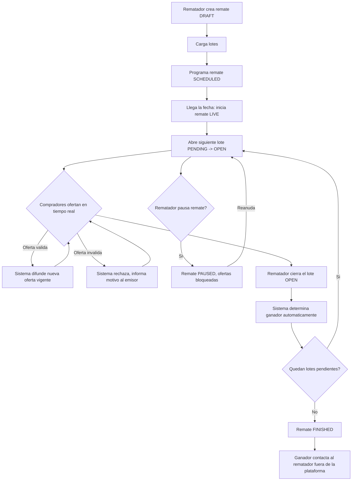

# 05 — Flujo Completo de Negocio

## Narrativa

1. Un **rematador** crea un remate (`DRAFT`): título, descripción, fecha/hora prevista.
2. Carga todos los **lotes** que va a rematar, cada uno con precio inicial, incremento
   mínimo, imágenes y descripción, en un orden definido.
3. Cuando el remate está completo, lo programa (`SCHEDULED`). A partir de acá, la
   estructura de lotes queda congelada — cambiarla después de este punto generaría
   ambigüedad sobre qué vieron los compradores que ya siguen el remate.
4. Llegada la fecha, el rematador **inicia** el remate (`LIVE`). Los compradores conectados
   empiezan a ver la transmisión (integración simple, ver [ADR-005](adr/ADR-005-transmision-en-vivo-fuera-de-alcance-del-mvp.md))
   y el estado del remate.
5. El rematador **abre el primer lote** (`PENDING → OPEN`). Solo puede haber un lote
   abierto por remate a la vez — esto refleja el comportamiento real de un remate: se
   compite por un ítem por vez.
6. Los compradores conectados **ofertan** en tiempo real. Cada oferta se valida
   server-side (estado del lote, incremento mínimo) y, si es aceptada, se difunde
   inmediatamente a todos los conectados a ese remate. Si el remate tiene anti-sniping
   habilitado, una oferta de último momento extiende el cierre.
7. El rematador **cierra el lote** (`OPEN → CLOSED_SOLD` o `CLOSED_UNSOLD`). El sistema
   determina el ganador automáticamente: es la oferta válida de mayor monto, resuelta de
   forma transaccional para que no existan condiciones de carrera con la última oferta
   recibida (ver [ADR-004](adr/ADR-004-concurrencia-en-determinacion-de-ganador.md)).
8. El rematador **abre el siguiente lote** y se repite el ciclo 5→7 hasta agotar los lotes.
9. Al cerrarse el último lote, el remate **finaliza** (`FINISHED`) automáticamente.
10. El comprador ganador de cada lote puede consultar el resultado en su historial. El
    contacto con el rematador para coordinar pago y entrega ocurre **fuera de la
    plataforma** en el MVP (ver [13-mvp-y-roadmap.md](13-mvp-y-roadmap.md)).

En cualquier punto entre `LIVE` y el cierre del último lote, el rematador puede **pausar**
el remate (`PAUSED`): esto bloquea nuevas ofertas sobre el lote abierto (si lo hay) sin
cerrarlo ni perder su estado, y lo reanuda más tarde (`PAUSED → LIVE`). También puede
**cancelar** el remate completo o un lote puntual, con motivo obligatorio.

## Diagrama de flujo principal



## Diagrama de secuencia: una oferta en tiempo real

Este es el camino más crítico del sistema — todo el valor técnico del proyecto pasa por acá.

```mermaid
sequenceDiagram
    participant C as Comprador (WS)
    participant BE as Instancia Backend
    participant PG as PostgreSQL
    participant R as Redis (Pub/Sub)
    participant Otros as Otros clientes conectados (cualquier instancia)

    C->>BE: oferta(lote_id, monto, client_ref_id)
    BE->>PG: BEGIN; SELECT lote FOR UPDATE
    PG-->>BE: estado del lote + oferta vigente
    alt oferta invalida (lote cerrado, remate pausado, monto insuficiente)
        BE-->>C: rechazo(motivo)
        BE->>PG: ROLLBACK
    else oferta valida
        BE->>PG: INSERT oferta (ACCEPTED); UPDATE oferta_vigente del lote
        BE->>PG: COMMIT
        BE->>R: PUBLISH evento oferta_aceptada (remate_id)
        R-->>BE: fan-out a todas las instancias suscriptas al remate
        BE-->>C: confirmacion(oferta aceptada)
        BE-->>Otros: broadcast oferta_aceptada
    end
```
