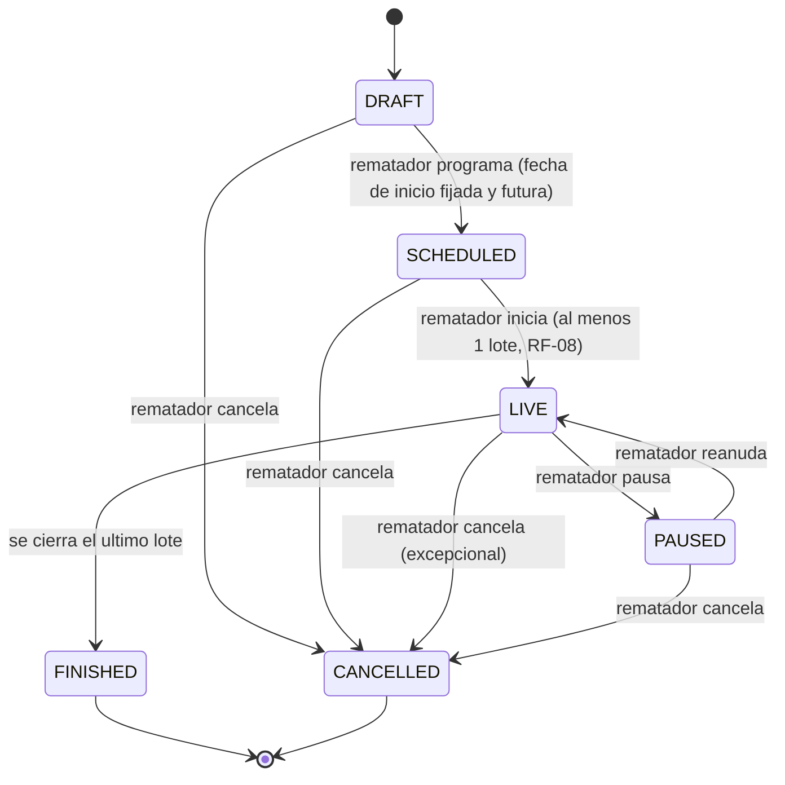
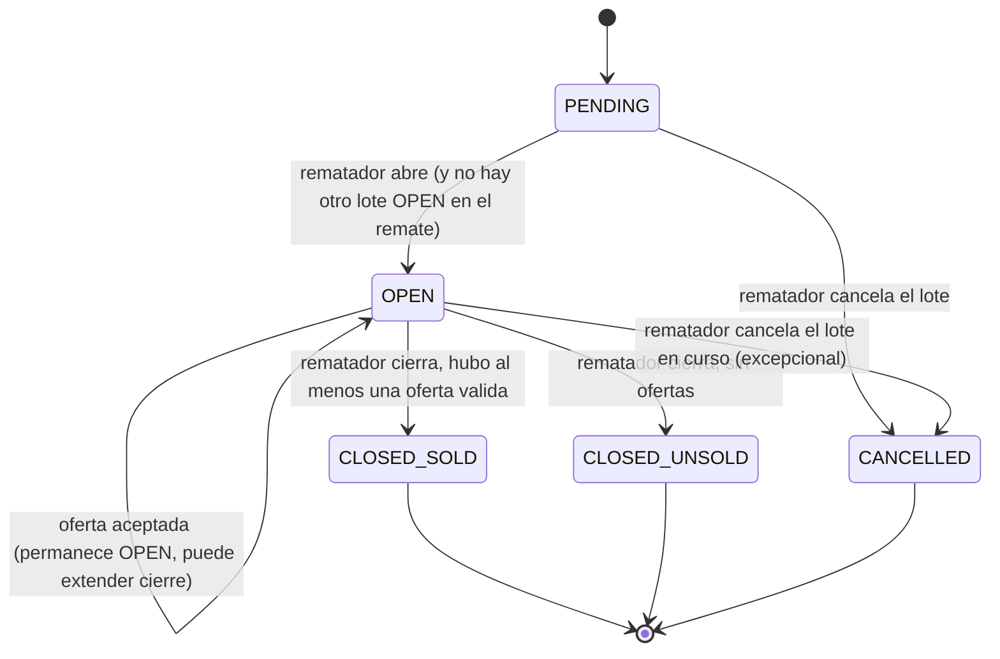
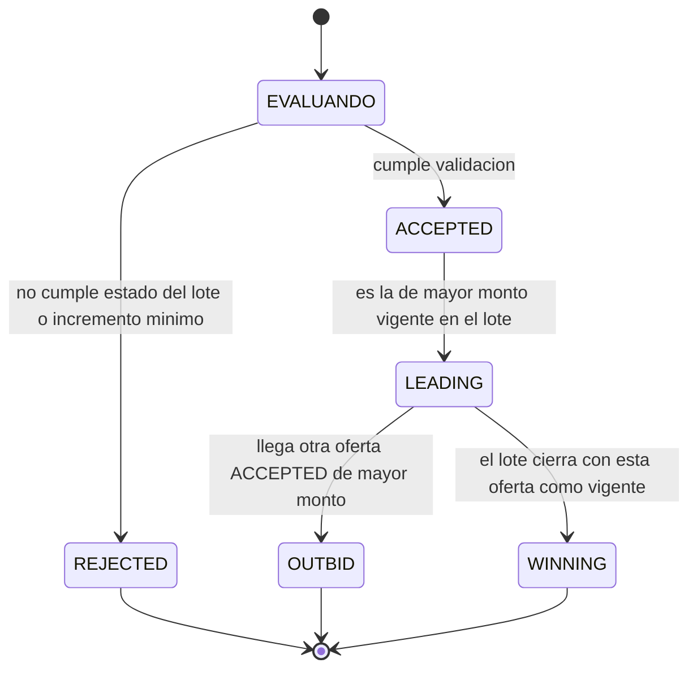

# 07 — Máquinas de Estado

Modelar remate, lote y oferta como máquinas de estado explícitas (en vez de flags booleanos
sueltos como `activo`, `cerrado`, `pausado` combinables libremente) es una decisión
deliberada: evita estados imposibles (¿qué significa `activo=true, cerrado=true`?) y hace
que las transiciones válidas sean auditable y testeables una por una.

## Estados de un Remate

| Estado | Significado | Ofertas permitidas |
|---|---|---|
| `DRAFT` | En armado, lotes editables | No |
| `SCHEDULED` | Fecha fijada, estructura de lotes congelada | No |
| `LIVE` | En curso | Sí, sobre el lote `OPEN` |
| `PAUSED` | En curso pero suspendido temporalmente | No |
| `FINISHED` | Todos los lotes resueltos | No |
| `CANCELLED` | Cancelado antes o durante, con motivo | No |

**Nota de diseño**: `CANCELLED` es alcanzable desde `DRAFT`, `SCHEDULED`, `LIVE` y `PAUSED`
pero nunca desde `FINISHED` — un remate terminado no se cancela retroactivamente, si hay un
problema con un resultado puntual se maneja a nivel de lote/oferta, no reescribiendo la
historia del remate completo.

**Corrección respecto a la versión original de este documento (detectada al implementar
el Módulo 2.1)**: la condición "al menos 1 lote" estaba escrita sobre la transición
`DRAFT -> SCHEDULED` en la versión inicial de este diagrama, pero RF-08
([03-requisitos-funcionales.md](03-requisitos-funcionales.md)) la ata a *iniciar*
(`SCHEDULED -> LIVE`), no a programar. Se corrigió el diagrama para que ambos documentos
digan lo mismo. Esto importa en la práctica: un remate puede programarse (quedar visible
públicamente, con fecha confirmada) sin tener lotes todavía; recién para pasar a `LIVE`
hace falta al menos uno.

**Estado de implementación** (Épica 2, [Módulo 2.1](14-modulo-remate.md)): están
implementadas `DRAFT -> SCHEDULED` y `(no terminal) -> CANCELLED`. `SCHEDULED -> LIVE`,
`LIVE <-> PAUSED` y `LIVE -> FINISHED` quedan para el módulo que agregue Lotes, porque
recién ahí se puede validar la precondición de RF-08. El código ya modela las seis
transiciones completas (`app/modules/remates/state_machine.py`), solo falta exponer las
que dependen de Lotes.

## Estados de un Lote

| Estado | Significado |
|---|---|
| `PENDING` | Cargado, esperando su turno |
| `OPEN` | Único lote del remate que acepta ofertas en este momento |
| `CLOSED_SOLD` | Cerrado con ganador determinado |
| `CLOSED_UNSOLD` | Cerrado sin ofertas válidas |
| `CANCELLED` | Retirado del remate, con motivo |

**Invariante clave**: a lo sumo un lote por remate puede estar en `OPEN` en un instante
dado (RF-12). Esto es lo que permite razonar sobre "el lote activo" sin ambigüedad, y es
además lo que se envía como snapshot a un cliente que se conecta o reconecta.

## Estados de una Oferta

A diferencia de remate/lote, el estado de una oferta individual es mayormente **derivado**,
no una máquina con transiciones libres: una oferta terminal (`ACCEPTED`/`REJECTED`) no
cambia de resultado de validación, pero su rol relativo dentro del lote sí evoluciona.

| Estado | Significado | ¿Es terminal? |
|---|---|---|
| `REJECTED` | No pasó la validación server-side (RF-17/RF-18) | Sí |
| `ACCEPTED` | Pasó la validación en el momento en que se recibió | No (transiciona a LEADING) |
| `LEADING` | Es, en este instante, la oferta vigente del lote | No, hasta que se supera o el lote cierra |
| `OUTBID` | Fue superada por una oferta posterior de mayor monto | Sí |
| `WINNING` | Era la vigente cuando el lote cerró con resultado `SOLD` | Sí |

**Por qué se persisten también las `REJECTED`** (y no se descartan silenciosamente): ante
una disputa ("yo oferté más y no gané"), el historial completo —incluidas las ofertas
rechazadas y su motivo— es la única forma de auditar qué pasó realmente (RF-25).

**Por qué `LEADING` no es un estado persistido aparte**: en todo momento es una consulta
derivada ("la oferta `ACCEPTED` de mayor monto para este lote, si el lote sigue `OPEN`"),
no un campo que haya que mantener sincronizado en dos lugares. Menos estado mutable
duplicado, menos forma de que se desincronice.
