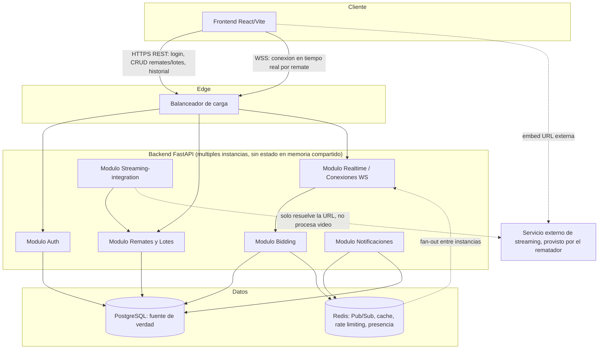

# 10 — Diagramas

## Diagrama de módulos (componentes)

**Puntos a resaltar del diagrama:**

- El frontend habla dos protocolos con el mismo backend: REST para operaciones CRUD/consulta
  y WebSocket para todo lo que es tiempo real (bidding, eventos de lote/remate).
- `Realtime/Conexiones` es el único módulo que mantiene conexiones abiertas; delega la
  lógica de negocio de una oferta al módulo `Bidding` — no valida reglas de negocio él
  mismo, solo transporta mensajes.
- Redis conecta todas las instancias del backend entre sí (fan-out), no conecta el backend
  con el frontend directamente.
- El módulo de streaming es intencionalmente delgado: no hay una caja de "servidor de
  medios" en este diagrama porque no existe en el MVP (ver [ADR-005](adr/ADR-005-transmision-en-vivo-fuera-de-alcance-del-mvp.md)).

## Diagrama del flujo principal del negocio

Ver [05-flujo-de-negocio.md](05-flujo-de-negocio.md) para el flowchart completo del ciclo
de vida de un remate y el diagrama de secuencia detallado de una oferta en tiempo real —
se mantienen ahí junto con la narrativa para no duplicar contenido que se desincronice.
