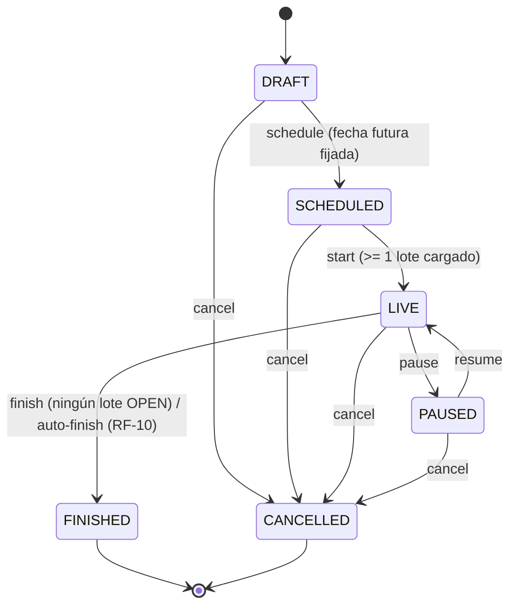
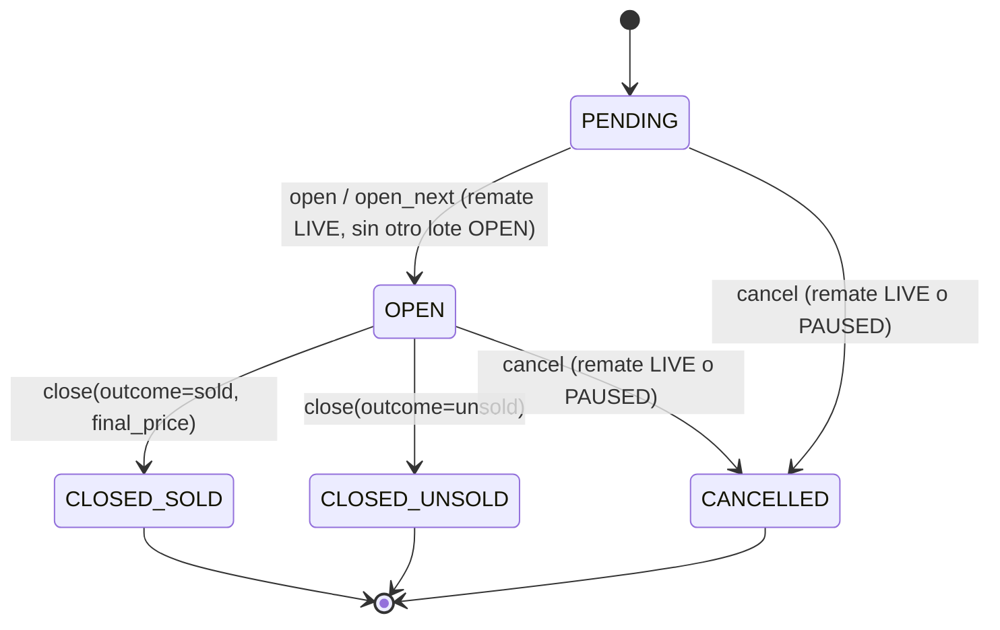

# 16 — Motor de Estados del Remate (Épica 2, Módulo 2.3)

Este documento es la referencia de diseño del motor de estados de `Remate` y `Lote`:
las transiciones de ciclo de vida durante un remate en curso. Complementa
[07-maquinas-de-estado.md](07-maquinas-de-estado.md) (Fase 0, diagramas originales),
[14-modulo-remate.md](14-modulo-remate.md) (Módulo 2.1) y
[15-modulo-lote.md](15-modulo-lote.md) (Módulo 2.2).

## Alcance de este módulo

Se implementan **todas** las transiciones de `Remate` y `Lote` que ya estaban modeladas
(pero no expuestas) en `state_machine.py` de cada uno desde sus módulos respectivos:
iniciar/pausar/reanudar/finalizar un remate, y abrir/cerrar/cancelar un lote (más "pasar
al siguiente lote", una conveniencia sobre "abrir"). **No** se toca nada de:

- Ofertas / bidding — determinar quién ganó un lote sigue sin existir.
- WebSockets, Redis, chat, notificaciones, streaming.
- El CRUD estructural de Remate/Lote (crear, editar, eliminar, reordenar) — sigue
  intacto, sin cambios, tal como quedó en los Módulos 2.1/2.2.

Es, literalmente, "el motor que mueve el campo `status`" — pero con todas las reglas de
negocio que la máquina de estados por sí sola no puede expresar (¿hay lotes cargados?,
¿hay otro lote abierto?, ¿hay algo abierto todavía?), que es exactamente lo que este
módulo agrega sobre las tablas de transición que ya existían.

## Por qué esto no rompe lo ya documentado, corrige una expectativa de fase

Los Módulos 2.1 y 2.2 asumieron que abrir/cerrar/cancelar un lote llegaría **junto** con
el módulo de Ofertas (ver la sección "Qué queda" de ambos documentos). En la práctica,
el pedido de esta fase separa ambas cosas: el **motor de estados** (este módulo) llega
antes, sin bidding; **Ofertas** llega después y reutiliza este motor sin modificarlo,
aportando únicamente la determinación automática del ganador. `docs/14` y `docs/15` se
actualizan para reflejar esta corrección (regla 5 de [docs/README.md](README.md)).

## Diagrama de estados — Remate

Sin cambios respecto al diagrama de Fase 0 ([07](07-maquinas-de-estado.md)) — este módulo
solo **expone por HTTP** las cuatro transiciones que faltaban (`start`, `pause`, `resume`,
`finish`); la tabla completa (`app/modules/remates/state_machine.py`) ya existía sin
modificarse desde el Módulo 2.1.

## Diagrama de estados — Lote

Tampoco cambia respecto a Fase 0 — `app/modules/remates/lotes/state_machine.py` (Módulo
2.2) ya modelaba las cinco transiciones completas; este módulo es la primera vez que se
invoca `assert_transition_allowed` desde algún lado.

## Transiciones válidas — explicación completa

### Remate

| Transición | Acción | Precondición adicional (más allá de la tabla de estados) |
|---|---|---|
| `SCHEDULED -> LIVE` | `start` | Debe existir al menos un lote no eliminado en el remate (RF-08). |
| `LIVE -> PAUSED` | `pause` | Ninguna — pausar es siempre posible desde `LIVE`. |
| `PAUSED -> LIVE` | `resume` | Ninguna. |
| `LIVE -> FINISHED` | `finish` (manual) o automático | Ningún lote en estado `OPEN` en ese remate. El automático ocurre además solo cuando, tras cerrar/cancelar un lote, no queda **ningún** lote `PENDING` ni `OPEN` (RF-10) — ver "Finalización automática" abajo. |
| `DRAFT/SCHEDULED/LIVE/PAUSED -> CANCELLED` | `cancel` | Sin cambios — ya implementado en el Módulo 2.1. |

### Lote

| Transición | Acción | Precondición adicional |
|---|---|---|
| `PENDING -> OPEN` | `open` (por id) | El remate padre debe estar `LIVE`; no puede haber otro lote `OPEN` en el mismo remate (RF-12, reforzado por [ADR-017](adr/ADR-017-invariante-un-lote-abierto-por-remate-como-indice-parcial.md)); el lote debe pertenecer al remate de la URL (ya lo garantiza `_get_owned_lote_or_raise`, reutilizado sin cambios). |
| `PENDING -> OPEN` | `open_next` | Igual que `open`, pero el lote lo elige el sistema: el `PENDING` de menor `display_order` (RF-13, "el rematador abre el siguiente lote de forma manual"). Si no queda ningún `PENDING`, error de negocio explícito. |
| `OPEN -> CLOSED_SOLD` | `close(outcome="sold", final_price=...)` | El remate padre debe estar `LIVE` o `PAUSED`; `final_price` es obligatorio y no puede ser menor a `base_price` — ver [ADR-018](adr/ADR-018-cierre-de-lote-sin-motor-de-ofertas.md) sobre por qué el resultado se declara manualmente en esta fase. |
| `OPEN -> CLOSED_UNSOLD` | `close(outcome="unsold")` | Igual que arriba, sin `final_price` (debe venir vacío). |
| `PENDING/OPEN -> CANCELLED` | `cancel(reason)` | El remate padre debe estar `LIVE` o `PAUSED`; motivo obligatorio (RF-11), igual que `Remate.cancel`. |

**Efecto secundario de `close` y `cancel` de lote**: ambos, al terminar con éxito,
disparan `RemateService.try_auto_finish` — ver la sección siguiente.

## Finalización automática (RF-10)

> "Un remate se finaliza automáticamente cuando se cierra su último lote, o manualmente
> por el rematador."

Después de que `LoteService.close` o `LoteService.cancel` resuelven un lote con éxito,
llaman a `RemateService.try_auto_finish(remate)`: si el remate sigue `LIVE` y ya no queda
ningún lote `PENDING` ni `OPEN`, lo pasa a `FINISHED` (mismo efecto que `finish`, sin
necesidad de que el rematador llame al endpoint manual). Es una operación **best-effort**:
si el remate no está en condiciones de finalizar (por ejemplo, quedan lotes `PENDING`, o
el remate está `PAUSED`), simplemente no hace nada — no es un error, todavía no
corresponde. Ver [ADR-019](adr/ADR-019-finalizacion-automatica-de-remate.md) para el
razonamiento completo, incluyendo por qué esta lógica vive en `RemateService` (no en el
router) y cómo se evita un import circular entre `remates/service.py` y
`remates/lotes/service.py`.

## Transiciones inválidas — comportamiento esperado

Todas devuelven `BusinessRuleError` → HTTP 422, con un mensaje explícito (nunca un fallo
silencioso ni un 500), salvo donde se indica lo contrario:

| Intento | Por qué falla | Código |
|---|---|---|
| `start` sin ningún lote cargado | RF-08 | 422 |
| `start` sobre un remate que no está `SCHEDULED` (ej. ya `LIVE`, o todavía `DRAFT`) | `assert_transition_allowed` rechaza la transición | 422 |
| `pause` sobre un remate que no está `LIVE` | Igual que arriba | 422 |
| `resume` sobre un remate que no está `PAUSED` | Igual que arriba | 422 |
| `finish` con un lote `OPEN` | Regla explícita de este módulo | 422 |
| `finish` sobre un remate `PAUSED` (debe reanudarse primero) | El diagrama de Fase 0 nunca permitió `PAUSED -> FINISHED` directamente | 422 |
| `open`/`open_next` sobre un remate que no está `LIVE` (ej. `PAUSED`, `SCHEDULED`) | Regla explícita: abrir un lote nuevo no tiene sentido si el remate no está en curso | 422 |
| `open` de un lote que no está `PENDING` (ej. ya `OPEN`, `CLOSED_*` o `CANCELLED`) | `assert_transition_allowed` | 422 |
| `open` mientras ya hay otro lote `OPEN` en el remate | RF-12 (chequeo de aplicación + respaldo de [ADR-017](adr/ADR-017-invariante-un-lote-abierto-por-remate-como-indice-parcial.md) ante una carrera de concurrencia) | 422 (o 409 si dos pedidos concurrentes pasan el chequeo de aplicación y colisionan en la base) |
| `open_next` sin ningún lote `PENDING` restante | No hay qué abrir | 422 |
| `open` de un lote que pertenece a **otro** remate | El lote no se encuentra bajo la URL de ese remate — regla explícita del enunciado | 404 (mismo criterio ya usado en todo el proyecto: no se confirma la existencia de un recurso fuera de su contexto) |
| `close`/`cancel` de un lote que no está `OPEN` (para close) o `PENDING`/`OPEN` (para cancel) | `assert_transition_allowed` | 422 |
| `close(outcome="sold")` sin `final_price`, o con `final_price < base_price` | Validación explícita de esta fase (ADR-018) | 422 |
| `close(outcome="unsold")` con `final_price` presente | Dato contradictorio — un lote desierto no tiene precio final | 422 |
| Cualquier acción de este módulo sobre un remate/lote que no es propio | Ownership, mismo patrón que Módulos 2.1/2.2 | 403 (visible) / 404 (borrador ajeno) |

## Permisos

Sin cambios de patrón respecto a los módulos anteriores: **todas** las acciones de este
módulo son exclusivas del rematador dueño del remate — se verifican reutilizando
`RemateService.get_owned_or_raise` (para las acciones de `Remate`) y
`LoteService._get_owned_lote_or_raise` (para las de `Lote`, que a su vez reutiliza lo
anterior). No se agrega ningún `require_roles` nuevo: la razón es la misma que en
Módulos 2.1/2.2 — solo un `rematador` puede ser dueño de un remate.

## Dónde vive el código

Sin paquetes nuevos: se extienden `app/modules/remates/service.py` (nuevos métodos
`start`, `pause`, `resume`, `finish`, `try_auto_finish`) y
`app/modules/remates/lotes/service.py` (nuevos métodos `open`, `open_next`, `close`,
`cancel`), sus repositorios (nuevas consultas de solo lectura) y sus routers (nuevos
endpoints). Ningún archivo cambia de lugar ni se renombra. El único acoplamiento nuevo es
`RemateService` -> `LoteRepository` (de solo lectura, no `LoteService`) — ver ADR-019
para por qué esa dirección específica y no otra.

## Columnas nuevas en `Lote`

Ver [ADR-018](adr/ADR-018-cierre-de-lote-sin-motor-de-ofertas.md): `opened_at`,
`closed_at`, `final_price`, `cancellation_reason`, `cancelled_at` — todas nulleables,
todas completadas exclusivamente por las transiciones de este módulo. `Remate` no
necesita ninguna columna nueva: `finished_at`, `cancelled_at` y `cancellation_reason` ya
existían desde el Módulo 2.1, pre-agregadas exactamente para este momento.

## Qué queda para el módulo de Ofertas (próximo)

**Actualización (Épica 2.4, 2026-07-15)**: la recepción, validación y aceptación de
ofertas por HTTP ya está implementada — ver [17-auction-engine.md](17-auction-engine.md)
y [ADR-020](adr/ADR-020-diseno-del-auction-engine.md). Lo que queda:

- ~~Recepción, validación y aceptación de ofertas~~ — implementado (todavía por HTTP,
  no WebSocket).
- Determinación automática del ganador al cerrar un lote: `close(outcome, final_price)`
  sigue recibiendo esos valores manualmente del rematador (ADR-018) — todavía no está
  enganchado con la oferta vigente calculada por el Auction Engine. La transición de
  estado en sí (`OPEN -> CLOSED_SOLD/CLOSED_UNSOLD`) no cambia, solo falta que algo
  calcule `outcome`/`final_price` en vez de recibirlos como input manual.
- WebSockets, Redis (fan-out), snapshot/reconexión, anti-sniping, notificaciones de
  "superado" — ninguno tocado todavía; ver la sección "Qué queda" de
  [17-auction-engine.md](17-auction-engine.md) para el detalle actualizado.
