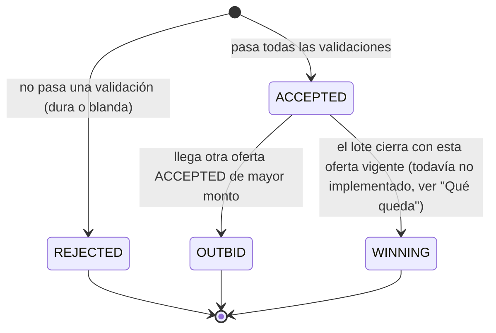
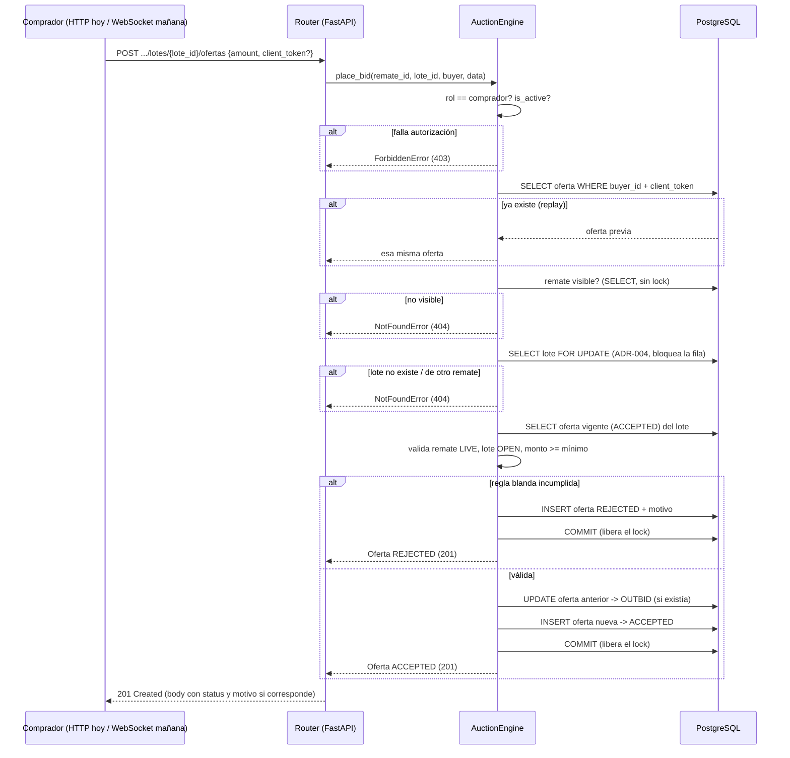

# 17 — Auction Engine (Épica 2.4)

Este documento es la referencia de diseño del **Auction Engine**: el componente
responsable de recibir, validar y procesar ofertas. Complementa
[07-maquinas-de-estado.md](07-maquinas-de-estado.md) (estados de `Oferta`, Fase 0),
[16-motor-de-estados.md](16-motor-de-estados.md) (motor de estados de Remate/Lote,
Módulo 2.3) y [ADR-004](adr/ADR-004-concurrencia-en-determinacion-de-ganador.md) (Fase 0,
la decisión de concurrencia que este módulo pone en práctica por primera vez). El diseño
completo, con sus alternativas y trade-offs, está en
[ADR-020](adr/ADR-020-diseno-del-auction-engine.md); acá se explica el funcionamiento,
no se vuelve a justificar cada decisión.

## Alcance de esta épica

Se implementa la entidad `Oferta` y el `AuctionEngine`: recibir una oferta HTTP,
validarla contra el estado del remate/lote/comprador, aceptarla o rechazarla,
mantener automáticamente cuál es la oferta vigente, y persistir el historial completo
(incluidas las rechazadas). **Todo por HTTP** — sin WebSockets, sin Redis, sin
notificaciones, sin ningún componente de tiempo real. El diseño interno, sin embargo,
está pensado explícitamente para que el mismo motor sirva sin cambios cuando esos
componentes lleguen (ver la sección final).

## Dónde vive el código

`app/modules/ofertas/` — un módulo **nuevo, top-level**, no un sub-paquete de `remates`.
A diferencia de `Lote` (que comparte bounded context con `Remate`, ver
[docs/15](15-modulo-lote.md)), [09-arquitectura-y-decisiones.md](09-arquitectura-y-decisiones.md)
(Fase 0) ya distingue "Bidding" como su propio módulo interno, separado de "Remates".
`Oferta.lote_id` y `Oferta.buyer_id` son FKs simples, **sin** `relationship()` de
SQLAlchemy — mismo patrón que `Remate.owner_id -> User`, ahora con una razón todavía más
directa: `ofertas` cruza un límite de módulo real (Bidding vs. Remates/Users), no uno
interno como el caso de `Lote`.

Estructura: `models.py`, `schemas.py`, `repository.py`, `dependencies.py`, `router.py` —
más **`engine.py`** en vez de `service.py`. Es una desviación deliberada del nombre de
archivo estándar, con precedente directo en este mismo proyecto: `remates/state_machine.py`
ya existe fuera del set de archivos habitual "porque la máquina de estados de Remate es lo
bastante importante como para no enterrarla dentro de `service.py`" (Módulo 2.1). El
Auction Engine es, si acaso, más central todavía — merece su propio nombre de archivo por
la misma razón.

**Los únicos archivos existentes tocados** son los dos puntos de extensión ya usados en
cada módulo anterior: `app/db/base.py` (registrar `Oferta` para Alembic) y
`app/modules/remates/lotes/router.py` (una línea de `include_router` para montar
`/remates/{remate_id}/lotes/{lote_id}/ofertas`) — más **una única función nueva** en
`app/modules/remates/lotes/repository.py` (`get_by_id_for_update`), necesaria para
implementar el mecanismo de bloqueo de fila que [ADR-004](adr/ADR-004-concurrencia-en-determinacion-de-ganador.md)
(Fase 0) ya exigía y que hasta ahora ningún módulo había puesto en práctica. Ningún otro
archivo de `remates`/`lotes` cambia.

## Campos de `Oferta`: justificación y obligatoriedad

| Campo | Obligatorio | Por qué |
|---|---|---|
| `lote_id` | Sí | El lote sobre el que se oferta. FK simple, `RESTRICT`, sin `relationship()` (ver arriba). |
| `buyer_id` | Sí (del token, no del body) | El comprador nunca lo elige el cliente — se toma del usuario autenticado, mismo criterio que `Remate.owner_id`. |
| `amount` | Sí | El monto ofertado ("monto"). `Numeric(14,2)` — mismo tipo que los montos de `Lote` (Módulo 2.2), nunca `float`. |
| `status` | Sí, sistema | Ver "Estados" abajo. Nunca lo setea el cliente. |
| `created_at` | Sistema | Cumple el requisito de "fecha" — no hace falta una columna aparte: es exactamente el instante en que la oferta fue recibida y evaluada. |
| `updated_at` | Sistema | Se modifica cuando una oferta `ACCEPTED` pasa a `OUTBID` (ver máquina de estados) — es la única mutación que una oferta sufre después de creada. |
| `rejection_reason` | No (solo si `status = REJECTED`) | RF-18 exige un motivo explícito ante todo rechazo. Mismo patrón que `Lote.cancellation_reason`. |
| `client_token` | No | Ver "Idempotencia" en ADR-020. Permite que un reintento de red (el mismo comprador reenviando la misma oferta porque no recibió la respuesta) no produzca una oferta duplicada — explícitamente anticipado en el glosario de Fase 0 ("Idempotencia: relevante para reintentos de ofertas ante fallas de red transitorias"). |

**Sin `winner_id` en `Lote`, sin relación inversa**: quién ganó un lote se lee de
`Oferta` (`status = WINNING`), no se duplica como columna en `Lote`. Evita mantener el
mismo dato en dos lugares.

**Inmutable por diseño**: no hay `soft_delete`, no hay endpoint de borrado. Una `Oferta`,
una vez creada, solo puede sufrir una transición de estado (`ACCEPTED -> OUTBID`,
`ACCEPTED -> WINNING`, esto último todavía no alcanzable en esta fase) — nunca se
elimina ni se reescribe su `amount`/`buyer_id`/`lote_id`. RF-25 lo exige explícitamente:
"el sistema conserva un registro inmutable de toda oferta recibida, aceptada o
rechazada."

## Estados de `Oferta`

Los cuatro estados **persistidos** ya estaban definidos en Fase 0
([07-maquinas-de-estado.md](07-maquinas-de-estado.md)): `ACCEPTED`, `REJECTED`,
`OUTBID`, `WINNING`. **`LEADING` no es un estado de la base de datos** — es, tal como
ese documento ya aclaraba, una consulta derivada ("la oferta `ACCEPTED` de mayor monto
para un lote, si el lote sigue `OPEN`"). Este módulo lo implementa de la forma más
simple posible gracias a un invariante que el propio motor garantiza: **a lo sumo una
oferta `ACCEPTED` por lote en todo momento** (ver "Invariantes de base" en ADR-020) — el
momento en que una oferta nueva supera a la anterior, la anterior pasa a `OUTBID` en la
misma transacción. Por lo tanto, "la oferta vigente" es, literalmente, "la oferta con
`status = ACCEPTED` de ese lote" — no hace falta un `MAX(amount)` para encontrarla.

**Estado de implementación**: `REJECTED`, `ACCEPTED` y `OUTBID` están completamente
implementados. `WINNING` está modelado (el enum ya lo incluye, el índice único parcial
ya lo protege) pero **no es alcanzable todavía** — ningún código de esta fase lo asigna.
Ver "Qué queda" al final.

## Funcionamiento interno del `AuctionEngine.place_bid`

Paso a paso, en el orden exacto en que se ejecuta:

1. **Autorización del comprador** (no genera ninguna fila si falla): el usuario
   autenticado debe tener rol `comprador` y `is_active = true`. Si no, `ForbiddenError`
   (403) — ver "Reglas duras vs. blandas" más abajo. En la práctica, un comprador
   suspendido nunca llega a disparar este chequeo por HTTP: `get_current_user` (capa de
   auth, sin tocar) ya revalida `is_active` contra la base en cada request y corta con
   401 antes. El chequeo del motor queda como segunda capa de defensa, explícita y
   documentada, para cualquier caller futuro que no garantice un `User` fresco (por
   ejemplo, una conexión de WebSocket de larga duración con sesión cacheada).
2. **Replay de idempotencia** (atajo, antes de tocar el lote): si viene `client_token` y
   ya existe una oferta de este mismo comprador con ese token, se devuelve esa oferta tal
   cual quedó la primera vez — sin repetir ninguna validación.
3. **Visibilidad del remate**: se reutiliza `RemateService.get_visible_or_raise` sin
   ningún cambio — un comprador solo puede ofertar en remates que puede ver (no
   `DRAFT`). Si no es visible, `NotFoundError` (404), mismo criterio que en todo el
   resto de la API.
4. **Bloqueo de fila del lote** (`SELECT ... FOR UPDATE`, ADR-004): se abre una
   transacción que toma el lock sobre esa fila puntual de `lotes` antes de leer nada
   más. Esto serializa, por lote, **todas** las ofertas concurrentes que compitan por
   él — la oferta que gana la carrera por el lock es la que se procesa primero, sin
   importar en qué instancia de backend haya entrado. Si el lote no existe, está borrado,
   o pertenece a otro remate que el de la URL, `NotFoundError` (404) — esto es,
   literalmente, la regla "el comprador intenta ofertar sobre un lote perteneciente a
   otro remate".
5. **Se busca la oferta vigente** (`ACCEPTED` de ese lote, a lo sumo una por el
   invariante ya explicado) — todavía dentro de la transacción que sostiene el lock.
6. **Validaciones "blandas"** (no rechazan la solicitud HTTP, generan una `Oferta`
   `REJECTED` con motivo — ver tabla abajo): estado del remate (`LIVE`), estado del lote
   (`OPEN`), monto (`>= vigente + incremento_mínimo`, o `>= base_price` si es la primera
   oferta del lote).
7. **Si se rechaza**: se inserta la oferta con `status = REJECTED` y el motivo, se
   confirma, se devuelve — **201 Created**, no un error.
8. **Si se acepta**: si había una oferta vigente anterior, se la pasa a `OUTBID` (misma
   transacción); se inserta la nueva oferta con `status = ACCEPTED`; se confirma
   (libera el lock) y se devuelve — **201 Created**.
9. **Manejo de condición de carrera en la idempotencia**: si el `commit` falla por
   violar la unicidad de `(buyer_id, client_token)` (dos reintentos concurrentes del
   mismo comprador llegaron casi al mismo tiempo, antes de que el paso 2 pudiera ver el
   primero todavía sin confirmar), se recupera la oferta ya persistida por el otro y se
   devuelve esa — nunca un error ni una oferta duplicada.

## Diagrama de flujo de una oferta

## Reglas duras vs. blandas

Distinción central del diseño (justificada en detalle en ADR-020): no todas las
condiciones de la lista "una oferta no podrá realizarse si..." se tratan igual.

| Regla | Tipo | Resultado |
|---|---|---|
| El comprador no tiene rol `comprador` | Dura | 403, sin persistir nada |
| El comprador está suspendido (`is_active = false`) | Dura | 403, sin persistir nada |
| El remate no es visible para el comprador (`DRAFT` ajeno) | Dura | 404, sin persistir nada |
| El lote no existe, está borrado, o pertenece a otro remate | Dura | 404, sin persistir nada |
| El remate no está `LIVE` (`PAUSED`, `SCHEDULED`, `FINISHED`, `CANCELLED`) | Blanda | 201, `Oferta REJECTED` con motivo |
| El lote no está `OPEN` (`PENDING`, `CLOSED_SOLD`, `CLOSED_UNSOLD`, `CANCELLED`) | Blanda | 201, `Oferta REJECTED` con motivo |
| El monto es menor a `vigente + incremento_mínimo` (o a `base_price` si es la primera) | Blanda | 201, `Oferta REJECTED` con motivo |

Las **duras** son sobre si la solicitud en sí es legítima (¿este usuario puede siquiera
intentar esto sobre este recurso?) — coinciden con el mismo criterio 403/404 ya usado en
toda la API. Las **blandas** son sobre el resultado de una oferta bien formada
compitiendo en la subasta — y ese resultado siempre se audita como una fila más de
`Oferta`, nunca como un error de transporte. Es la misma distinción que RF-18 ya hacía
implícitamente al agrupar "lote cerrado", "remate pausado" y "monto insuficiente" bajo
un mismo "motivo explícito, nunca un fallo silencioso".

## Endpoints y permisos

- `POST /remates/{remate_id}/lotes/{lote_id}/ofertas` — ofertar. Solo rol `comprador`,
  activo. Siempre `201`, cuerpo con `status`/`rejection_reason`.
- `GET /remates/{remate_id}/lotes/{lote_id}/ofertas/leading` — monto de la oferta
  vigente (`null` si todavía no hay ninguna). Visible para cualquiera que pueda ver el
  lote (dueño, admin, cualquier comprador) — respuesta mínima, sin identidad del
  comprador que la hizo, para no necesitar ningún mecanismo de ocultamiento por rol.
- `GET /remates/{remate_id}/lotes/{lote_id}/ofertas` — historial completo, incluidas las
  rechazadas (RF-24). Solo el rematador dueño del remate o un administrador. Un
  comprador (incluso el que ofertó) recibe 403 acá — ver "Qué queda" sobre por qué el
  historial "en vivo" para compradores se deja para el módulo de tiempo real en vez de
  resolverse con polling HTTP.

## Por qué esta arquitectura facilita la futura integración con Redis y WebSockets

1. **El motor ya es agnóstico de transporte.** `AuctionEngine.place_bid(remate_id,
   lote_id, buyer, data) -> Oferta` no conoce HTTP: no arma respuestas, no usa códigos
   de estado, no importa nada de FastAPI más allá de recibir objetos de dominio ya
   resueltos (`buyer: User`, `data: OfertaCreate`). Cuando exista un handler de
   WebSocket, va a llamar a este mismo método, con los mismos argumentos, después de
   resolver el usuario autenticado de la conexión — cero cambios en `engine.py`. Esto es
   exactamente lo que ya pedía la arquitectura de excepciones desde Fase 1
   ("los servicios no deberían conocer el concepto de HTTP", `core/exceptions.py`); acá
   se aplica por primera vez a un componente que efectivamente correrá detrás de dos
   transportes distintos.
2. **La correctitud no depende de cuántas instancias de backend haya.** El lock vive en
   PostgreSQL (`SELECT ... FOR UPDATE`), no en memoria de proceso — es la misma razón de
   fondo que [ADR-002](adr/ADR-002-postgres-fuente-de-verdad-y-redis-como-soporte.md) ya
   documentó: Postgres es la única fuente de verdad de negocio. Cuando el proyecto corra
   en múltiples instancias detrás de un balanceador (como prevé
   [09-arquitectura-y-decisiones.md](09-arquitectura-y-decisiones.md)), dos ofertas
   simultáneas sobre el mismo lote, entrando por instancias distintas, se van a serializar
   igual — el motor ya está correcto para ese escenario, no hace falta rediseñarlo.
3. **Redis va a resolver un problema distinto, que este motor no necesita para ser
   correcto.** El rol futuro de Redis (ver
   [ADR-009](adr/ADR-009-redis-pubsub-vs-streams-para-fanout.md)) es *fan-out*: avisarle
   a todos los clientes conectados a un remate que una oferta fue aceptada/rechazada.
   Esto es una preocupación de **difusión**, no de **arbitraje** — el arbitraje (quién
   ganó la carrera por ofertar) ya lo resuelve Postgres solo, con el lock de fila. El
   día que exista el backplane de Redis, el único cambio en este módulo es: después de
   que `place_bid` devuelve una `Oferta`, el handler de WebSocket (no el motor) publica
   un mensaje con el resultado. `engine.py` no se toca.
4. **El historial ya es la fuente de snapshot.** [ADR-008](adr/ADR-008-snapshot-mas-delta-para-reconexion.md)
   (Fase 0) ya decidió que la reconexión se resuelve con un snapshot completo, no con
   replay de eventos. `get_leading_amount` (este módulo) es exactamente la consulta que
   ese snapshot va a necesitar ("¿cuál es la oferta vigente de este lote ahora mismo?")
   — ya existe y ya está optimizada (el índice único parcial de `ACCEPTED` la resuelve
   con una búsqueda directa, no un `MAX`).

## Qué queda para el módulo de tiempo real (próximo)

- WebSockets, conexión y autenticación sobre el socket ([ADR-006](adr/ADR-006-autenticacion-jwt-en-http-y-websocket.md)).
- Redis Pub/Sub para difundir el resultado de cada oferta a todos los clientes conectados
  a ese remate (RF-19), y notificaciones de "superado" a quien queda en `OUTBID` (RF-22).
- Snapshot + reconexión (RF-16, ADR-008), construido sobre `get_leading_amount` y el
  estado del lote `OPEN`, ambos ya disponibles.
- Anti-sniping (RF-20, [ADR-007](adr/ADR-007-anti-sniping.md)): extender el cierre de un
  lote ante una oferta de último momento — depende de que exista un timer de cierre por
  lote, que todavía no existe (el cierre sigue siendo manual, Módulo 2.3).
- La transición `ACCEPTED -> WINNING`: cuando el rematador cierra un lote como vendido
  (`LoteService.close`, ADR-018), el módulo que la dispare debe marcar la oferta vigente
  de ese lote como `WINNING` — deliberadamente no implementado en esta épica porque el
  enunciado de la 2.4 no pidió tocar el flujo de cierre de lote, solo el de recepción de
  ofertas. El invariante de base (a lo sumo una `WINNING` por lote) ya está creado y
  esperando.
- Historial "en vivo" accesible al comprador vía HTTP con polling: deliberadamente no
  construido — la visibilidad en tiempo real de la puja es, por diseño, responsabilidad
  del canal de WebSocket (RF-19), no de un endpoint HTTP adicional que quedaría obsoleto
  apenas exista.
