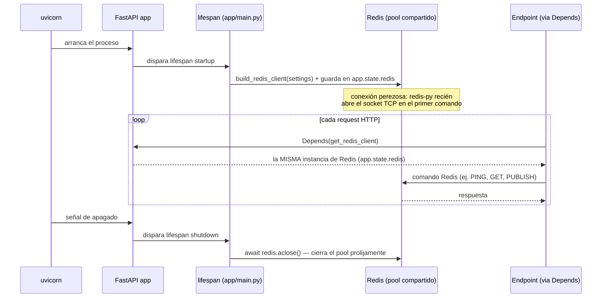

# 18 — Integración de Redis (Épica 3, Módulo 3.1)

Este documento es la referencia de diseño de la infraestructura de Redis: el cliente
compartido, su ciclo de vida, y las cuatro capas preparadas (cache, pub/sub, streams,
locks) que los módulos de tiempo real van a usar a partir de la Épica 3.2. Complementa
[ADR-002](adr/ADR-002-postgres-fuente-de-verdad-y-redis-como-soporte.md) y
[ADR-009](adr/ADR-009-redis-pubsub-vs-streams-para-fanout.md) (Fase 0, ya deciden **qué
rol** cumple Redis en el sistema) y [ADR-021](adr/ADR-021-integracion-de-redis.md) (esta
fase, decide **cómo** se implementa esa integración). Acá se explica el funcionamiento,
no se repiten las justificaciones ya escritas en esos ADR.

## Alcance de este módulo

Se deja Redis **correctamente integrado y preparado**, sin ninguna lógica de negocio
todavía:

- Redis corre vía Docker Compose, con health check propio.
- Un cliente async compartido, con manejo de conexión y cierre correctos.
- Cuatro capas de infraestructura genéricas (`RedisCache`, `RedisPubSub`, `RedisStreams`,
  `RedisLockFactory`), sin ningún conocimiento de `Remate`/`Lote`/`Oferta`.
- El endpoint `/health` reporta si Redis está disponible.

**No** se implementa: WebSockets, chat, broadcast, notificaciones, presencia,
sincronización de ofertas, canales de dominio, ni cacheo de ningún dato real. Nada del
Auction Engine ni de los módulos de dominio existentes se modifica — Redis no tiene,
todavía, ningún consumidor real.

## Dónde vive el código

`app/redis/` — nueva carpeta transversal, al mismo nivel que `app/db/`. Mismo criterio
que ese paquete: infraestructura de acceso a un motor de datos concreto, sin modelos ni
reglas de negocio (ver el README raíz, sección "Por qué esta organización"). No es un
`app/modules/`: ningún módulo de dominio "es dueño" de Redis, es una pieza transversal
que cualquier módulo futuro puede usar, igual que `app/db/session.py` no le pertenece a
ningún módulo de negocio puntual.

| Archivo | Responsabilidad |
|---|---|
| `client.py` | Construcción pura del cliente (`build_redis_client(settings) -> Redis`) — **no** decide cuándo se crea ni se cierra, eso es responsabilidad del `lifespan` de `app/main.py`. |
| `dependencies.py` | `get_redis_client` (el cliente compartido vía `request.app.state`) y una función `get_*` por cada capa (`get_cache`, `get_pubsub`, `get_streams`, `get_lock_factory`), mismo patrón de `Depends()` encadenados que ya usa cada módulo de dominio. |
| `cache.py` | `RedisCache` — `get`/`set`/`delete`/`exists` genéricos, con TTL opcional. |
| `pubsub.py` | `RedisPubSub` — `publish`/`subscribe` genéricos sobre cualquier canal (el nombre de canal lo elige quien lo use). |
| `streams.py` | `RedisStreams` — `add`/`read` genéricos sobre cualquier stream. |
| `locks.py` | `RedisLockFactory` — lock distribuido genérico (`SET NX` + expiración vía `redis.asyncio.lock.Lock`, la implementación estándar de `redis-py`). |

## Cliente compartido: por qué no es "una instancia por request"

`app/db/session.py` crea una `AsyncSession` **nueva en cada request** (`get_db`), porque
cada request de la API es una transacción de negocio independiente que debe poder
confirmarse o revertirse sola. Redis no tiene ese concepto: `redis.asyncio.Redis` ya
envuelve internamente un **pool de conexiones TCP** pensado para reutilizarse — abrirlo
una vez al arrancar la aplicación y compartir la misma instancia entre todos los
requests (y, en la Épica 3.2, entre todas las conexiones WebSocket) es el patrón
recomendado por la propia librería, no una simplificación de este proyecto.



**Cómo se prueba esto en tests**: `httpx.ASGITransport` (usado por
`tests/conftest.py`) no dispara automáticamente el protocolo de `lifespan` de ASGI —
a diferencia de un servidor ASGI real (uvicorn), que sí lo hace siempre. Por eso el
fixture `client` de `conftest.py` envuelve el request al app en
`app.router.lifespan_context(app)`, el mecanismo estándar de Starlette para disparar
`startup`/`shutdown` sin un servidor real — así los tests ejercitan exactamente el mismo
ciclo de vida que producción, no un atajo aparte.

## Health check

`GET /health` devuelve:

```json
{"status": "ok", "checks": {"redis": "ok"}}
```

o, si Redis no responde a `PING`:

```json
{"status": "ok", "checks": {"redis": "unavailable"}}
```

**Por qué sigue devolviendo `200` (nunca `503`) aunque Redis esté caído**: es una
consecuencia directa de [ADR-002](adr/ADR-002-postgres-fuente-de-verdad-y-redis-como-soporte.md)
— Redis es soporte, nunca fuente de verdad. Hoy (Módulo 3.1) ningún endpoint depende de
Redis para funcionar; en la Épica 3.2, cuando exista tiempo real, una caída de Redis
degrada la difusión en vivo (R-04, ya aceptado) pero no debería tumbar toda la API REST
(login, CRUD de remates/lotes, historial de ofertas), que sigue funcionando contra
Postgres sin problema. Un `/health` que devolviera `503` por Redis caído le pediría a un
orquestador (Docker, Kubernetes) que reinicie o saque de servicio un proceso que en
realidad puede seguir atendiendo la mayoría de su tráfico — el campo `checks.redis`
existe para que un monitoreo externo pueda alertar sobre la degradación sin que el
proceso mismo se autodestruya por eso.

## Las cuatro capas preparadas

Ninguna tiene conocimiento de `Remate`/`Lote`/`Oferta` — son utilidades de
infraestructura puras, tan genéricas como `LoteRepository` lo es respecto a HTTP.

- **`RedisCache`**: `get(key)`, `set(key, value, ttl=...)`, `delete(key)`, `exists(key)`.
  Quien la use decide qué cachea, con qué clave y por cuánto tiempo — esta capa no tiene
  ninguna opinión sobre eso.
- **`RedisPubSub`**: `publish(channel, message)` y `subscribe(*channels)` (context
  manager async que entrega el objeto `PubSub` de `redis-py`, listo para iterar
  mensajes). Es, literalmente, el backplane que [ADR-009](adr/ADR-009-redis-pubsub-vs-streams-para-fanout.md)
  ya decidió usar para el fan-out de la Épica 3.2 — acá solo se prepara el mecanismo, sin
  ningún canal todavía.
- **`RedisStreams`**: `add(stream, fields)` y `read(stream, ...)`. Disponible como
  capacidad de infraestructura aunque ADR-009 ya descartó Streams *específicamente para
  el fan-out en vivo* (ese rol es de Pub/Sub) — Streams queda preparado para cualquier
  necesidad futura distinta (por ejemplo, una cola de trabajo simple), no contradice esa
  decisión.
- **`RedisLockFactory`**: `acquire(key, timeout=..., blocking_timeout=...)`, un context
  manager async sobre `redis.asyncio.lock.Lock` (la implementación estándar de
  `redis-py`: `SET NX PX` con token de propietario). **No reemplaza** el
  `SELECT ... FOR UPDATE` de PostgreSQL que ya usa el Auction Engine para decidir quién
  ganó una oferta ([ADR-004](adr/ADR-004-concurrencia-en-determinacion-de-ganador.md)) —
  ese sigue siendo, sin excepción, responsabilidad exclusiva de Postgres. Este lock es
  para coordinación entre instancias que **no** decida un resultado de negocio (por
  ejemplo, asegurar que una tarea de mantenimiento futura corra una sola vez entre varias
  réplicas del backend).

## Cómo esta implementación facilita la integración con WebSockets (próximo módulo)

1. **El cliente ya es compartido y de larga vida.** Una conexión WebSocket vive minutos
   u horas, no el ciclo corto de un request HTTP — necesita exactamente el mismo cliente
   Redis que ya existe en `app.state.redis`, no uno nuevo por conexión. El handler de WS
   de la Épica 3.2 va a inyectar `get_redis_client`/`get_pubsub` igual que cualquier
   endpoint HTTP de hoy.
2. **`RedisPubSub.subscribe` ya devuelve un objeto iterable de mensajes.** El patrón que
   va a usar el handler de WS ("por cada conexión, suscribirse al canal del remate que
   está mirando, y reenviar cada mensaje que llegue por el socket") ya está resuelto por
   la capa de infraestructura — falta únicamente decidir qué se publica y con qué forma
   (eso es diseño de protocolo de la Épica 3.2, no de este módulo).
3. **El health check ya distingue "la API funciona" de "el tiempo real funciona".**
   Cuando WebSockets exista, un cliente que no puede conectarse al socket va a poder
   consultar `/health` y saber si el problema es Redis (`checks.redis: unavailable`) o
   algo más — la observabilidad ya está para ese diagnóstico.
4. **Nada de esto obligó a tocar el dominio.** Auth, usuarios, remates, lotes y ofertas
   quedaron exactamente como estaban — la prueba de que Redis está bien encapsulado como
   infraestructura transversal es que integrarlo no requirió modificar una sola línea de
   `app/modules/`.

## Qué queda para el módulo de tiempo real (próximo)

- WebSockets nativos, autenticación sobre el socket ([ADR-006](adr/ADR-006-autenticacion-jwt-en-http-y-websocket.md)).
- Canales de dominio concretos (uno por remate, probablemente) y el formato de los
  mensajes publicados — ninguno de los dos existe todavía.
- Enganchar `AuctionEngine.place_bid` (Épica 2.4) para que, después de aceptar/rechazar
  una oferta, publique el resultado con `RedisPubSub.publish` — sin modificar el motor en
  sí (ver docs/17-auction-engine.md, "por qué facilita Redis y WebSockets").
- Presencia (contador de espectadores por remate) y rate limiting de ofertas por
  conexión (RNF-13), ambos apoyados en `RedisCache`/comandos nativos de Redis.
- Snapshot + reconexión (RF-16, [ADR-008](adr/ADR-008-snapshot-mas-delta-para-reconexion.md)).
