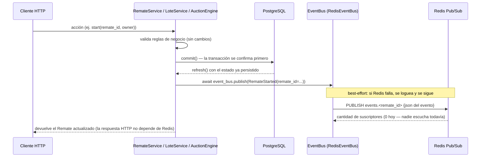

# 19 — Arquitectura de Eventos (Épica 3, Módulo 3.2)

Este documento es la referencia de diseño del sistema interno de eventos: el catálogo de
eventos de dominio, el Event Bus, y cómo se publican sobre Redis Pub/Sub. Complementa
[18-integracion-redis.md](18-integracion-redis.md) (Módulo 3.1, la infraestructura de
Redis que este módulo consume) y [ADR-022](adr/ADR-022-arquitectura-de-eventos.md) (el
razonamiento completo de las decisiones tomadas acá).

## Alcance de este módulo

Se desacopla el dominio de sus futuros consumidores: `Remate`, `Lote` y el Auction
Engine ahora **publican** un evento bien definido cada vez que ocurre una transición
importante, a través de un Event Bus interno. **No hay ningún consumidor todavía** —
publicar un evento hoy no tiene ningún efecto observable más allá de quedar disponible
en un canal de Redis Pub/Sub, sin nadie escuchando. No se implementa: WebSockets, chat,
broadcast, sincronización en tiempo real, ni presencia — eso es la próxima épica.

El único cambio permitido (y aplicado) en el dominio existente es agregar la llamada de
publicación al final de cada transición ya implementada — ninguna validación, regla de
negocio, permiso ni firma de método existente cambió. Ver "Qué se tocó y por qué" más
abajo.

## Catálogo de eventos

Los nombres del enunciado (`AuctionCreated`, `LotOpened`, `BidPlaced`, etc.) se tradujeron
al vocabulario que el proyecto ya usa en todo el dominio (`Remate`, `Lote`, `Oferta` —
nunca `Auction`/`Lot`/`Bid`, salvo el ya establecido "Auction Engine" como nombre del
motor de ofertas, Épica 2.4). Se agregaron algunos eventos no listados explícitamente
por simetría con transiciones que ya existían en el código (`RemateScheduled`,
`RemateResumed`, `RemateCancelled`, `LoteCancelled`) — omitirlos hubiera dejado el
catálogo incompleto respecto al propio motor de estados (Módulo 2.3).

| Evento | Se publica cuando | Módulo |
|---|---|---|
| `RemateCreated` | `RemateService.create` | `remates` |
| `RemateScheduled` | `RemateService.schedule` | `remates` |
| `RemateStarted` | `RemateService.start` | `remates` |
| `RematePaused` | `RemateService.pause` | `remates` |
| `RemateResumed` | `RemateService.resume` | `remates` |
| `RemateFinished` | `RemateService.finish` (manual) y `try_auto_finish` (automático, RF-10) | `remates` |
| `RemateCancelled` | `RemateService.cancel` | `remates` |
| `LoteOpened` | `LoteService.open` / `open_next` | `remates.lotes` |
| `LoteClosed` | `LoteService.close` (`sold` o `unsold`, ver `outcome`) | `remates.lotes` |
| `LoteCancelled` | `LoteService.cancel` | `remates.lotes` |
| `OfertaPlaced` | `AuctionEngine.place_bid`, siempre que se persiste una fila (aceptada o rechazada) | `ofertas` |
| `OfertaAccepted` | `AuctionEngine.place_bid`, cuando la oferta pasa todas las validaciones | `ofertas` |
| `OfertaRejected` | `AuctionEngine.place_bid`, cuando una regla blanda la rechaza (con motivo) | `ofertas` |
| `OfertaWinnerChanged` | `AuctionEngine.place_bid`, cuando una oferta aceptada supera a una vigente anterior | `ofertas` |

**No se publica ningún evento** en: CRUD estructural de Lote (`create`/`update`/
`soft_delete`/`reorder`, Módulo 2.2), `RemateService.update`/`soft_delete`, ni en el
camino de reintento idempotente de `place_bid` (cuando `client_token` ya existe, se
devuelve la oferta anterior sin volver a publicar nada — nada nuevo ocurrió). Ninguna de
esas operaciones es una "acción importante" del ciclo de vida en curso; son
estructurales o, en el caso de la idempotencia, deliberadamente sin efecto.

## Los eventos son objetos, no strings

Cada evento es una clase Pydantic concreta con sus propios campos tipados — nunca un
`dict` suelto ni un string de canal armado a mano. Jerarquía:

```
DomainEvent (app/events/base.py)
├── event_id: UUID (generado automáticamente)
├── occurred_at: datetime (UTC, generado automáticamente)
├── event_type: str (obligatorio, cada subclase lo fija con un Literal)
└── topic (property abstracta -> canal de Redis Pub/Sub)

RemateScopedEvent (app/events/base.py)
├── hereda de DomainEvent
├── remate_id: UUID
└── topic = f"events.{remate_id}"

RemateCreated, RemateScheduled, ... (app/modules/remates/events.py)
LoteOpened, LoteClosed, LoteCancelled (app/modules/remates/lotes/events.py)
OfertaPlaced, OfertaAccepted, OfertaRejected, OfertaWinnerChanged (app/modules/ofertas/events.py)
└── cada una hereda de RemateScopedEvent y agrega sus propios campos
```

`event_type` usa `Literal["remate.created"]` (no un `str` libre): cada clase concreta
fija su propio valor constante, verificado por el chequeo de tipos — es imposible
instanciar un evento con un `event_type` que no le corresponde. Este mismo patrón
(discriminated union de Pydantic) es exactamente lo que un futuro consumidor va a
necesitar para deserializar el JSON que llega por Redis Pub/Sub y despacharlo al
handler correcto según su `event_type`, sin tener que adivinar la forma del payload.

## Por qué un canal por remate, no uno por tipo de evento

Todos los eventos de este sistema están scoped a un `Remate` (`Lote` y `Oferta` son
sub-entidades de su ciclo de vida) y se publican en el **mismo** canal:
`events.<remate_id>`, no `events.remate.created`/`events.lote.opened`/etc. por
separado. La razón es directamente el próximo módulo: un cliente de WebSocket mirando
un remate puntual necesita **todos** sus eventos, sin importar de qué entidad
provienen — con un canal por remate, se suscribe una sola vez; con un canal por tipo de
evento, tendría que suscribirse a 14 canales distintos (y a los que se agreguen
después) y cruzarlos por `remate_id` del lado del cliente. Ver
[ADR-022](adr/ADR-022-arquitectura-de-eventos.md), sección de alternativas, para el
detalle completo.

## El Event Bus

```python
class EventBus(Protocol):
    async def publish(self, event: DomainEvent) -> None: ...
```

Es un `Protocol` (tipado estructural, PEP 544), no una clase concreta ni una interfaz
con herencia obligatoria — el dominio (`RemateService`, `LoteService`, `AuctionEngine`)
declara su dependencia como `event_bus: EventBus` en el constructor, nunca importa nada
de Redis. La única implementación hoy es `RedisEventBus` (`app/events/redis_bus.py`),
inyectada vía `Depends(get_event_bus)` — pero el dominio no lo sabe ni le importa; **no
conoce quién consume los eventos ni cómo se transportan**, tal como pide el enunciado de
este módulo.

**Contrato de `publish`: nunca lanza.** Cualquier implementación de `EventBus` debe
capturar sus propios errores (por ejemplo, Redis caído) y solo registrarlos por log —
publicar un evento es una operación de mejor esfuerzo, nunca puede hacer fallar una
transacción de negocio que ya se confirmó en PostgreSQL. Ver ADR-022 para el porqué
completo (es una extensión directa de [ADR-002](adr/ADR-002-postgres-fuente-de-verdad-y-redis-como-soporte.md)).

## Flujo completo de una publicación



**Orden importa**: el evento se publica **después** de que la transacción ya se
confirmó en Postgres, nunca antes. Si se publicara antes del commit y la transacción
fallara después, un consumidor futuro habría reaccionado a algo que en realidad nunca
pasó — Postgres sigue siendo la única fuente de verdad (ADR-002), el evento es apenas un
aviso de algo que **ya es cierto**.

## Qué se tocó y por qué (único cambio permitido en el dominio)

`RemateService`, `LoteService` y `AuctionEngine` ganaron un parámetro de constructor
(`event_bus: EventBus`) y una llamada a `self._event_bus.publish(...)` al final de cada
método que corresponde a una transición del catálogo — **nada más**. Ninguna
validación, ninguna regla de negocio, ninguna firma de método público, ningún mensaje de
error cambió. Los tres `dependencies.py` correspondientes se actualizaron para inyectar
`get_event_bus`. Es exactamente la extensión que el enunciado autoriza explícitamente:
"el único cambio permitido es que, cuando ocurra una acción importante, publique el
evento correspondiente."

## Por qué esta arquitectura facilita conectar WebSockets sin modificar el dominio

1. **El dominio ya no necesita cambiar cuando aparezcan consumidores.** El próximo
   módulo va a agregar un suscriptor (el handler de WebSocket) al canal
   `events.<remate_id>` — eso es *código nuevo*, no una modificación de
   `RemateService`/`LoteService`/`AuctionEngine`. El dominio ya publica todo lo que un
   cliente en vivo necesita saber; falta únicamente alguien que escuche y reenvíe.
2. **Un canal por remate ya es la forma exacta que necesita una sala de WebSocket.**
   "Suscribite al remate X, recibí todo lo que pasa ahí" es literalmente
   `RedisPubSub.subscribe(f"events.{remate_id}")` — cero adaptación de canal necesaria.
3. **Los eventos ya son JSON tipado con un discriminador (`event_type`).** El handler de
   WebSocket va a poder reenviar el mismo payload que llega de Redis casi sin
   transformarlo, y el cliente (frontend) puede despachar por `event_type` sin ambigüedad.
4. **El contrato "nunca falla" ya está probado.** Cuando WebSockets dependa de que cada
   acción del dominio dispare su evento de forma confiable, ya se sabe que una caída de
   Redis no corrompe ni bloquea ninguna operación de negocio — se degrada la difusión en
   vivo, nunca la escritura en Postgres (mismo argumento que ADR-002/R-04).
5. **La prueba de que el dominio quedó bien desacoplado es que integrarlo con eventos no
   agregó una sola línea de lógica de negocio nueva** — solo llamadas de publicación al
   final de transiciones que ya existían.

## Qué queda para el módulo de tiempo real (próximo)

- Un endpoint/handler de WebSocket que autentique la conexión (RF-16,
  [ADR-006](adr/ADR-006-autenticacion-jwt-en-http-y-websocket.md)) y se suscriba al canal
  del remate que el cliente está mirando.
- Traducir cada evento de dominio a un mensaje de protocolo específico para el frontend
  (probablemente el mismo JSON, o una proyección de él).
- Snapshot completo al conectar/reconectar (RF-16, [ADR-008](adr/ADR-008-snapshot-mas-delta-para-reconexion.md)).
- Presencia y rate limiting de ofertas, apoyados en las capas de Redis ya preparadas
  (Módulo 3.1) pero todavía sin usar.
- La transición `Oferta.ACCEPTED -> WINNING` (al cerrar un lote vendido) sigue sin
  implementarse — cuando exista, publicará su propio evento (`OfertaWon` o similar)
  siguiendo este mismo patrón.
