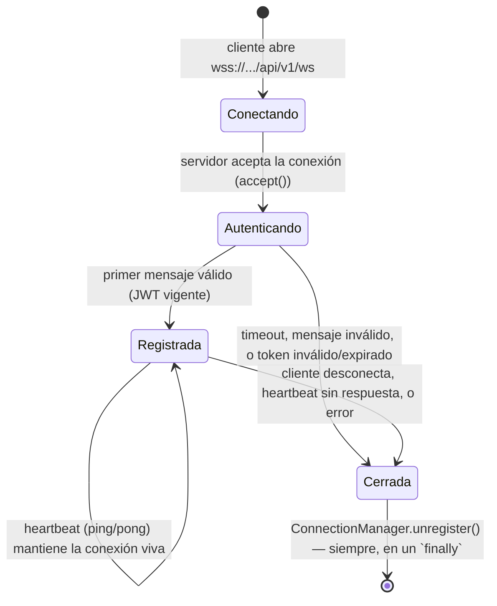
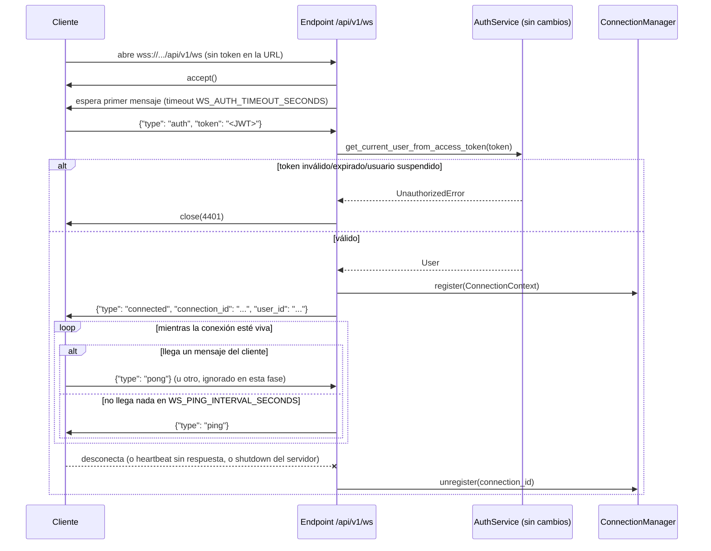

# 20 — Gateway WebSocket (Épica 3, Módulo 3.3)

Este documento es la referencia de diseño del Gateway WebSocket: el endpoint de
conexión, el ciclo de vida de una conexión, la autenticación y el administrador
centralizado de conexiones. Complementa [ADR-003](adr/ADR-003-websockets-nativos-vs-socketio.md)
(WebSockets nativos, protocolo propio) y [ADR-006](adr/ADR-006-autenticacion-jwt-en-http-y-websocket.md)
(autenticación en el primer mensaje, Fase 0 — este módulo la **implementa**, no la
rediseña) y [ADR-023](adr/ADR-023-gateway-websocket.md) (decisiones nuevas de esta fase).

## Alcance de este módulo

Se implementa **únicamente** la infraestructura de conexión: aceptar una conexión
WebSocket, autenticarla con el JWT ya existente, registrarla en un administrador
centralizado, mantenerla viva con heartbeat, y desconectarla limpiamente. **No hay
salas, no hay broadcast, no hay sincronización de remates, no se transmiten ofertas, y
el Gateway no importa nada de `app/modules/` ni de `app/events/`.** Es, deliberadamente,
la pieza más "tonta" posible: administra conexiones, no significados.

## Dónde vive el código

`app/websocket/` — transversal, al mismo nivel que `app/redis/` y `app/events/`. No es
un módulo de dominio: no tiene modelo de base de datos, no conoce `Remate`/`Lote`/
`Oferta`. Mismo criterio que esos dos paquetes: infraestructura reutilizable desde
cualquier módulo futuro, sin que ese módulo futuro tenga que reinventarla.

| Archivo | Responsabilidad |
|---|---|
| `messages.py` | Protocolo de mensajes propio (Pydantic, discriminado por `type`, con `schema_version`) — `AuthMessage`, `ConnectedMessage`, `PingMessage`, `PongMessage`, `ErrorMessage`. |
| `close_codes.py` | Códigos de cierre propios del protocolo (rango 4000-4999, reservado por RFC 6455 para uso de aplicación). |
| `manager.py` | `ConnectionContext` (una conexión registrada) y `ConnectionManager` (el administrador centralizado — registrar, dar de baja, listar, cerrar todas). |
| `auth.py` | `authenticate_connection`: implementa el flujo de ADR-006 (esperar el primer mensaje con timeout, validar el JWT reutilizando `AuthService`, aceptar o rechazar). |
| `dependencies.py` | `get_connection_manager` — expone la instancia única creada en el `lifespan`. |
| `router.py` | El endpoint `@router.websocket("/ws")` y el bucle de vida de la conexión (heartbeat incluido). |

**Los únicos archivos existentes tocados** son los tres puntos de extensión ya
establecidos: `app/main.py` (crear el `ConnectionManager` en el `lifespan` y cerrarlo
prolijamente al apagar, igual que ya se hace con Redis), `app/api/router.py` (una línea
de `include_router`) y `app/core/config.py` (tres variables de configuración nuevas,
con default). **Cero cambios** en `app/modules/auth/` — el Gateway reutiliza
`AuthService.get_current_user_from_access_token` tal cual, sin tocar un carácter de su
código ni del resto del módulo `auth`.

## Ciclo de vida de una conexión



1. **Conectando**: el cliente abre la conexión sin ningún credential en la URL (ADR-006)
   — `wss://.../api/v1/ws`, sin query params de token.
2. **Autenticando**: el servidor acepta la conexión (`websocket.accept()`) y espera el
   primer mensaje, con un timeout (`WS_AUTH_TIMEOUT_SECONDS`, default 10s). El mensaje
   debe ser `{"type": "auth", "token": "<JWT de acceso>"}`. Se valida con
   `AuthService.get_current_user_from_access_token` — el mismo método, sin cambios, que
   ya usa `get_current_user` para HTTP. Si el token es válido, el usuario existe y está
   activo, la conexión pasa a "Registrada" y el servidor responde
   `{"type": "connected", "connection_id": "...", "user_id": "..."}`. Si falla
   cualquier paso (timeout, JSON inválido, token inválido/expirado, usuario suspendido),
   la conexión se cierra con un código específico (ver "Manejo de errores") — nunca se
   registra.
3. **Registrada**: `ConnectionManager.register(context)` — la conexión queda en el
   administrador centralizado, disponible para que módulos futuros la encuentren (por
   `connection_id`, por `user_id`, o iterando todas). El bucle principal alterna entre
   esperar un mensaje del cliente y, si no llega nada dentro del intervalo de
   heartbeat, enviar un `ping`.
4. **Cerrada**: por desconexión del cliente (`WebSocketDisconnect`), por heartbeat sin
   respuesta, por un error inesperado, o porque el servidor se está apagando. En
   **cualquier** caso, `ConnectionManager.unregister(connection_id)` corre en un
   `finally` — nunca queda una conexión fantasma en el registro.

## Autenticación (ADR-006, implementada acá por primera vez)

No hay credenciales en la URL de conexión ni un query param `?token=...` — eso es
exactamente lo que ADR-006 descartó por R-08 (fuga de tokens en logs de proxies). El
flujo es:

1. El servidor **acepta** la conexión incondicionalmente (no hay nada que validar
   todavía — el handshake HTTP inicial de un WebSocket no tiene lugar para un
   `Authorization` header custom sin coordinación previa del lado del cliente).
2. El servidor espera el primer mensaje de aplicación, con un timeout corto. Si no
   llega a tiempo, cierra la conexión (`4408`, ver códigos de cierre).
3. Ese primer mensaje **debe** ser `{"type": "auth", "token": "..."}`. Cualquier otra
   cosa (JSON inválido, `type` distinto, falta el campo `token`) cierra la conexión
   (`4400`).
4. El token se valida con `AuthService.get_current_user_from_access_token(token)` — el
   mismo método que usa la autenticación HTTP (`app/modules/auth/dependencies.py`,
   `get_current_user`), inyectado acá vía `Depends(get_auth_service)` exactamente igual
   que en cualquier endpoint REST. Si el token expiró, la firma no es válida, el usuario
   no existe o está suspendido, `AuthService` levanta `UnauthorizedError` — el Gateway
   la atrapa y cierra la conexión (`4401`).
5. Si todo es válido, se registra la conexión y se responde `{"type": "connected",
   ...}`.

**Ningún código de autenticación se duplicó ni se modificó** — el Gateway es, en los
hechos, un segundo *transporte* para la misma identidad ya validada por HTTP, tal como
ADR-006 ya preveía ("el mismo JWT de corta duración usado en REST se reutiliza acá; no
hay un esquema de autenticación paralelo").

## El administrador centralizado de conexiones (`ConnectionManager`)

```python
class ConnectionContext:
    connection_id: UUID
    user_id: UUID
    websocket: WebSocket
    connected_at: datetime
    last_pong_at: datetime

class ConnectionManager:
    async def register(self, context: ConnectionContext) -> None: ...
    async def unregister(self, connection_id: UUID) -> None: ...
    def get(self, connection_id: UUID) -> ConnectionContext | None: ...
    def connections_for_user(self, user_id: UUID) -> list[ConnectionContext]: ...
    def list_connections(self) -> list[ConnectionContext]: ...
    def count(self) -> int: ...
    async def close_all(self, *, code: int, reason: str) -> None: ...
```

Es una **única instancia por proceso**, creada en el `lifespan` de `app/main.py` (mismo
patrón que el cliente Redis compartido, Módulo 3.1) y expuesta vía
`Depends(get_connection_manager)`. Internamente es un `dict[UUID, ConnectionContext]`
en memoria — sin locks explícitos: todas las conexiones de una misma instancia de
backend corren en el mismo event loop, y una mutación de `dict` entre puntos de `await`
es atómica en asyncio, así que no hace falta sincronización adicional.

**Por qué está indexado por `connection_id` y no por `remate_id`**: todavía no existe
el concepto de "sala" — indexar por algo que no existe sería inventar una sala
disfrazada. `connections_for_user` ya cubre el único agrupamiento que tiene sentido
hoy (todas las conexiones de un mismo usuario, útil por ejemplo para notificarle en
todas sus pestañas abiertas).

**Por qué es explícitamente *por instancia*, no global entre réplicas del backend**: el
registro vive en memoria de un único proceso — dos instancias de backend detrás de un
balanceador tienen cada una su propio `ConnectionManager`, sin conocerse entre sí. Esto
es exactamente lo que ya anticipaban [ADR-002](adr/ADR-002-postgres-fuente-de-verdad-y-redis-como-soporte.md)
y [09-arquitectura-y-decisiones.md](09-arquitectura-y-decisiones.md): la coordinación
*entre* instancias (por ejemplo, "avisale a todos los conectados a este remate, estén
en la instancia que estén") es trabajo de Redis Pub/Sub (Módulo 3.1) y del Event Bus
(Módulo 3.2), no del `ConnectionManager` — que solo necesita saber de las conexiones que
él mismo administra.

## Heartbeat (ping/pong aplicativo)

El bucle principal de cada conexión espera un mensaje del cliente con un timeout
(`WS_PING_INTERVAL_SECONDS`, default 20s). Si no llega nada en ese lapso, el servidor
envía `{"type": "ping"}` y sigue esperando. Si el cliente no responde con
`{"type": "pong"}` dentro de `WS_PONG_TIMEOUT_SECONDS` (default 40s) desde el último
pong recibido, el servidor considera la conexión caída y la cierra (`4000`, ver códigos
de cierre) — libera el recurso en vez de esperar a que el sistema operativo detecte un
socket muerto, que puede tardar minutos u horas en redes inestables.

**Por qué aplicativo y no solo ping/pong de protocolo (RFC 6455)**: el heartbeat de
protocolo (frames de control) depende de la configuración del servidor ASGI concreto
(por ejemplo, `--ws-ping-interval` de uvicorn) y no es inspeccionable ni testeable desde
el código de la aplicación. Un heartbeat a nivel de mensaje, con su propio esquema
versionado, es exactamente el "protocolo propio" que [ADR-003](adr/ADR-003-websockets-nativos-vs-socketio.md)
ya decidió construir a mano en vez de delegarlo a una librería — y es portable a
cualquier servidor ASGI sin depender de sus flags específicas.

## Manejo de errores y códigos de cierre

| Código | Significado | Cuándo |
|---|---|---|
| `4400` | Mensaje inválido | El primer mensaje (o cualquier mensaje del protocolo del Gateway) no es JSON válido o no matchea ningún tipo conocido |
| `4401` | No autorizado | El JWT es inválido, expiró, o el usuario no existe/está suspendido |
| `4408` | Timeout de autenticación | No llegó el mensaje de `auth` dentro de `WS_AUTH_TIMEOUT_SECONDS` |
| `4000` | Heartbeat sin respuesta | No llegó un `pong` dentro de `WS_PONG_TIMEOUT_SECONDS` |
| `1011` | Error interno | Cualquier excepción no prevista en el bucle de la conexión — se loguea con `structlog`, nunca se propaga como un 500 (acá no hay HTTP que devolver) |
| `1001` | Servidor apagándose | `ConnectionManager.close_all()`, disparado desde el `lifespan` al apagar la aplicación |

Todo cierre queda logueado (código, motivo, `connection_id` si ya estaba autenticada) —
mismo criterio de observabilidad que ya usa `RequestContextMiddleware` para HTTP.

## Configuración reutilizable

`app/core/config.py` (Settings) suma: `WS_AUTH_TIMEOUT_SECONDS` (10.0),
`WS_PING_INTERVAL_SECONDS` (20.0), `WS_PONG_TIMEOUT_SECONDS` (40.0) — todas con default
razonable para desarrollo, ajustables por entorno como cualquier otra variable ya
existente. Ningún valor queda hardcodeado dentro de `app/websocket/`.

## Diagrama: cómo se conecta un cliente



## Cómo este Gateway permitirá implementar salas en el siguiente módulo

1. **`ConnectionContext` ya es la unidad que una sala necesita agrupar.** Una "sala"
   (ej. "todos los conectados a este remate") va a ser, técnicamente, un filtro sobre
   `ConnectionManager.list_connections()` o un índice adicional (`dict[remate_id,
   set[connection_id]]`) — una estructura de datos nueva, no una reescritura del
   Gateway. `ConnectionManager` ya expone lo necesario (`get`, `list_connections`) para
   construir eso encima sin tocar su lógica de registro/baja.
2. **`register`/`unregister` ya son `async`,** aunque hoy no hagan ningún `await`
   real — el día que unirse a una sala necesite publicar una señal (por ejemplo, un
   evento de presencia sobre Redis Pub/Sub, `presencia.usuario_conectado` de
   [06-eventos-del-sistema.md](06-eventos-del-sistema.md)), el cambio es agregar ese
   `await` adentro, no cambiar la firma ni ningún call site.
3. **El bucle de vida de la conexión ya tiene un lugar para mensajes nuevos.** Hoy solo
   reconoce `pong` (y descarta silenciosamente cualquier otro tipo); agregar
   `{"type": "join_room", "remate_id": "..."}` es agregar una rama al `match`/`if` que
   despacha por `type`, no reestructurar el bucle.
4. **La separación instancia-local (`ConnectionManager`) vs. cross-instancia (Redis
   Pub/Sub, ya integrado en el Módulo 3.1) ya está resuelta.** Una sala real, con
   múltiples instancias de backend, necesita ambas capas trabajando juntas — y ambas ya
   existen, cada una haciendo exactamente su parte.
5. **Escuchar el Event Bus (Módulo 3.2) es agregar un suscriptor nuevo**, no modificar
   el Gateway ni el Event Bus: un componente futuro (por ejemplo, un
   `RedisPubSub.subscribe(f"events.{remate_id}")` corriendo como tarea de fondo) recibe
   los eventos de dominio y llama a `ConnectionManager` para reenviarlos a las
   conexiones de esa sala — el Gateway sigue sin saber qué es un `Remate`.

## Qué queda para el módulo de salas (implementado — ver Módulo 3.4)

La sección "Cómo este Gateway permitirá implementar salas" (arriba) se cumplió tal cual
estaba prevista: `app/websocket/rooms.py` agrupa conexiones por remate sin que
`manager.py` ni `auth.py` hayan necesitado ningún cambio. Ver
[21-sistema-de-salas.md](21-sistema-de-salas.md) y
[ADR-024](adr/ADR-024-sistema-de-salas.md) para el detalle completo. Lo que sigue
siendo trabajo futuro, ahora del **próximo** módulo (integración del Event Bus con las
salas):

- Escuchar el canal `events.<remate_id>` (Módulo 3.2) y reenviar cada evento a las
  conexiones de la sala correspondiente (`RoomManager.connections_in_room`).
- Snapshot al conectar/reconectar (RF-16, [ADR-008](adr/ADR-008-snapshot-mas-delta-para-reconexion.md)).
- Presencia (contador de conectados por remate) y notificaciones dirigidas
  ("superado").
