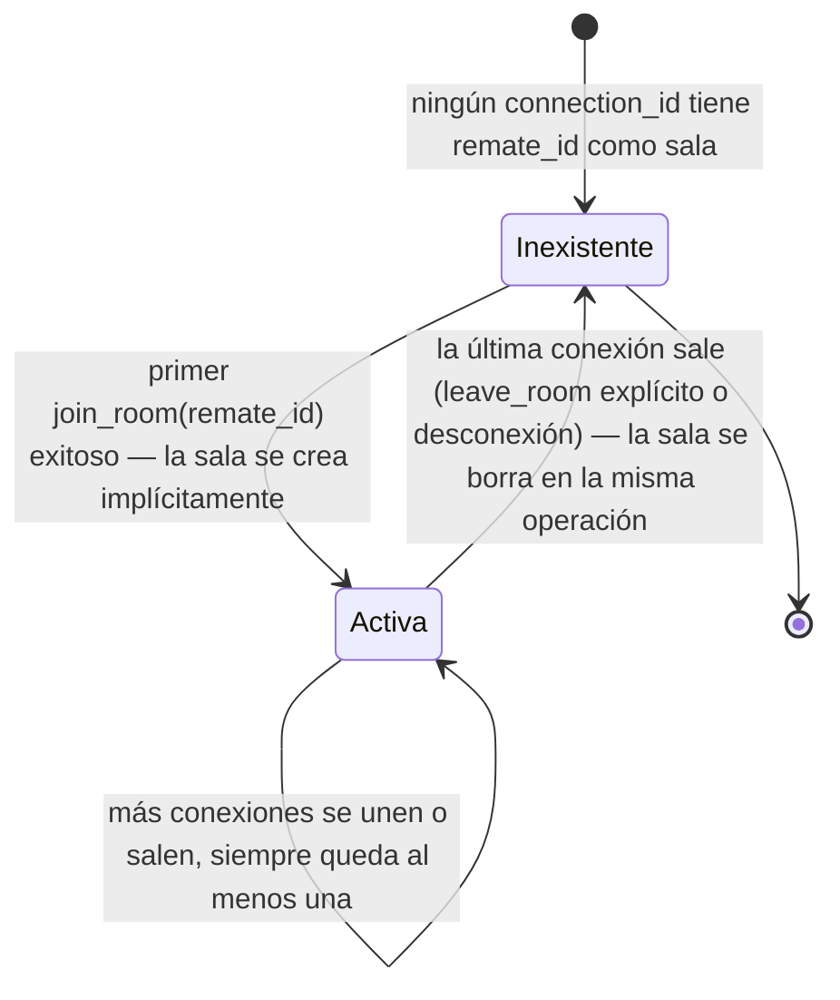
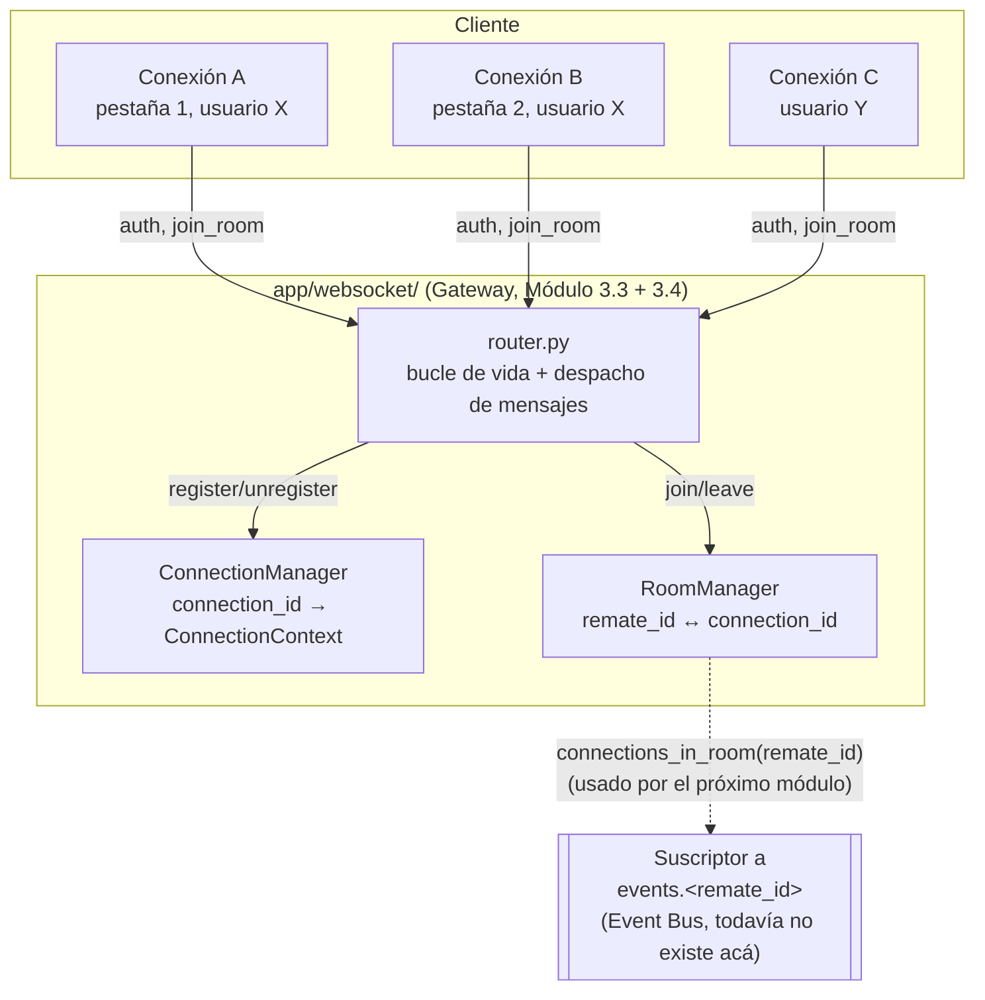

# 21 — Sistema de Salas (Épica 3, Módulo 3.4)

Este documento es la referencia de diseño del sistema de salas: cómo se agrupan
conexiones WebSocket por remate, el ciclo de vida de una sala, y cómo se administran
varias conexiones de un mismo usuario. Complementa
[20-gateway-websocket.md](20-gateway-websocket.md) (Módulo 3.3, que este módulo
extiende sin modificar en su lógica de registro/heartbeat) y
[ADR-024](adr/ADR-024-sistema-de-salas.md) (decisiones de esta fase).

## Alcance de este módulo

Se implementa **únicamente** la administración de salas: creación automática, unión,
salida, eliminación automática de salas vacías, y las métricas básicas de cuántas hay y
quién está en cada una. **No hay broadcast de eventos de dominio, no hay chat, no hay
presencia online, no hay sincronización de ofertas, no hay notificaciones, y no hay
estado de remate.** El sistema de salas no sabe qué es un `Remate` más allá de que su id
es un UUID — es, igual que el Gateway del que depende, deliberadamente "tonto": agrupa
conexiones, no reacciona a lo que pasa en ellas.

## Dónde vive el código

Sigue viviendo en `app/websocket/` — no es un módulo de dominio nuevo, es una extensión
del Gateway existente.

| Archivo | Responsabilidad | Estado |
|---|---|---|
| `rooms.py` | `RoomManager` — administrador centralizado de salas. | **Nuevo** |
| `messages.py` | Suma `JoinRoomMessage`, `LeaveRoomMessage`, `RoomJoinedMessage`, `RoomLeftMessage`. `ErrorMessage` (ya existía, sin uso) se usa por primera vez. | Extendido |
| `dependencies.py` | Suma `get_room_manager`. | Extendido |
| `router.py` | Despacha `join_room`/`leave_room` en el bucle de la conexión; el `finally` que ya limpiaba `ConnectionManager` ahora también limpia `RoomManager`. | Extendido |
| `manager.py`, `auth.py` | Ciclo de vida de conexión y autenticación. | **Sin cambios** |

## El administrador centralizado de salas (`RoomManager`)

```python
class RoomManager:
    async def join(self, remate_id: UUID, connection_id: UUID) -> bool: ...
    async def leave(self, connection_id: UUID) -> UUID | None: ...
    def room_id_for_connection(self, connection_id: UUID) -> UUID | None: ...
    def connections_in_room(self, remate_id: UUID) -> list[UUID]: ...
    def connection_count(self, remate_id: UUID) -> int: ...
    def room_count(self) -> int: ...
    def total_connections(self) -> int: ...
    def list_rooms(self) -> list[UUID]: ...
```

Una única instancia por proceso, creada en el `lifespan` de `app/main.py` (mismo patrón
que `ConnectionManager` y el cliente Redis compartido) y expuesta vía
`Depends(get_room_manager)`. Internamente son dos `dict` en memoria que se mantienen
sincronizados entre sí — ver [ADR-024](adr/ADR-024-sistema-de-salas.md), sección A, para
por qué dos índices y no uno.

**Por qué es independiente de `ConnectionManager`**: `RoomManager` no necesita saber si
un `connection_id` sigue registrado en el Gateway — solo lo consultan mensajes que ya
llegaron a través de una conexión activa (el bucle de `router.py` solo despacha
`join_room`/`leave_room` para conexiones que ya pasaron autenticación), así que esa
garantía la sostiene el flujo de control existente, no una dependencia cruzada entre
managers.

## Ciclo de vida de una sala



Una sala **no tiene un método `create()` ni `delete()` explícito** — no existe como
entidad independiente de sus miembros. `_rooms[remate_id]` aparece la primera vez que
alguien llama `join(remate_id, ...)` con éxito, y desaparece en el mismo `leave()` que
deja su `set` de conexiones vacío. No hay estado intermedio "sala vacía pero todavía
registrada": es una invariante que `RoomManager` mantiene en cada operación, no algo que
haya que barrer después.

## Unión y salida — el protocolo

Estos mensajes solo tienen efecto **después** de que la conexión ya pasó por
autenticación (ADR-006/ADR-023) — no son parte del handshake inicial, son mensajes del
bucle principal, igual que `pong`.

| Mensaje (cliente → servidor) | Respuesta si es válido | Respuesta si es inválido |
|---|---|---|
| `{"type": "join_room", "remate_id": "<uuid>"}` | `{"type": "room_joined", "remate_id": "..."}` | `{"type": "error", "code": "invalid_room_id" \| "already_in_room", "message": "..."}` |
| `{"type": "leave_room"}` | `{"type": "room_left", "remate_id": "..."}` | `{"type": "error", "code": "not_in_room", "message": "..."}` |

Ningún error de sala cierra la conexión — a diferencia de un fallo de autenticación
(ADR-023), estos son recuperables: el cliente sigue conectado, corrige el mensaje (o
manda `leave_room` primero) y reintenta. Ver ADR-024, sección F.

**Validaciones aplicadas** (ADR-024, secciones B y C):

1. `remate_id` debe deserializar como UUID válido — si no, `error/invalid_room_id`, sin
   ningún efecto en el estado.
2. Una conexión no puede estar en dos salas distintas a la vez — un `join_room` a una
   sala diferente de la actual, sin haber salido antes, devuelve
   `error/already_in_room`. Pedir unirse a la sala en la que ya está es idempotente
   (responde `room_joined` de nuevo, sin error).
3. `leave_room` sin estar en ninguna sala devuelve `error/not_in_room`.

**Ninguna validación de dominio**: no se verifica que exista un `Remate` con ese
`remate_id`, ni su estado. Ver ADR-024, sección D, para la justificación completa.

## Cómo se administran varias conexiones del mismo usuario

`RoomManager` indexa por `connection_id`, nunca por `user_id` — mismo criterio que
`ConnectionManager` (docs/20, sección "El administrador centralizado de conexiones").
Un usuario con dos pestañas abiertas tiene dos `connection_id` distintos (una
`ConnectionContext` por conexión, ver docs/20), y cada uno tiene su **propia**
membresía de sala, completamente independiente:

- Puede tener sus dos pestañas mirando el mismo remate → ambos `connection_id` aparecen
  en el mismo `_rooms[remate_id]`. `connection_count(remate_id)` cuenta 2, no 1 — el
  sistema de salas cuenta conexiones, no usuarios (no hay concepto de presencia todavía,
  ver "Qué NO se implementa" más abajo).
- Puede tener una pestaña en el remate A y otra en el remate B → cada `connection_id`
  aparece en la sala correspondiente, sin que una interfiera con la otra. La invariante
  "una sala por conexión" (ADR-024, sección B) es *por conexión*, nunca por usuario —
  nada en este módulo impide que un mismo usuario esté, a través de conexiones
  distintas, en salas distintas o en la misma sala varias veces.
- Si cierra una pestaña, solo esa conexión sale de su sala (ver siguiente sección) — la
  otra sigue intacta.

## Manejo de desconexiones inesperadas

No hay lógica nueva de detección de desconexión — se apoya enteramente en el `finally`
que `router.py` ya tenía (docs/20, "Cerrada: ... `ConnectionManager.unregister()` corre
en un `finally` — nunca queda una conexión fantasma"). Ese mismo bloque ahora también
llama a `room_manager.leave(connection_id)`:

```python
finally:
    await room_manager.leave(context.connection_id)
    await manager.unregister(context.connection_id)
```

Cubre, sin distinción, los mismos cuatro casos que ya cubría `ConnectionManager`:
desconexión del cliente, heartbeat sin respuesta, error interno no previsto, y apagado
del servidor (`ConnectionManager.close_all()` fuerza el cierre del socket, lo que hace
que el bucle de esa conexión termine y pase por este mismo `finally`). `leave()` es
un no-op seguro (devuelve `None`, no lanza) si la conexión nunca se unió a ninguna sala
— la mayoría de las conexiones del Módulo 3.3 (que todavía no sabían de salas) caen en
este caso, y va a seguir pasando con cualquier cliente que se conecte sin unirse a
ninguna sala.

## Métricas

`RoomManager` expone lo que pidió el enunciado, como métodos — sin un endpoint HTTP
todavía (ADR-024, sección H):

- `room_count()` — cantidad de salas activas.
- `connection_count(remate_id)` — cantidad de conexiones en una sala puntual.
- `total_connections()` — cantidad total de conexiones que están, ahora mismo, dentro de
  alguna sala (puede ser menor que `ConnectionManager.count()`: hay conexiones
  autenticadas que todavía no se unieron a ninguna sala).
- `list_rooms()` — los `remate_id` de todas las salas activas.

## Diagrama de arquitectura



## Qué NO se implementa en este módulo

Explícitamente fuera de alcance (enunciado de la épica):

- Broadcast de eventos del dominio a las conexiones de una sala.
- Chat entre conexiones de una misma sala.
- Presencia online (contadores visibles para otros usuarios, notificaciones de
  entrada/salida).
- Sincronización de ofertas.
- Notificaciones.
- Estado del remate.
- Validación de que `remate_id` corresponda a un `Remate` real (ver ADR-024, sección D).

## Cómo este módulo prepara la integración del Event Bus (próxima etapa)

1. **`RoomManager.connections_in_room(remate_id)` ya devuelve exactamente la lista que
   un suscriptor futuro necesita** para saber a quién reenviar un evento publicado en
   `events.<remate_id>` (Módulo 3.2) — no hace falta ninguna estructura de datos nueva,
   solo iterar esa lista.
2. **`ConnectionManager.get(connection_id)` ya resuelve el `WebSocket` real** de cada
   `connection_id` que devuelva `connections_in_room` — el suscriptor futuro combina
   ambos managers (`RoomManager` para "quién", `ConnectionManager` para "cómo
   mandarle"), sin que ninguno de los dos necesite conocer al otro ni cambiar su API.
3. **El suscriptor es un componente nuevo, no una modificación de este módulo**: una
   tarea de fondo (o una por sala activa) que hace
   `RedisPubSub.subscribe(f"events.{remate_id}")` y, por cada evento recibido, llama
   `connections_in_room` + `ConnectionManager.get` + `websocket.send_text(...)` con la
   traducción de `DomainEvent` a un mensaje de protocolo del Gateway. Ni `RoomManager`
   ni `ConnectionManager` ni el bucle de heartbeat de `router.py` deberían necesitar
   cambios — mismo patrón que ADR-023 ya había previsto para este módulo, ahora un nivel
   más adelante.
4. **La eliminación automática de salas vacías (sección "Ciclo de vida" arriba) ya
   resuelve cuándo un suscriptor debería darse de baja de un canal**: si
   `room_count()` — o específicamente, si `remate_id not in list_rooms()` — la sala ya
   no tiene conexiones, y el suscriptor a ese canal puede cancelarse sin perder ningún
   evento relevante (nadie está escuchando).

## Checklist del módulo

- [x] Creación automática de salas (implícita en el primer `join` exitoso).
- [x] Unión de usuarios a una sala (`join_room` → `RoomManager.join`).
- [x] Salida de usuarios de una sala (`leave_room` → `RoomManager.leave`).
- [x] Eliminación automática de salas vacías (integrada en `leave`).
- [x] Administrador centralizado de salas (`RoomManager`, instancia única por proceso).
- [x] Asociación entre conexión y sala (índice `connection_id → remate_id`).
- [x] Manejo seguro de desconexiones inesperadas (reutiliza el `finally` de
      `router.py`, `leave()` es no-op seguro).
- [x] Validaciones para impedir uniones inválidas (UUID inválido, ya en otra sala,
      salir sin estar en ninguna).
- [x] Una conexión, a lo sumo, una sala — verificado con múltiples conexiones del mismo
      usuario en la misma sala y en salas distintas.
- [x] Métricas: salas activas, conexiones por sala, conexiones totales en salas.
- [x] Arquitectura preparada para integrar el Event Bus sin modificar
      `ConnectionManager`, `RoomManager` ni el bucle de heartbeat.
- [x] Integración con el Gateway WebSocket (`router.py`), sin tocar `manager.py` ni
      `auth.py`.
- [x] Tests unitarios (`RoomManager` en aislamiento) e integración (a través del
      endpoint `/api/v1/ws` real).
- [x] Documentación y ADR actualizados.
