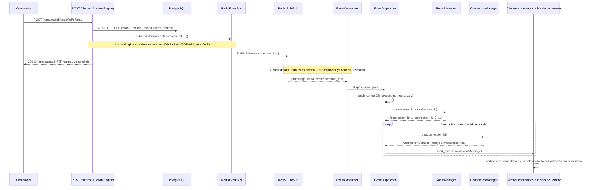

# 22 — Sincronización de eventos en tiempo real (Épica 3, Módulo 3.5)

Este documento es la referencia de diseño del Event Consumer: el componente que conecta
la arquitectura de eventos ([19-arquitectura-de-eventos.md](19-arquitectura-de-eventos.md),
Módulo 3.2) con el sistema de salas ([21-sistema-de-salas.md](21-sistema-de-salas.md),
Módulo 3.4), para que los eventos que el dominio ya publica lleguen automáticamente a
los clientes conectados al remate correspondiente. Complementa
[ADR-025](adr/ADR-025-sincronizacion-tiempo-real.md) (decisiones de esta fase).

## Alcance de este módulo

Se implementa **únicamente** la sincronización de estado: un evento de dominio ya
publicado (Módulo 3.2) llega, sin que el cliente pida nada por HTTP, a las conexiones
WebSocket de la sala de ese remate. **No hay chat, no hay notificaciones push, no hay
presencia online, no hay streaming de video, no hay mensajería entre usuarios.** Esos
son, todos, consumidores futuros de la misma arquitectura — no se construyen acá (ver
"Cómo esta arquitectura permitirá agregarlos" más abajo).

## Restricciones de esta fase (y cómo se cumplieron)

| Restricción | Cómo se cumple |
|---|---|
| No modificar el dominio (`app/modules/remates/`, `.../lotes/`) | Cero archivos tocados — el Event Consumer solo *importa* las clases de evento ya existentes. |
| No modificar el Auction Engine (`app/modules/ofertas/`) | Cero archivos tocados — mismo criterio. `engine.py` sigue dependiendo únicamente de `EventBus` (`Protocol`), sin saber que existe Redis Pub/Sub del otro lado ni que existen WebSockets. |
| No modificar el Gateway WebSocket (`app/websocket/router.py`, `auth.py`, `messages.py`, `close_codes.py`, `dependencies.py`, `utils.py`) | Cero archivos tocados. El Event Consumer escribe directamente en el `WebSocket` de cada `ConnectionContext` — un objeto que el Gateway ya exponía vía `ConnectionManager.get()` desde el Módulo 3.3. |
| No modificar el Room Manager (`app/websocket/rooms.py`) | Cero archivos tocados. `RoomManager.connections_in_room()` ya existía, pensado exactamente para este momento (ver ADR-024, sección final). |
| No modificar el sistema de autenticación (`app/modules/auth/`) | Cero archivos tocados — el Event Consumer no autentica nada, corre como tarea de fondo del proceso, no por conexión. |
| No modificar la estructura del Event Bus (`app/events/`) | Cero archivos tocados. `RedisEventBus.publish` es exactamente el mismo método que ya usaba el dominio desde el Módulo 3.2. |
| Solo `app/main.py` (lifespan) y `app/core/config.py` (dos settings nuevas) se tocan, fuera del paquete nuevo `app/realtime/` — mismo patrón que cada módulo anterior (Redis, Event Bus, Gateway, Salas) al integrarse. |

Verificado, además de por revisión manual, con un test estático de límites de import
(`tests/test_architecture_boundaries.py`) que falla si `app/websocket/` o
`app/modules/ofertas/`/`app/modules/remates/` llegan a importar algo de `app/realtime/`.

## Dónde vive el código

`app/realtime/` — paquete transversal nuevo, al mismo nivel que `app/redis/`,
`app/events/` y `app/websocket/`. Es, a propósito, el único paquete que conoce ambos
mundos.

| Archivo | Responsabilidad |
|---|---|
| `registry.py` | Whitelist: `event_type -> clase Pydantic concreta`, para los eventos que se sincronizan. |
| `messages.py` | `DomainEventMessage` — extiende `WSMessage` (Módulo 3.3, sin modificarlo) con el envelope de salida. |
| `dispatcher.py` | `EventDispatcher` — interpreta el JSON crudo, resuelve la sala, entrega el mensaje. |
| `consumer.py` | `EventConsumer` — tarea de fondo: suscripción a Redis Pub/Sub, reconexión, logging. |

## Diagrama completo de la arquitectura en tiempo real

```mermaid
flowchart TB
    subgraph Dominio["Dominio (sin cambios)"]
        AE["AuctionEngine / RemateService / LoteService"]
        EB["EventBus (Protocol) — app/events/bus.py"]
        REB["RedisEventBus.publish() — app/events/redis_bus.py"]
        AE -->|"event_bus.publish(evento)"| EB
        EB --> REB
    end

    subgraph Redis["Redis (Módulo 3.1)"]
        PS[("Pub/Sub — canal events.&lt;remate_id&gt;")]
    end

    subgraph Realtime["app/realtime/ (Módulo 3.5 — ÚNICO puente)"]
        EC["EventConsumer<br/>psubscribe('events.*')"]
        ED["EventDispatcher<br/>interpreta + resuelve sala + entrega"]
        REG[["registry.py<br/>whitelist de event_type"]]
        EC --> ED
        ED -.-> REG
    end

    subgraph Gateway["app/websocket/ (Módulos 3.3/3.4 — sin cambios)"]
        CM["ConnectionManager<br/>connection_id → WebSocket"]
        RM["RoomManager<br/>remate_id → {connection_id}"]
    end

    subgraph Clientes
        C1["Conexión A — sala remate_X"]
        C2["Conexión B — sala remate_X"]
        C3["Conexión C — sala remate_Y"]
    end

    REB -->|publish| PS
    PS -->|psubscribe, listen| EC
    ED -->|"connections_in_room(remate_id)"| RM
    ED -->|"get(connection_id) → websocket"| CM
    ED -->|"websocket.send_text(domain_event)"| C1
    ED -->|"websocket.send_text(domain_event)"| C2
    C3 -.->|"no recibe nada de remate_X"| ED
```



## Flujo completo: de una oferta a que todos los clientes se enteren

Ejemplo concreto con `BidAccepted`/`OfertaAccepted`, de punta a punta:



**Punto clave**: el comprador que ofertó ya recibió su `200 OK` por HTTP antes de que el
evento siquiera llegue a Redis — el camino de tiempo real es completamente independiente
del camino de request/response. Todos los clientes conectados a esa sala (incluido, si
está conectado por WebSocket, el propio comprador que ofertó) se enteran por el mismo
mecanismo, sin ninguna solicitud HTTP nueva.

## El Event Consumer

`EventConsumer` es una única tarea de fondo por proceso (`asyncio.create_task`),
arrancada en el `lifespan` de `app/main.py` junto con los demás componentes de
infraestructura (Redis, `ConnectionManager`, `RoomManager`). Su responsabilidad es
enteramente de transporte:

1. Se suscribe por **patrón** (`psubscribe("events.*")`) sobre el cliente Redis
   compartido — un único suscriptor para todos los remates, no uno por sala (ver
   ADR-025, sección B, para por qué).
2. Sondea `pubsub.get_message(timeout=...)` en un bucle, **secuencialmente**: procesa
   un mensaje, espera que termine de despacharse, recién ahí pasa al siguiente. Esto no
   es una limitación de rendimiento accidental — es lo que garantiza que el consumer
   nunca tenga dos envíos en simultáneo hacia la misma conexión (ver ADR-025, sección C,
   y "Cómo se garantiza que llega a la sala correcta" más abajo). No usa
   `async for message in pubsub.listen()` a propósito: esa lectura bloqueante no tiene
   timeout propio, así que hereda el `socket_timeout` de la conexión Redis compartida
   (`app/redis/client.py`, 5s, pensado para acotar comandos normales) y una ventana idle
   de más de 5s sin publicaciones nuevas se veía como una desconexión real — reproducido
   en producción, ver `docs/13-mvp-y-roadmap.md`.
3. Si la suscripción falla o se cae en medio de la escucha, reintenta con backoff
   exponencial (`REALTIME_CONSUMER_RETRY_BASE_SECONDS` → `REALTIME_CONSUMER_RETRY_MAX_SECONDS`,
   configurables), reseteando el contador de intentos cada vez que una reconexión tiene
   éxito.
4. Un error al procesar un mensaje puntual no cuenta como caída de conexión: se loguea
   y se sigue escuchando, sin reconectar innecesariamente.
5. Se detiene limpiamente (`stop()`, cancela la tarea) desde el `lifespan`, antes de
   cerrar `ConnectionManager`/Redis al apagar el proceso.

## El Dispatcher

`EventDispatcher.dispatch(raw_payload)` es el único método público, llamado por
`EventConsumer` una vez por mensaje. Hace, en orden, todo lo que la épica pidió:

1. **Interpreta el tipo de evento**: parsea el JSON, busca `event_type` en
   `registry.py`. Si no está registrado, lo descarta (log en `debug`) — nunca reenvía
   algo que nadie decidió explícitamente sincronizar.
2. **Revalida el payload** contra la clase Pydantic concreta (`OfertaAccepted`,
   `LoteOpened`, etc.) — si no matchea el schema exacto (campos faltantes, tipos
   incorrectos), lo descarta con un log de advertencia. Nunca reenvía un `dict` sin
   tipar a un cliente.
3. **Determina a qué sala pertenece**: lee `remate_id` directamente del evento ya
   validado (todo evento sincronizable es un `RemateScopedEvent` — el campo siempre
   existe, no hace falta parsear el nombre del canal).
4. **Publica únicamente a esa sala**: `RoomManager.connections_in_room(remate_id)` da
   la lista exacta de conexiones; si está vacía, no hace nada más (nadie mirando ese
   remate ahora mismo).
5. **Entrega el mensaje**: por cada `connection_id`, resuelve el `WebSocket` real vía
   `ConnectionManager.get()` y llama `send_text()`. Una conexión que ya no está
   registrada (se desconectó justo entre que `RoomManager` armó la lista y este envío)
   se salta sin error — `router.py` ya se encarga de darla de baja en su propio
   `finally` (Módulos 3.3/3.4, sin tocar). Un `send_text` que falla en una conexión no
   frena la entrega a las demás de la misma sala.

## Cómo se garantiza que únicamente la sala correcta recibe cada evento

Tres capas independientes, cada una ya construida por un módulo anterior sin saber que
este módulo iba a existir:

1. **El evento ya trae su propio `remate_id`** (`RemateScopedEvent`, Módulo 3.2) — no
   hay ambigüedad ni inferencia: el dispatcher lee un campo, no adivina un destino.
2. **`RoomManager` es, por construcción, un índice exacto de "quién está en qué sala"**
   (Módulo 3.4) — `connections_in_room(remate_id)` nunca devuelve una conexión que no
   pidió unirse explícitamente a esa sala (`join_room`, con sus propias validaciones ya
   cubiertas por ADR-024).
3. **`ConnectionManager.get(connection_id)` resuelve exactamente ese socket, no otro**
   (Módulo 3.3) — no hay un paso intermedio de "broadcast a todos y que el cliente
   filtre": el servidor decide a quién le manda cada mensaje, uno por uno.

Un cliente en la sala del remate `Y` nunca recibe un evento del remate `X` porque nunca
aparece en el resultado de `connections_in_room(X)` — no hay ningún camino de código que
le entregue ese mensaje. Verificado en
`tests/test_realtime_sync.py::test_domain_event_reaches_only_connections_in_the_matching_room`.

## Eventos sincronizados

Los 10 pedidos por la épica, mapeados a las clases ya existentes del catálogo de
dominio (Módulo 3.2), más 2 agregados por aportar el mismo valor de "avisar un cambio de
estado visible" (ver ADR-025, sección D, para la justificación completa):

| Nombre de la épica | Clase real (`app/modules/.../events.py`) | `event_type` |
|---|---|---|
| `AuctionStarted` | `RemateStarted` | `remate.started` |
| `AuctionPaused` | `RematePaused` | `remate.paused` |
| `AuctionResumed` | `RemateResumed` | `remate.resumed` |
| `AuctionFinished` | `RemateFinished` | `remate.finished` |
| — (agregado) | `RemateCancelled` | `remate.cancelled` |
| `LotOpened` | `LoteOpened` | `lote.opened` |
| `LotClosed` | `LoteClosed` | `lote.closed` |
| — (agregado) | `LoteCancelled` | `lote.cancelled` |
| `BidPlaced` | `OfertaPlaced` | `oferta.placed` |
| `BidAccepted` | `OfertaAccepted` | `oferta.accepted` |
| `BidRejected` | `OfertaRejected` | `oferta.rejected` |
| `BidWinnerChanged` | `OfertaWinnerChanged` | `oferta.winner_changed` |

Agregar uno nuevo (por ejemplo, si a futuro se sincroniza `RemateCreated`) es sumar la
clase a `SYNCED_EVENTS` en `registry.py` — una línea, sin tocar `dispatcher.py`,
`consumer.py` ni ningún otro módulo.

## Forma del mensaje que recibe el cliente

```json
{
  "schema_version": 1,
  "type": "domain_event",
  "event_type": "oferta.accepted",
  "remate_id": "5c6c...",
  "occurred_at": "2026-07-20T15:04:03.120Z",
  "payload": {
    "event_id": "9f21...",
    "occurred_at": "2026-07-20T15:04:03.120Z",
    "event_type": "oferta.accepted",
    "remate_id": "5c6c...",
    "oferta_id": "a831...",
    "lote_id": "77e0...",
    "buyer_id": "1b44...",
    "amount": "1500.00"
  }
}
```

`type`/`event_type`/`remate_id`/`occurred_at` en el nivel superior son para que el
cliente pueda enrutar/filtrar sin descender a `payload`; `payload` es el evento de
dominio completo (`model_dump(mode="json")`), para que el cliente tenga todos los
campos específicos de cada tipo sin que el Gateway tenga que mantener un mapeo campo por
campo.

## Configuración

`app/core/config.py` suma `REALTIME_CONSUMER_RETRY_BASE_SECONDS` (1.0) y
`REALTIME_CONSUMER_RETRY_MAX_SECONDS` (30.0) — backoff de reconexión, con default
razonable para desarrollo, ajustable por entorno como cualquier otra variable existente.

## Manejo de errores — resumen

| Situación | Qué pasa |
|---|---|
| Redis se cae mientras el consumer escucha | `EventConsumer` reintenta con backoff exponencial hasta reconectar. |
| Falla el `psubscribe` inicial | Igual que arriba — el `_run` no distingue "nunca se conectó" de "se desconectó". |
| Llega un JSON inválido por el canal | `EventDispatcher` lo descarta, log de advertencia, sigue escuchando. |
| Llega un `event_type` no registrado | Se descarta, log en `debug` (esperado, no es un error). |
| El payload no matchea el schema Pydantic del tipo registrado | Se descarta, log de advertencia. |
| Un evento roto tira una excepción inesperada dentro de `dispatch` | `EventConsumer` la atrapa alrededor de cada mensaje individual — no interrumpe la escucha del canal. |
| Una sala no tiene conexiones | No-op silencioso (`debug` log), no es un error. |
| Una conexión de la sala ya no está en `ConnectionManager` | Se salta esa conexión, se sigue con las demás. |
| `send_text` falla en una conexión puntual | Se loguea, se sigue con las demás conexiones de la sala. |

## Cómo esta arquitectura permitirá agregar Chat, Notificaciones y Presencia Online sin modificar el Auction Engine

El punto de extensión para los tres es el mismo, y ya existe:

1. **Chat**: no es un evento de dominio — es un mensaje que el propio Gateway podría
   despachar (como ya hace con `join_room`/`leave_room`, Módulo 3.4) hacia
   `RoomManager.connections_in_room(remate_id)`, sin pasar por Redis Pub/Sub ni por este
   módulo en absoluto. Si en cambio se decide que el chat necesita persistencia o
   coordinación entre instancias de backend, se modela como un evento más
   (`ChatMessageSent`) publicado por un futuro módulo de dominio `chat`, sincronizado
   agregando su clase a `registry.py` — el Auction Engine no se entera de que existe.
   **Implementado en el Módulo 6.4** — se confirmó la segunda vía: el chat sí necesita
   persistencia (mensajes con historial paginado, moderación) y se modeló como un
   módulo de dominio propio (`app/modules/chat/`), con `ChatMessageSent`/
   `ChatMessageDeleted`/`ChatUserTyping` agregados a `SYNCED_EVENTS`
   (`registry.py`), exactamente como se anticipaba acá. Los mensajes de sistema del
   ciclo de vida del remate (inicio/pausa/apertura de lote/etc.) se generan con un
   **segundo** `EventConsumer`, independiente del de este módulo — ver
   [34-chat-del-remate.md](34-chat-del-remate.md) y
   [ADR-037](adr/ADR-037-chat-del-remate.md) para el detalle completo, y ADR-025,
   sección "Consecuencias", para la confirmación de esa predicción específica.
2. **Notificaciones**: son, típicamente, el mismo evento de dominio que ya se sincroniza
   (`OfertaWinnerChanged`, por ejemplo) pero dirigido a un usuario específico en vez de a
   toda la sala. `ConnectionManager.connections_for_user(user_id)` (Módulo 3.3, ya
   existe) es exactamente lo que un `NotificationDispatcher` nuevo necesitaría — mismo
   patrón que `EventDispatcher`, un componente hermano en `app/realtime/` que resuelve
   destino por usuario en vez de por sala. El Auction Engine sigue publicando el mismo
   evento de siempre; qué consumidor lo traduce a qué mensaje es decisión de la capa de
   tiempo real, no del dominio.
3. **Presencia online**: un contador de conectados por sala ya es trivial de calcular
   hoy (`RoomManager.connection_count(remate_id)`, Módulo 3.4) — falta únicamente
   *anunciarlo*. Eso es un evento más (`presencia.usuario_conectado`, ya nombrado en
   [06-eventos-del-sistema.md](06-eventos-del-sistema.md) desde Fase 0) sincronizado con
   el mismo `EventDispatcher` que ya existe. El Auction Engine no participa en absoluto.
   **Implementado en el Módulo 6.2** — con una salvedad respecto a lo que se anticipaba
   acá: el `event_bus.publish(...)` **no** terminó agregado dentro de
   `RoomManager.join`/`leave` (eso hubiera roto su firma de cero argumentos y los tests
   que ya lo instancian así); en cambio, un `PresenceService` nuevo
   (`app/presence/`) envuelve a `RoomManager` desde afuera sin modificarlo. Ver
   [33-sistema-de-presencia.md](33-sistema-de-presencia.md) y
   [ADR-036](adr/ADR-036-sistema-de-presencia.md), sección B, para el detalle completo
   de por qué cambió el plan.

En los tres casos, el patrón se repite: **el dominio (Auction Engine incluido) sigue
publicando eventos sin saber quién los consume; `app/realtime/` decide qué hacer con
cada uno; el Gateway sigue sin saber qué es un evento de dominio.** Ninguna de las tres
features requiere reabrir `app/modules/ofertas/engine.py`.

## Checklist del módulo

- [x] Event Consumer que escucha eventos publicados vía Redis Pub/Sub (`psubscribe`,
      patrón único).
- [x] Interpreta el tipo de evento (whitelist + revalidación contra el schema Pydantic
      exacto).
- [x] Determina a qué sala pertenece (`remate_id` del propio evento).
- [x] Publica únicamente a la sala correspondiente
      (`RoomManager.connections_in_room` + `ConnectionManager.get`).
- [x] Al menos los 10 eventos pedidos integrados, más 2 adicionales que aportan valor
      (`RemateCancelled`, `LoteCancelled`).
- [x] Los clientes reciben los cambios sin ninguna solicitud HTTP nueva (verificado en
      `test_realtime_sync.py`).
- [x] El Auction Engine nunca importa nada de WebSockets (verificado estáticamente en
      `test_architecture_boundaries.py`).
- [x] El Gateway nunca importa nada de lógica de negocio (verificado igual).
- [x] Consumer de Redis Pub/Sub (`EventConsumer`).
- [x] Dispatcher de eventos (`EventDispatcher`).
- [x] Integración con Room Manager (lectura, sin modificarlo).
- [x] Broadcast por sala (secuencial, con razón documentada de por qué alcanza sin
      lock por conexión).
- [x] Manejo de errores en cada capa (JSON inválido, tipo no registrado, payload
      inválido, entrega fallida, sala vacía).
- [x] Reconexión automática con backoff exponencial y reseteo tras éxito.
- [x] Logging estructurado en cada paso relevante (`structlog`, mismo criterio que el
      resto del proyecto).
- [x] Tests de integración de punta a punta (`test_realtime_sync.py`, Redis real) +
      tests de aislamiento del dispatcher/consumer (`test_realtime_dispatcher.py`,
      `test_realtime_consumer.py`) + test estático de límites de import
      (`test_architecture_boundaries.py`).
- [x] Documentación y ADR actualizados.
