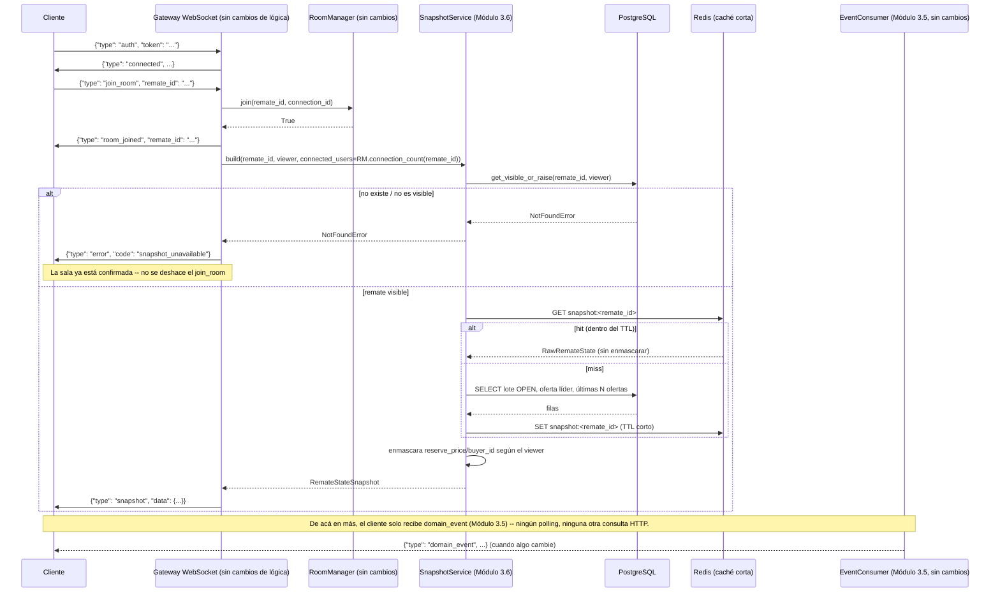

# 23 — Snapshot Service (Épica 3, Módulo 3.6)

Este documento es la referencia de diseño del Snapshot Service: el componente que
reconstruye el estado completo y actual de un remate para un cliente que se conecta a
mitad de un remate en vivo. Complementa
[22-sincronizacion-tiempo-real.md](22-sincronizacion-tiempo-real.md) (Módulo 3.5, cuyo
Event Consumer sigue sin modificar) y [ADR-026](adr/ADR-026-snapshot-service.md)
(decisiones de esta fase).

## Alcance de este módulo

Reconstruir, bajo demanda, el estado completo de un remate: información y estado del
remate, lote activo y su estado, oferta ganadora actual, historial reciente de ofertas
(últimas N) y cantidad de conexiones activas en la sala — todo lo que un cliente
necesita para renderizar la interfaz **antes** de empezar a recibir eventos nuevos. El
Gateway WebSocket usa este servicio en un único punto (justo después de entrar
correctamente a una sala); también existe un endpoint HTTP equivalente, para demostrar
que el servicio no depende de ningún transporte en particular.

## Restricciones de esta fase (y cómo se cumplieron)

| Restricción | Cómo se cumple |
|---|---|
| No modificar el dominio (`app/modules/remates/`, `.../lotes/`, `app/modules/ofertas/`) | Cero archivos tocados — `SnapshotService` solo *llama* métodos y consultas ya públicos, o arma sus propias consultas de solo lectura sobre los modelos ya existentes. |
| No modificar el Auction Engine | Cero archivos tocados. |
| No modificar el Event Bus (`app/events/`) | Cero archivos tocados. |
| No modificar Redis (`app/redis/`) | Cero archivos tocados — se reutiliza `RedisCache` tal cual, y se construye un `RedisEventBus`/`RedisPubSub` propio (ver más abajo) sin tocar ningún archivo del paquete. |
| No modificar el Gateway WebSocket (`app/websocket/router.py`, `manager.py`, `auth.py`, `messages.py`, `close_codes.py`, `dependencies.py`) | Un único cambio permitido y aplicado: `router.py` gana la llamada a `SnapshotService.build` dentro de `_handle_join_room` (el punto de integración que la épica pidió explícitamente). Cero cambios en `manager.py`, `auth.py`, `messages.py`, `close_codes.py`, `dependencies.py`. |
| No modificar el Room Manager (`app/websocket/rooms.py`) | Cero archivos tocados — se sigue sin validar `remate_id` contra el dominio al unirse a una sala (ADR-024, sección D, sin reabrir). |
| No modificar el Event Consumer (`app/realtime/`) | Cero archivos tocados. |

Verificado, además de por revisión manual, con tests de límites de import nuevos en
`tests/test_architecture_boundaries.py` (`SnapshotService` nunca importa
`app.websocket`/`app.realtime`, salvo la única excepción documentada de
`messages.py`).

## Dónde vive el código

`app/snapshot/` — paquete transversal nuevo, al mismo nivel que `app/redis/`,
`app/events/`, `app/websocket/` y `app/realtime/`.

| Archivo | Responsabilidad |
|---|---|
| `schemas.py` | DTOs: `OfertaSnapshotEntry` (nuevo), `RawRemateState` (forma cacheable, sin enmascarar), `RemateStateSnapshot` (envelope público, reutiliza `RemateRead`/`LoteRead`). |
| `service.py` | `SnapshotService` — el único componente con lógica real. |
| `dependencies.py` | `get_snapshot_service`, más los adaptadores `HTTPConnection` que hacen que funcione desde HTTP y WebSocket por igual (ver ADR-026, sección F). |
| `messages.py` | `SnapshotMessage` — extiende `WSMessage` (Módulo 3.3, sin modificarlo). Único archivo que conoce el Gateway. |
| `router.py` | `GET /remates/{remate_id}/snapshot` — demuestra la reutilización por HTTP. |

## Diagrama: flujo de conexión de un usuario

## El Snapshot Service

`SnapshotService.build(remate_id, viewer, *, connected_users=0)` es el único método
público. Internamente:

1. **Visibilidad**: `RemateService.get_visible_or_raise` (sin modificar) — mismo
   criterio que ya usa `GET /remates/{id}`. Si el remate no existe o no es visible para
   `viewer`, levanta `NotFoundError` — nunca se construye un snapshot parcial de algo
   que el viewer no debería ver.
2. **Lote activo**: una consulta propia y optimizada (`SELECT ... WHERE status = 'open'
   LIMIT 1`, apoyada en el índice único parcial de ADR-017) — nunca trae todos los
   lotes del remate para filtrar en Python.
3. **Oferta ganadora**: `OfertaRepository.get_leading_offer` (ya existía, `O(1)` vía
   índice).
4. **Historial reciente**: `OfertaRepository.list_by_lote(offset=0, limit=N)` — la
   misma paginación ya usada por el historial completo, acá acotada a las últimas `N`
   (`SNAPSHOT_RECENT_OFFERS_LIMIT`, default 10).
5. **Conexiones activas**: recibida como parámetro (`connected_users`), nunca calculada
   por el propio servicio — ver "Por qué es reutilizable" más abajo.
6. **Enmascarado**: `reserve_price` (del lote) y `buyer_id` (de la oferta ganadora y del
   historial) se ocultan si `viewer` no es el dueño del remate ni un administrador —
   mismo criterio de privacidad que ya aplica `LoteService`/`LeadingOfferRead`
   (ver ADR-026, sección D).

## Por qué es reutilizable (HTTP, WebSocket, apps móviles futuras)

`SnapshotService` no importa nada de `app/websocket/` (salvo `messages.py`, adaptador
exclusivo del Gateway) ni de `app/realtime/`. Su única "opinión" sobre el transporte es
que alguien le pase `connected_users` como un entero — cómo se obtiene ese número es
decisión de cada transporte:

- El Gateway WebSocket lo calcula con `room_manager.connection_count(remate_id)`
  (`app/websocket/router.py`).
- El endpoint HTTP (`GET /remates/{remate_id}/snapshot`, `app/snapshot/router.py`) lee
  el mismo `RoomManager` desde `request.app.state.room_manager` — mismo dato, otra
  puerta de entrada.
- Una futura app móvil, o cualquier otro consumidor, llamaría al mismo
  `SnapshotService.build` con su propio criterio (o simplemente `connected_users=0` si
  no le importa ese dato).

Verificado con tests reales, no solo declarado: `test_snapshot_http.py` confirma que la
respuesta HTTP tiene exactamente la misma forma (`RemateStateSnapshot`) que
`SnapshotMessage.data` sobre WebSocket, con el mismo enmascarado según el viewer.

## Por qué hace falta combinar Snapshot + Eventos (ninguno alcanza solo)

- **Solo eventos (lo que había hasta el Módulo 3.5)**: un cliente que se conecta a
  mitad de un remate no tiene ningún estado — ve una pantalla vacía hasta que ocurra el
  próximo evento, que puede tardar arbitrariamente. No hay forma de saber "¿qué pasó
  antes de que me conectara?" sin volver a implementar, en el cliente, la misma lógica
  de reconstrucción de estado que ya vive en el servidor.
- **Solo snapshot, sin eventos**: el cliente tendría que hacer *polling* (pedir un
  snapshot nuevo cada N segundos) para enterarse de cambios — exactamente el patrón que
  toda la Épica 3 vino a reemplazar. Además, entre que se pide el snapshot y llega la
  respuesta, el estado ya pudo haber cambiado — sin un mecanismo de eventos posterior,
  no hay forma de saber que quedó desactualizado.
- **Los dos juntos**: el snapshot da el punto de partida correcto (una foto consistente
  del estado en un instante conocido); los eventos, desde ese momento en adelante, son
  la única fuente de verdad de cambios — el cliente nunca necesita volver a pedir nada
  por HTTP. El orden importa: el snapshot se manda **antes** de que el cliente empiece a
  procesar eventos de esa sala (se confirma `room_joined`, y recién ahí — ya suscripto,
  vía `RoomManager.join`, a lo que el Event Consumer vaya a reenviar — se arma y se
  manda el snapshot). Un evento publicado en el instante exacto entre el `join` y el
  snapshot se recibiría de todos modos por el canal normal de eventos; en el peor caso,
  el cliente ve ese cambio reflejado dos veces (una vez en el snapshot, otra en el
  evento) — un `re-render` redundante, no un dato faltante ni inconsistente.

## Configuración

`app/core/config.py` suma `SNAPSHOT_RECENT_OFFERS_LIMIT` (10) y
`SNAPSHOT_CACHE_TTL_SECONDS` (2.0) — ver ADR-026, sección G, sobre por qué el TTL
efectivo queda limitado a segundos enteros.

## Manejo de errores — resumen

| Situación | Qué pasa |
|---|---|
| El remate no existe o no es visible para el viewer | `NotFoundError` — por HTTP, `404`; por WebSocket, `error/snapshot_unavailable` sin cerrar la conexión ni deshacer el `join_room`. |
| Redis no disponible al leer/escribir la caché | Se captura, se loguea una advertencia, se sigue con una consulta directa a la base — nunca rompe la respuesta. |
| JSON corrupto en la caché | Se descarta como si fuera un cache miss, se recalcula desde la base. |
| Cualquier otra excepción inesperada al construir el snapshot (solo WebSocket) | Se loguea (`logger.exception`) y se informa `error/snapshot_unavailable` — la conexión sigue viva. |

## Cómo esta arquitectura permite soportar miles de conexiones concurrentes

1. **La consulta más pesada (lote activo + oferta líder + historial) está cacheada con
   un TTL corto (2s por default), compartida entre todos los clientes que se conecten al
   mismo remate en esa ventana.** Un remate popular con una ráfaga de reconexiones (por
   ejemplo, después de un corte de red que afecta a muchos compradores a la vez) genera,
   en el peor caso, una consulta a la base cada 2 segundos por remate — no una por
   cliente. Con miles de conexiones concurrentes repartidas en decenas de remates
   simultáneos, esto es la diferencia entre cientos de miles de consultas por minuto y
   unas pocas decenas.
2. **Cada consulta individual ya es `O(1)` vía índice** (lote activo, oferta líder) o
   `O(N)` acotado por un límite configurable (historial reciente) — nunca escanea una
   tabla completa ni depende del tamaño histórico del remate.
3. **El enmascarado (la única parte que depende de *quién* pregunta) es una operación en
   memoria sobre el resultado ya cacheado** — no repite ninguna consulta a la base por
   viewer. Miles de viewers distintos del mismo remate comparten el mismo trabajo de
   base de datos.
4. **El servicio no mantiene ningún estado propio en memoria del proceso** (a diferencia
   de `ConnectionManager`/`RoomManager`, que sí son por instancia) — es completamente
   *stateless* entre llamadas, así que escala horizontalmente sin ninguna
   coordinación: cualquier instancia de backend detrás de un balanceador puede atender
   cualquier pedido de snapshot, y todas comparten la misma caché de Redis.
5. **El snapshot se pide una única vez por conexión** (al entrar a la sala), nunca por
   polling — el costo por conexión activa, después de ese primer pedido, es cero
   consultas a la base: todo lo que seguirá enterándose lo hace el Event Consumer
   (Módulo 3.5), que ya está diseñado para esa escala (un único suscriptor de Redis
   Pub/Sub por proceso, sin importar cuántas conexiones haya, ver ADR-025).

## Checklist del módulo

- [x] Snapshot Service que reconstruye el estado completo de un remate.
- [x] Información del remate.
- [x] Estado del remate.
- [x] Lote activo.
- [x] Estado del lote.
- [x] Oferta ganadora actual.
- [x] Historial reciente de ofertas (últimas N, configurable).
- [x] Cantidad de usuarios conectados a la sala.
- [x] Información suficiente para renderizar la interfaz inmediatamente (sin pedidos
      HTTP adicionales).
- [x] Reutilizable: sin depender del Gateway ni del Frontend — usado desde HTTP y desde
      WebSocket con el mismo código, verificado con tests reales de ambos transportes.
- [x] El Gateway WebSocket lo usa únicamente al entrar correctamente a una sala.
- [x] DTOs necesarios (`OfertaSnapshotEntry`, `RawRemateState`, `RemateStateSnapshot`).
- [x] Integración con el Gateway (`router.py`, único cambio permitido).
- [x] Optimización de consultas (lote activo vía índice único, sin traer todos los
      lotes; consultas ya optimizadas del resto reutilizadas tal cual).
- [x] Uso de Redis cuando corresponde (caché corta del estado crudo, best-effort).
- [x] Manejo de errores en cada capa (visibilidad, caché, inesperados).
- [x] Logging estructurado (`structlog`, mismo criterio que el resto del proyecto).
- [x] Tests unitarios (`test_snapshot_service.py`, contra base y Redis reales, sin
      HTTP/WebSocket).
- [x] Tests de integración (`test_websocket_gateway.py` sección Snapshot,
      `test_snapshot_http.py`).
- [x] Cero cambios en dominio, Auction Engine, Event Bus, Redis, Gateway WebSocket
      (salvo el punto de integración pedido), Room Manager y Event Consumer —
      verificado con tests de límites de import.
- [x] Documentación y ADR actualizados.
