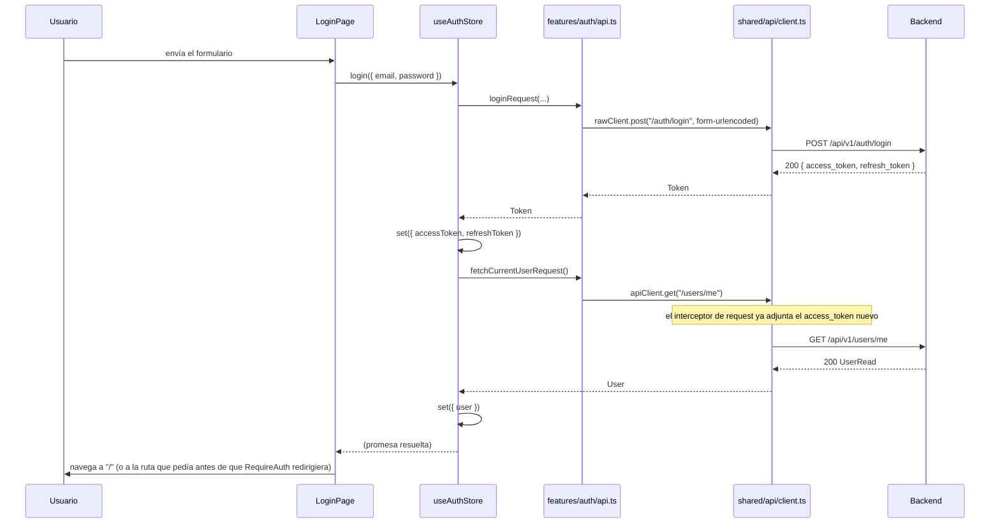
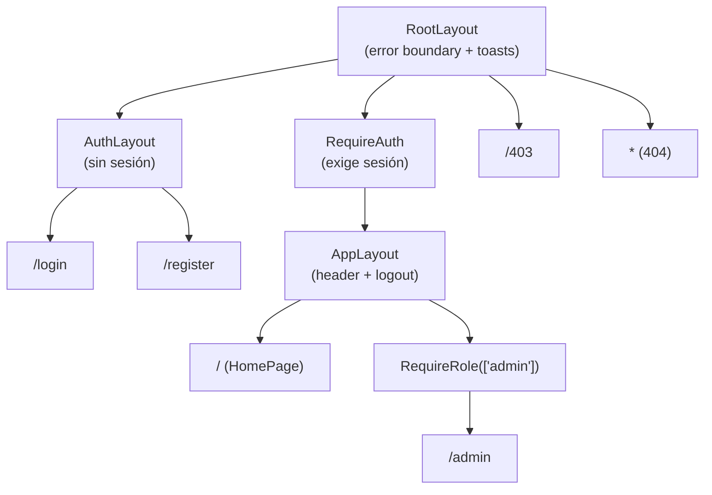

# 24 — Fundación del Frontend (Épica 4, Módulo 4.1)

Este documento es la referencia de diseño de la base del frontend: estructura de
carpetas, ruteo, layouts, cliente HTTP centralizado, manejo de JWT, guards y
componentes base. Complementa [12-stack-tecnologico.md](12-stack-tecnologico.md) (Fase
0, ya había decidido React + Vite) y [ADR-027](adr/ADR-027-fundacion-frontend.md)
(decisiones de esta fase, con su justificación completa).

## Alcance de este módulo

Se implementa **únicamente** la fundación: nada de esto es una pantalla de producto.
**No hay pantallas de remates, de lotes, sala del remate, chat, WebSockets ni
dashboard** — son, todos, módulos futuros que van a construirse *sobre* esta base, no
parte de ella. El criterio de "terminado" acá es: login/registro funcionan de punta a
punta contra el backend real, la sesión persiste, las rutas protegidas redirigen
correctamente, y hay un puñado de componentes base ya usables.

## Restricción de esta fase

**No se modificó un solo archivo de `backend/`.** La única superficie compartida
tocada fuera de `frontend/` es infraestructura de orquestación, no lógica de negocio:
`docker-compose.yml` (un servicio `frontend` nuevo, aditivo) y el `.gitignore` de la
raíz no se tocó (el del frontend es nuevo, generado por el propio scaffold de Vite).

## Árbol completo

```
frontend/
├── .dockerignore
├── .env                          # no versionado -- copia de .env.example
├── .env.example
├── .gitignore
├── Dockerfile                    # dev-only, ver ADR-027 sección "Consecuencias"
├── index.html
├── package.json
├── tsconfig.json / tsconfig.app.json / tsconfig.node.json
├── vite.config.ts                # plugin de React + Tailwind + config de Vitest
├── public/
│   └── favicon.svg
└── src/
    ├── main.tsx                   # entry point -- crea el root de React
    ├── App.tsx                    # <RouterProvider router={router} />
    ├── vite-env.d.ts              # tipado de import.meta.env
    ├── styles/
    │   └── index.css              # entrypoint de Tailwind v4 + tokens de diseño (@theme)
    ├── app/                       # ensamblaje de la aplicación -- ver sección siguiente
    │   ├── router.tsx
    │   ├── layouts/
    │   │   ├── RootLayout.tsx
    │   │   ├── AuthLayout.tsx
    │   │   └── AppLayout.tsx
    │   └── pages/
    │       ├── HomePage.tsx               # placeholder -- el dashboard real es otro módulo
    │       ├── AdminPlaceholderPage.tsx    # demuestra RequireRole de punta a punta
    │       ├── ForbiddenPage.tsx           # 403
    │       └── NotFoundPage.tsx            # 404
    ├── features/
    │   └── auth/                  # único feature de dominio de este módulo
    │       ├── api.ts              # llamadas HTTP puras (login/register/refresh/logout/me)
    │       ├── store.ts            # estado de sesión (Zustand + persist)
    │       ├── store.test.ts
    │       ├── hooks.ts            # useAuth(), useAuthActions() -- selectores con useShallow
    │       ├── types.ts            # User, AuthTokens, LoginPayload, RegisterPayload
    │       └── pages/
    │           ├── LoginPage.tsx
    │           └── RegisterPage.tsx
    ├── shared/                    # transversal, sin conocer ningún dominio de negocio
    │   ├── api/
    │   │   ├── client.ts           # apiClient/rawClient + interceptores
    │   │   ├── client.test.ts
    │   │   ├── errors.ts           # normalizeApiError -- manejo global de errores
    │   │   ├── errors.test.ts
    │   │   └── types.ts            # ApiErrorEnvelope, Page<T> -- formas genéricas del backend
    │   ├── components/             # componentes base reutilizables
    │   │   ├── Button.tsx (+ .test.tsx)
    │   │   ├── Input.tsx
    │   │   ├── Spinner.tsx
    │   │   ├── Alert.tsx
    │   │   └── Card.tsx
    │   ├── guards/
    │   │   ├── RequireAuth.tsx (+ .test.tsx)
    │   │   └── RequireRole.tsx (+ .test.tsx)
    │   ├── config/
    │   │   └── env.ts              # wrapper tipado sobre import.meta.env
    │   └── toast/
    │       ├── toastStore.ts       # cola de avisos globales (Zustand)
    │       └── ToastViewport.tsx   # se monta una única vez, en RootLayout
    └── test/
        └── setup.ts                # matchers de jest-dom para Vitest
```

## Explicación de cada carpeta

| Carpeta | Qué vive ahí | Regla |
|---|---|---|
| `app/` | El ensamblaje de la aplicación: el árbol de rutas, los tres layouts, y páginas que todavía no pertenecen a ningún dominio de producto (Home, 403, 404). | Puede importar de `features/` y `shared/`. Nada debería importar `app/` — es la punta del árbol, no una dependencia de nadie. |
| `features/<dominio>/` | Todo lo específico de un dominio de negocio: llamadas HTTP, estado, tipos, páginas. Hoy solo `auth`. | Puede importar de `shared/`. No debería importar de otro `features/<otro-dominio>/` directamente (si dos features necesitan compartir algo, ese algo sube a `shared/`). |
| `shared/` | Todo lo transversal: cliente HTTP, manejo de errores, componentes base, guards, config de entorno, toasts. | No importa nada de `features/` ni de `app/` — la misma disciplina de límites que ya aplica `app/core/`/`app/common/` en el backend. |
| `shared/api/` | El cliente HTTP centralizado y el manejo global de errores — ver "Manejo centralizado de llamadas HTTP" más abajo. | |
| `shared/components/` | Componentes de UI genéricos, sin conocimiento de ningún dominio (`Button`, `Input`, no `RemateCard`). | |
| `shared/guards/` | `RequireAuth`/`RequireRole` — elementos de ruta, no componentes que se usan envolviendo JSX a mano. | |
| `shared/toast/` | Manejo global de errores/avisos visibles al usuario — un store de Zustand más, montado una única vez (`ToastViewport` en `RootLayout`). | |
| `test/` | Configuración compartida de Vitest (matchers de `@testing-library/jest-dom`). | |

## Flujo de autenticación



**Persistencia**: `accessToken`, `refreshToken` y `user` se guardan en `localStorage`
(`zustand/middleware/persist`, ver ADR-027 sección H) — refrescar la página no cierra
la sesión. `isHydrated` distingue "todavía no sabemos si hay sesión" (se está leyendo
`localStorage`) de "sabemos que no hay sesión" — sin este flag, `RequireAuth`
redirigiría a `/login` por una fracción de segundo en cada recarga de una ruta
protegida, incluso con una sesión válida persistida.

**Refresh automático y transparente**: ninguna pantalla llama a `/auth/refresh`
explícitamente. Cuando cualquier request autenticada recibe un `401`,
`shared/api/client.ts` refresca la sesión una única vez (con cola single-flight, ver
ADR-027 sección G) y reintenta la request original — el componente que la disparó ni se
entera, salvo que el refresh también falle (ahí sí se cierra la sesión y, si la request
venía de una ruta protegida, `RequireAuth` redirige a `/login` en el próximo render).

**Logout**: limpia el estado local primero, siempre — el `POST /auth/logout` al backend
es best-effort (revoca el refresh token del lado del servidor, pero si falla por
cualquier motivo no hay nada más que deshacer del lado del cliente).

## Manejo de rutas



`app/router.tsx` usa `createBrowserRouter` (API de datos de React Router v7, ver
ADR-027 sección I) con rutas **anidadas sin `path` propio** para layouts y guards:

- `RootLayout` envuelve **todo**, sin excepción — es el único lugar con el error
  boundary global y el visor de toasts.
- Las rutas públicas (`/login`, `/register`) cuelgan de `AuthLayout`.
- Las rutas protegidas cuelgan de `RequireAuth` (que redirige a `/login` si no hay
  sesión) y, adentro, de `AppLayout` (header con usuario + logout).
- Una ruta que además necesita un rol puntual (`/admin`, en este módulo solo a modo de
  ejemplo) cuelga de un `RequireRole` anidado **dentro** de `RequireAuth` — asume que ya
  hay sesión, nunca se usa suelto.
- `/403` y `/404` son rutas de escape, fuera de cualquier guard (si estuvieran adentro,
  un usuario sin sesión que cae en `/403` rebotaría a `/login` en un loop).

Agregar una ruta protegida nueva es una entrada más en el árbol de `router.tsx`, nunca
tocar `RequireAuth`/`RequireRole` en sí — ambos son completamente genéricos.

## Manejo centralizado de llamadas HTTP

Ningún componente debería importar `axios` directamente. El flujo es siempre:

```
componente -> features/<dominio>/hooks.ts o api.ts -> shared/api/client.ts (apiClient) -> backend
```

- **Configuración**: `shared/api/client.ts` crea `apiClient` con `baseURL` desde
  `shared/config/env.ts` (`VITE_API_BASE_URL`).
- **JWT automático**: un interceptor de request adjunta `Authorization: Bearer
  <access_token>` a cualquier llamada que no sea uno de los cuatro endpoints de sesión.
- **Interceptor de 401**: refresca la sesión una vez (cola single-flight) y reintenta
  la request original — ver "Flujo de autenticación" arriba.
- **Manejo global de errores**: `shared/api/errors.ts::normalizeApiError` convierte
  cualquier error (envelope del backend, red caída, lo que sea) a una forma única
  (`{ status, code, message, details }`). Un formulario lo usa para mostrar un mensaje
  inline (`<Alert variant="error">`); código que corre fuera de un formulario (por
  ejemplo, un fallo inesperado en segundo plano) usa
  `useToastStore.getState().push('error', mensaje)` para mostrar un aviso flotante sin
  necesidad de que ningún componente de más arriba sepa que ocurrió.

## Checklist del módulo

- [x] Estructura de carpetas (`app/`, `features/`, `shared/`), por dominio.
- [x] Sistema de rutas (`createBrowserRouter`, anidado, con guards como rutas sin `path`).
- [x] Layout principal (`RootLayout` — error boundary + toasts).
- [x] Layout para autenticación (`AuthLayout`).
- [x] Layout para la aplicación (`AppLayout`).
- [x] Manejo centralizado de llamadas HTTP (`shared/api/client.ts`, un único punto de
      entrada para el resto de la app).
- [x] Configuración de Axios (`baseURL` desde variables de entorno, dos instancias con
      propósitos distintos).
- [x] Manejo automático del JWT (adjuntado por interceptor, nunca a mano).
- [x] Interceptores (request: adjunta token; response: refresh transparente ante 401).
- [x] Manejo global de errores (`normalizeApiError` + toasts).
- [x] Guards de autenticación (`RequireAuth`).
- [x] Guards por roles (`RequireRole`, componible con `RequireAuth`).
- [x] Variables de entorno (`VITE_API_BASE_URL`, wrapper tipado que falla rápido si falta).
- [x] Componentes reutilizables base (`Button`, `Input`, `Spinner`, `Alert`, `Card`).
- [x] Tests básicos (25 tests: cliente HTTP/interceptores, manejo de errores, store de
      auth, guards, un componente base) — `npm run test`.
- [x] Documentación (este archivo) y ADR (ADR-027) actualizados.
- [x] Cero cambios en `backend/`.
- [x] Verificado de punta a punta contra el backend real (no solo tests): registro,
      login, persistencia de sesión al recargar, guard de rol, logout, reintento
      automático tras 401, y el mismo flujo corriendo dentro de Docker Compose.
- [x] Explícitamente sin pantallas de producto: remates, lotes, sala del remate, chat,
      WebSockets, dashboard.

## Cómo esta arquitectura permitirá desarrollar el resto del frontend

1. **Un feature nuevo es una carpeta nueva, con el mismo esqueleto.**
   `features/remates/` (o `lotes/`, `sala/`) va a tener su propio `api.ts` (llamadas a
   `apiClient`, que ya sabe autenticar), sus propios `types.ts` (reflejando los
   schemas del backend, mismo criterio que `features/auth/types.ts`), y sus páginas —
   sin tocar `shared/` ni reorganizar nada existente.
2. **El patrón de estado con Zustand + selectores ya está probado** (ADR-027, sección
   D) — el store de una sala en vivo (conteo de conectados, oferta ganadora actual,
   lote activo) sigue exactamente la forma de `features/auth/store.ts`: estado +
   acciones en el mismo objeto, hooks de conveniencia con `useShallow` en un
   `hooks.ts` aparte.
3. **El cliente HTTP no necesita ningún cambio** para que una pantalla de remates
   empiece a pedir datos: `apiClient.get('/remates')` ya llega autenticado, ya
   reintenta ante un token vencido, y un error ya se puede normalizar con la misma
   función que usa `LoginPage`.
4. **Los guards ya soportan cualquier combinación de roles** — una pantalla exclusiva
   de rematador es `<RequireRole allowedRoles={['rematador']} />` colgando de donde
   corresponda en `router.tsx`, sin escribir lógica de permisos nueva.
5. **El snapshot inicial + eventos por WebSocket (backend Módulos 3.5/3.6) tienen,
   del lado del cliente, el mismo punto de entrada que cualquier otra request**: un
   nuevo `features/sala/api.ts` puede pedir `GET /remates/{id}/snapshot` con
   `apiClient` tal cual, y un nuevo cliente WebSocket (módulo futuro) puede reusar
   `useAuthStore.getState().accessToken` para autenticar la conexión, exactamente como
   ya lo hace `shared/api/client.ts` para HTTP.
6. **Los tres layouts ya delimitan dónde va cada cosa nueva**: navegación específica
   de una sala en vivo entra en un layout propio (colgando de `AppLayout` o a la par,
   según lo que la sala necesite), sin tocar `RootLayout` (que solo conoce
   error-boundary + toasts, y así debería seguir).

## Trabajo futuro (fuera de alcance de este módulo)

- Generación automática de tipos TypeScript desde el `openapi.json` del backend (hoy
  los tipos de `features/auth/types.ts`/`shared/api/types.ts` se mantienen a mano).
- Cliente WebSocket (sobre el Gateway del backend, Módulo 3.3) — reusará
  `useAuthStore` para el JWT de la conexión, sin cambios en el store de auth.
- Dashboard real, pantallas de remates/lotes, sala del remate, chat — todos, módulos
  de la Épica 4 que siguen.
- Dockerfile de producción del frontend (build estático + servidor liviano) — mismo
  criterio que el backend: roadmap explícito, no de esta fase.
