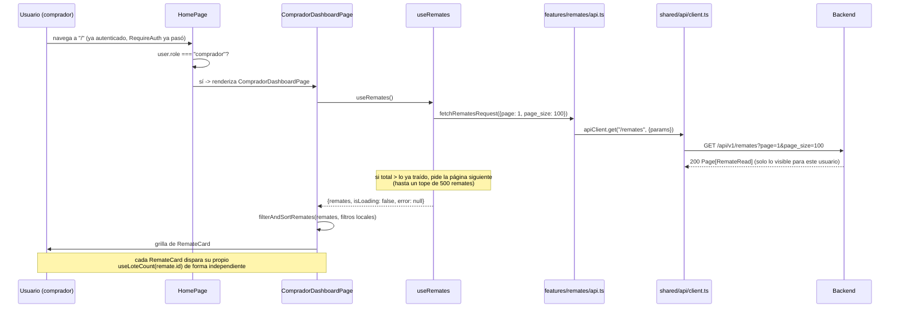

# 25 — Dashboard del Comprador (Épica 4, Módulo 4.3)

Este documento es la referencia de diseño del dashboard del comprador: flujo de datos,
consumo de la API existente, estructura de componentes reutilizables y sus
limitaciones conocidas. Complementa [24-fundacion-frontend.md](24-fundacion-frontend.md)
(la base sobre la que se construye este módulo) y
[ADR-028](adr/ADR-028-dashboard-comprador.md) (decisiones de esta fase, con su
justificación completa).

## Alcance de este módulo

Se implementa **únicamente** la pantalla principal para usuarios con rol `comprador`:
listado de remates visibles, con búsqueda, filtros, orden, y estados de carga/vacío/
error. **No hay sala del remate, WebSockets, ofertas, chat ni video** — el botón
"Ver remate" navega a una página placeholder (`RemateDetailPlaceholderPage`), módulos
futuros de la Épica 4. Tampoco hay dashboard propio para `rematador`/`admin`: ambos
siguen viendo el mismo placeholder de la Módulo 4.1 hasta que tengan el suyo.

## Restricciones de esta fase (verificadas)

- **Cero cambios en `backend/`.** Todo el módulo consume exclusivamente los endpoints
  que ya existían: `GET /remates`, `GET /remates/{id}/lotes`.
- **No se tocó la autenticación** (`shared/api/client.ts`, `features/auth/`) ni los
  guards (`shared/guards/`) — se reusan tal cual.
- **No se modificaron componentes base existentes** (`Button`, `Input`, `Spinner`,
  `Alert`, `Card`) ni los layouts (`RootLayout`, `AuthLayout`, `AppLayout`) — los nuevos
  primitivos (`Badge`, `Skeleton`, `EmptyState`) son archivos nuevos, aditivos.
- Las únicas ediciones a archivos preexistentes son `app/pages/HomePage.tsx` (agrega
  una rama por rol, ver más abajo) y `app/router.tsx` (agrega una ruta nueva) — ambos
  cambios ya estaban anticipados como "próximo módulo" en ADR-027.

## Contrato del backend consumido

Confirmado leyendo `backend/app/modules/remates/{router,schemas,models}.py` y
`backend/app/modules/remates/lotes/router.py` — no se adivinó ningún campo.

| Endpoint | Uso en este módulo |
|---|---|
| `GET /remates?page&page_size&category&status&owner_id` | Lista paginada de remates visibles para el usuario actual (`Page[RemateRead]`). Sin `category`/`status`/`owner_id`, trae todos los visibles. |
| `GET /remates/{id}/lotes?page&page_size` | Se usa con `page_size=1` únicamente para leer `total` del envelope — cantidad de lotes de un remate puntual. |

**Visibilidad ya resuelta por el backend** (`RemateService._is_visible`): un
`comprador` nunca recibe remates en estado `draft` (dueño/admin sí) — el frontend no
filtra ese estado, confía en lo que el backend ya decidió no exponer.

## Limitaciones conocidas (documentadas a propósito, no bugs)

1. **No hay búsqueda de texto server-side.** `GET /remates` solo acepta `category`,
   `status`, `owner_id` como filtros (confirmado en el router) — ningún parámetro de
   texto libre. La búsqueda por título de este módulo es 100% client-side, sobre la
   lista ya cargada (ver "Filtrado y orden" más abajo).
2. **`RemateRead` no incluye cantidad de lotes.** La única forma de conocerla es una
   request aparte por remate (`GET /remates/{id}/lotes?page_size=1`, quedándose con
   `total`) — un N+1 deliberado y acotado (una request por tarjeta visible, no por
   remate en la base), resuelto de forma perezosa por `useLoteCount`.
3. **No hay forma de resolver el rematador dueño a su nombre.** `RemateRead` solo trae
   `owner_id` (UUID); no existe `GET /users/{id}` y `GET /users` es exclusivamente para
   `admin` (confirmado en `backend/app/modules/users/router.py`). La tarjeta
   deliberadamente **no muestra ningún dato del rematador** — mostrar el UUID crudo
   sería peor que omitirlo. Si una fase futura necesita este dato, la solución correcta
   es un endpoint de backend nuevo (perfil público mínimo), no inferirlo del lado del
   cliente.

## Árbol nuevo

```
frontend/src/
├── shared/
│   ├── components/
│   │   ├── Badge.tsx            # nuevo -- etiqueta de estado/categoría
│   │   ├── Skeleton.tsx         # nuevo -- bloque de carga genérico
│   │   └── EmptyState.tsx       # nuevo -- "no hay nada que mostrar", genérico
│   └── lib/
│       └── format.ts            # nuevo -- formatDateTime (Intl.DateTimeFormat nativo)
├── features/
│   └── remates/                 # feature nuevo
│       ├── types.ts             # Remate, RemateStatus, RemateCategory, RemateListParams
│       ├── labels.ts            # texto/variant de badge por status y categoría
│       ├── api.ts                # fetchRematesRequest, fetchLoteCountRequest
│       ├── filtering.ts          # filterAndSortRemates -- función pura, sin estado
│       ├── filtering.test.ts
│       ├── hooks.ts              # useRemates (carga todo), useLoteCount (perezoso)
│       ├── hooks.test.ts
│       ├── components/
│       │   ├── icons.tsx                # SVG a mano, sin librería de íconos
│       │   ├── RemateCard.tsx           # tarjeta de un remate
│       │   ├── RemateCard.test.tsx
│       │   ├── RemateCardSkeleton.tsx   # misma forma, en versión "cargando"
│       │   └── DashboardToolbar.tsx     # búsqueda + filtros + orden
│       └── pages/
│           ├── CompradorDashboardPage.tsx
│           ├── CompradorDashboardPage.test.tsx
│           └── RemateDetailPlaceholderPage.tsx
└── app/
    ├── pages/
    │   ├── HomePage.tsx          # editado: rama por rol (comprador -> dashboard real)
    │   └── HomePage.test.tsx     # nuevo -- regresión del rol-branch
    └── router.tsx                # editado: + ruta /remates/:remateId
```

## Flujo del dashboard



**Por qué cargar todo en vez de paginar contra el servidor**: sin búsqueda de texto
server-side (limitación 1), filtrar/ordenar por título requiere tener la lista completa
en el cliente — paginar server-side y filtrar solo la página visible daría resultados
incompletos o incorrectos apenas hubiera más de una página. `useRemates` pagina contra
`GET /remates` internamente (100 por request) hasta juntar el total o llegar a un tope
de 500 remates, y expone la lista ya completa. Ver ADR-028 para el detalle de esta
decisión y su costo aceptado.

## Filtrado, búsqueda y orden

`features/remates/filtering.ts::filterAndSortRemates` es una función pura
`(remates: Remate[], filters: RemateFilters) => Remate[]` sin ningún estado ni
dependencia de React — se prueba con datos, sin montar nada
(`filtering.test.ts`, 9 casos). `CompradorDashboardPage` la llama dentro de un
`useMemo`, recalculando solo cuando cambian los remates cargados o los filtros.

- **Búsqueda**: coincidencia parcial, case-insensitive, sobre `title`.
- **Filtro de estado**: cualquiera de los cinco estados que un comprador puede llegar a
  ver (`scheduled`, `live`, `paused`, `finished`, `cancelled` — nunca `draft`, ver
  "Contrato del backend consumido").
- **Filtro de categoría**: las nueve categorías del backend.
- **Orden**:
  - *Próximos*: por `starts_at` ascendente, remates sin fecha al final.
  - *Recientes*: por `created_at` descendente.
  - *En vivo primero*: los `live` primero, después el resto por `starts_at` ascendente.

## Estructura de componentes reutilizables

| Componente | Vive en | Reutilizable para |
|---|---|---|
| `Badge` | `shared/components/` | Cualquier etiqueta corta con variante de color — no sabe qué es un "remate". |
| `Skeleton` | `shared/components/` | Bloque de carga genérico — la unidad con la que se arma cualquier esqueleto futuro. |
| `EmptyState` | `shared/components/` | "No hay nada que mostrar" para cualquier listado futuro (lotes, ofertas, etc.). |
| `RemateCard` / `RemateCardSkeleton` | `features/remates/components/` | Específicos del dominio remates — no suben a `shared/` porque conocen la forma de `Remate`. |
| `DashboardToolbar` | `features/remates/components/` | Controlado por el padre (recibe `filters`/`onChange`) — no sabe de dónde vienen los remates, solo edita el objeto de filtros. |

`RemateCard` no muestra el rematador dueño (limitación 3) y usa un degradé con ícono
como portada por defecto cuando `cover_image_url` es `null` — nunca un `` roto.

## Estados de la pantalla

`CompradorDashboardPage` distingue explícitamente cinco estados, cada uno con su propio
render (ver el componente y `CompradorDashboardPage.test.tsx`, 5 casos):

1. **Cargando** (`isLoading`): 6 `RemateCardSkeleton` en grilla, ni error ni datos.
2. **Error** (`error`): `Alert` con el mensaje normalizado (`normalizeApiError`) y un
   botón "Reintentar" que llama a `reload()`.
3. **Vacío real** (sin error, `remates.length === 0`): no hay ningún remate visible
   para este usuario todavía.
4. **Vacío por filtros** (hay remates, pero ninguno matchea los filtros actuales): con
   una acción "Limpiar filtros".
5. **Con datos**: grilla de `RemateCard`, responsive (`grid-cols-1` en mobile,
   `sm:grid-cols-2`, `xl:grid-cols-3`) — nunca una tabla.

## Checklist del módulo

- [x] Barra superior con búsqueda por título.
- [x] Filtro por estado.
- [x] Filtro por categoría.
- [x] Ordenamiento (próximos, recientes, en vivo primero).
- [x] Estados de carga (esqueletos, no un spinner genérico bloqueando todo).
- [x] Estado vacío (dos variantes: sin datos vs. sin resultados de filtro).
- [x] Manejo de errores (mensaje + reintento).
- [x] Tarjetas con portada (o default), título, categoría, estado, fecha/hora,
      ubicación, cantidad de lotes y botón "Ver remate".
- [x] Sin tablas — grilla de tarjetas responsive.
- [x] "Ver remate" navega a un placeholder (`/remates/:remateId`), sin sala real.
- [x] Cero cambios en `backend/`, en la autenticación, ni en componentes/layouts
      preexistentes (solo ediciones aditivas a `HomePage.tsx`/`router.tsx`).
- [x] Tests (28 nuevos: filtrado/orden, hooks, tarjeta, página, regresión de
      `HomePage`) — `npm run test`.
- [x] Verificado de punta a punta contra el backend real dentro de Docker Compose
      (login como comprador, búsqueda, filtro, "Ver remate", responsive mobile) — no
      solo tests.
- [x] Documentación (este archivo) y ADR (ADR-028) actualizados.

## Trabajo futuro (fuera de alcance de este módulo)

- Sala del remate en vivo: WebSocket, snapshot inicial, ofertas, chat, video — el
  backend ya expone Gateway y Snapshot Service (Módulos 3.3–3.6); falta el consumo
  desde el frontend.
- Dashboard propio para `rematador` (gestión de sus remates) y `admin`.
- Si el volumen real de remates supera el tope de carga de `useRemates` (500), agregar
  búsqueda de texto server-side en el backend en vez de subir ese número.
- Endpoint de backend para resolver `owner_id` a un perfil público mínimo (nombre del
  rematador) — hoy deliberadamente omitido en la tarjeta (limitación 3).
