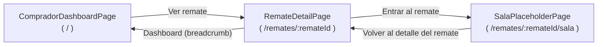
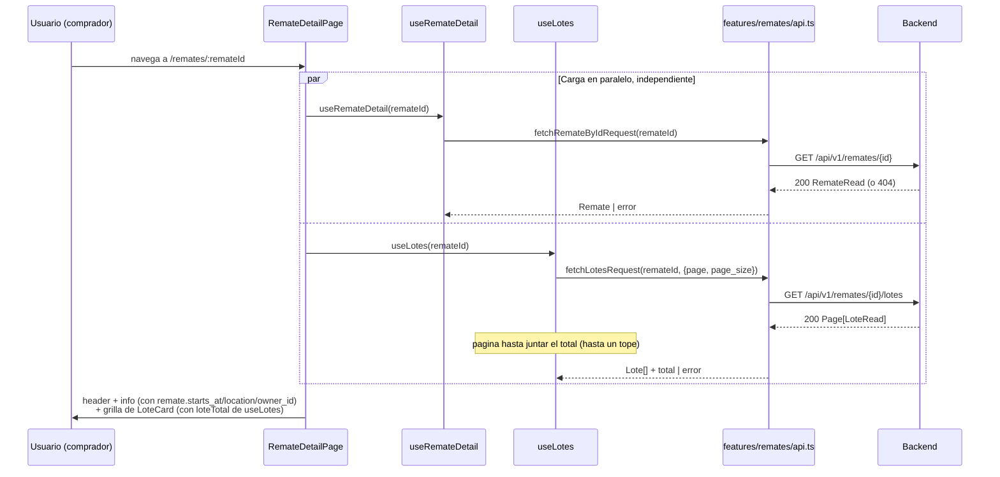

# 26 — Página de Detalle del Remate (Épica 4, Módulo 4.4)

Este documento es la referencia de diseño de la página de detalle: flujo de datos,
consumo de la API existente, estructura de componentes reutilizables y preparación
para integrarse con la sala del remate en vivo. Complementa
[25-dashboard-comprador.md](25-dashboard-comprador.md) (de donde se llega acá) y
[ADR-029](adr/ADR-029-detalle-remate.md) (decisiones de esta fase, con su justificación
completa).

## Alcance de este módulo

Se implementa **únicamente** la vista de "antes de entrar a la sala": toda la
información de un remate puntual (portada, estado, fecha, categoría, descripción,
ubicación, rematador, lotes) más un botón "Entrar al remate". **No hay WebSockets,
video, streaming, chat, ofertas ni nada en tiempo real** — el botón navega a
`SalaPlaceholderPage`, un placeholder deliberado en su propia ruta
(`/remates/:remateId/sala`), módulo futuro de la Épica 4.

## Restricciones de esta fase (verificadas)

- **Cero cambios en `backend/`.** Consume exclusivamente `GET /remates/{id}` y
  `GET /remates/{id}/lotes`, ambos ya existentes y ya usados por el dashboard
  (Módulo 4.3).
- **No se tocó la autenticación** ni los guards.
- **No se modificaron componentes base preexistentes** (`Button`, `Card`, `Alert`,
  `Badge`, `Skeleton`, `EmptyState`) — se reusan tal cual. El único primitivo nuevo,
  `Breadcrumb`, es un archivo aditivo en `shared/components/`.
- Único cambio a un archivo de dominio ya existente: `RemateCard.tsx` (dashboard) se
  refactorizó para reusar el nuevo `CoverPlaceholder` compartido en vez de su copia
  local — mismo resultado visual, cero cambio de comportamiento (cubierto por los
  tests ya existentes de `RemateCard`, que siguen pasando sin modificarse).
- `app/router.tsx` cambia de forma aditiva: la ruta `/remates/:remateId` deja de
  apuntar a un placeholder y pasa a apuntar a la página de detalle real; se agrega
  `/remates/:remateId/sala` para el placeholder de la sala (antes vivía en
  `/remates/:remateId`). Ningún otro archivo de la Módulo 4.1/4.3 se tocó.

## Contrato del backend consumido

| Endpoint | Uso en este módulo |
|---|---|
| `GET /remates/{id}` | Datos del remate (`RemateRead`) — 404 si no existe o no es visible para el usuario actual (`RemateService.get_visible_or_raise`, mismo criterio que el dashboard). |
| `GET /remates/{id}/lotes?page&page_size` | Listado completo de lotes (`Page[LoteRead]`), ya ordenado por `display_order` (confirmado en `lotes/repository.py`) — el mismo orden en que el rematador los armó. `total` del envelope es la cantidad total de lotes, sin pedidos adicionales. |

## Limitación conocida: sin nombre del rematador (heredada del Módulo 4.3)

Mismo hueco ya documentado en [ADR-028](adr/ADR-028-dashboard-comprador.md): no existe
`GET /users/{id}` para un comprador. A diferencia del dashboard (que omite el campo
por completo), **este módulo pide explícitamente mostrar "Rematador"** — se resuelve
mostrando "Rematador verificado" más un fragmento corto y monoespaciado del `owner_id`
(`RemateInfoSection.tsx`), sin inventar un nombre ni esconder la sección. Ver ADR-029
sección A para la justificación completa de esta decisión.

## Árbol nuevo

```
frontend/src/
├── shared/
│   └── components/
│       ├── Breadcrumb.tsx        # nuevo -- navegación de "migas de pan", genérico
│       └── Breadcrumb.test.tsx
└── features/remates/
    ├── types.ts                  # + Lote, LoteStatus, LoteImage, LoteListParams
    ├── labels.ts                 # + LOTE_STATUS_LABELS, LOTE_STATUS_BADGE_VARIANTS
    ├── api.ts                    # + fetchRemateByIdRequest, fetchLotesRequest
    ├── hooks.ts                  # + useRemateDetail, useLotes
    ├── hooks.test.ts             # + tests de ambos hooks nuevos
    ├── components/
    │   ├── CoverPlaceholder.tsx      # nuevo -- extraído de RemateCard, ahora compartido
    │   ├── RemateDetailHeader.tsx    # nuevo -- portada + título + estado + CTA
    │   ├── RemateInfoSection.tsx     # nuevo -- descripción + panel de detalles
    │   ├── LoteCard.tsx              # nuevo -- tarjeta de un lote en el listado
    │   ├── LoteCard.test.tsx
    │   └── LoteCardSkeleton.tsx      # nuevo
    └── pages/
        ├── RemateDetailPage.tsx      # nuevo -- la página de este módulo
        ├── RemateDetailPage.test.tsx
        └── SalaPlaceholderPage.tsx   # renombrado de RemateDetailPlaceholderPage.tsx
```

## Flujo de navegación



`RemateCard` (dashboard) no cambió su destino: ya navegaba a `/remates/${remate.id}`,
que antes mostraba el placeholder y ahora muestra el detalle real — la migración fue
transparente para el dashboard.

## Flujo de datos



**Por qué dos hooks independientes, no uno solo**: el remate y sus lotes son dos
peticiones con fallos independientes. Si `GET /remates/{id}/lotes` fallara (por
ejemplo, un timeout puntual) pero `GET /remates/{id}` hubiera respondido bien, no tiene
sentido perder toda la información del remate que sí llegó — la página muestra el
header/info normalmente y solo la sección de lotes entra en su propio estado de error,
con su propio botón de reintento. Ver ADR-029 sección B.

## Estructura de componentes reutilizables

| Componente | Vive en | Reutilizable para |
|---|---|---|
| `Breadcrumb` | `shared/components/` | Cualquier ruta anidada futura (sala del remate, un panel de administración) — no sabe qué es un remate, solo recibe `{label, to?}[]`. |
| `CoverPlaceholder` | `features/remates/components/` | Compartido entre `RemateCard` (dashboard), `RemateDetailHeader` y `LoteCard` — antes vivía duplicado dentro de `RemateCard.tsx`, se extrajo al tocar este módulo. |
| `RemateDetailHeader` | `features/remates/components/` | Específico del detalle: portada grande + título + estado + CTA. Recibe `onEnterRoom` como prop — no decide a dónde navega. |
| `RemateInfoSection` | `features/remates/components/` | Descripción + panel de detalles (fecha, ubicación, rematador, lotes). |
| `LoteCard` / `LoteCardSkeleton` | `features/remates/components/` | Tarjeta horizontal de un lote — mismo patrón que `RemateCard`/`RemateCardSkeleton` del dashboard (Módulo 4.3), pero sin filtros/orden: acá se muestran todos los lotes del remate, en el orden que definió el rematador. |

## Estados de la página

`RemateDetailPage` distingue los mismos tipos de estado que el dashboard, aplicados a
**dos fuentes de datos independientes** (ver `RemateDetailPage.test.tsx`, 6 casos):

1. **Cargando el remate**: esqueleto de header + info (todavía no se sabe si el remate
   existe, así que tampoco se pide la lista de lotes en esta fase visual).
2. **Error/404 del remate**: `Alert` con el mensaje que ya trae el backend (por ejemplo
   "Remate no encontrado."), con "Reintentar" y "Volver al dashboard".
3. **Remate cargado, lotes cargando**: header + info ya visibles, `LoteCardSkeleton` x3
   en la sección de lotes.
4. **Remate cargado, error en lotes**: header + info intactos, `Alert` con
   "Reintentar" solo en la sección de lotes.
5. **Remate cargado, sin lotes**: `EmptyState` ("Este remate todavía no tiene lotes
   cargados").
6. **Remate cargado, con lotes**: grilla vertical de `LoteCard`, nunca una tabla.

## Preparación para integrarse con la Sala del Remate en Vivo

- **Punto de entrada único y ya estable**: `SalaPlaceholderPage` vive en su propia ruta
  (`/remates/:remateId/sala`) desde este módulo — integrar la sala real es reemplazar
  el contenido de ese componente (o la ruta que apunta a él) por el cliente WebSocket +
  Snapshot Service, sin tocar `RemateDetailPage` ni cómo se llega hasta ahí
  ("Entrar al remate" ya navega al lugar correcto).
- **`useRemateDetail`/`useLotes` son reutilizables tal cual** por la sala: el snapshot
  inicial (`GET /remates/{id}/snapshot`, backend Módulo 3.6) puede convivir con estos
  hooks para la info "fría" del remate (título, categoría, ubicación) mientras el
  snapshot aporta la info "caliente" (lote activo, oferta ganadora, conectados) — no
  hay que duplicar el fetch de datos estructurales del remate.
- **`Lote` (tipo) ya está preparado para crecer**: hoy omite deliberadamente los campos
  de precio (ver `types.ts`) porque ninguna pantalla los necesita todavía; agregarlos
  cuando el módulo de ofertas los use es una extensión de la interfaz existente, no un
  rediseño.
- **`LoteCard` ya tiene su lugar para un estado "en vivo"**: `LOTE_STATUS_BADGE_VARIANTS`
  ya distingue visualmente `open` (variante `warning`, igual que un remate `live`) del
  resto — cuando haya datos de oferta en tiempo real, es la misma tarjeta la que los
  va a mostrar, no una nueva.

## Checklist del módulo

- [x] Imagen de portada (o degradé por defecto), nombre, estado, fecha y hora de
      inicio, categoría, descripción, ubicación, rematador, cantidad total de lotes.
- [x] Listado de lotes: número, título, imagen principal (o placeholder), descripción
      resumida, estado — en tarjetas, sin tablas.
- [x] Botón "Entrar al remate" a una página placeholder de la sala.
- [x] Breadcrumb de navegación (Dashboard → título del remate).
- [x] Skeleton loaders (header/info mientras carga el remate; tarjetas mientras cargan
      los lotes, de forma independiente).
- [x] Estado vacío (sin lotes cargados).
- [x] Manejo de errores (remate y lotes, cada uno con su propio `Alert` + reintento).
- [x] Componentes reutilizables (`Breadcrumb` en `shared/`; `CoverPlaceholder`,
      `RemateDetailHeader`, `RemateInfoSection`, `LoteCard`/`LoteCardSkeleton` en el
      feature).
- [x] Diseño responsive (grilla de 3 columnas en desktop, apilado en mobile — probado
      en viewport de 390px).
- [x] Sin WebSockets, video, streaming, chat, ofertas ni tiempo real.
- [x] Cero cambios en `backend/` ni en la autenticación.
- [x] Tests (18 nuevos: `useRemateDetail`/`useLotes`, `Breadcrumb`, `LoteCard`,
      `RemateDetailPage`) — `npm run test`, 70/70 verdes.
- [x] Verificado de punta a punta contra el backend real en Docker Compose: detalle con
      datos, navegación a la sala placeholder, breadcrumb de vuelta al dashboard, 404
      de un remate inexistente, layout mobile.
- [x] Documentación (este archivo) y ADR (ADR-029) actualizados.

## Trabajo futuro (fuera de alcance de este módulo)

- Sala del remate en vivo real, sobre `SalaPlaceholderPage` (WebSocket, Snapshot
  Service, ofertas, chat, video) — Módulos futuros de la Épica 4.
- Endpoint de backend para un perfil público mínimo del rematador (nombre) — la misma
  limitación ya señalada en ADR-028, ahora también visible acá.
- Si un remate llegara a tener más de 300 lotes (tope de `useLotes`), paginar el
  listado de lotes en la UI en vez de subir el tope.
