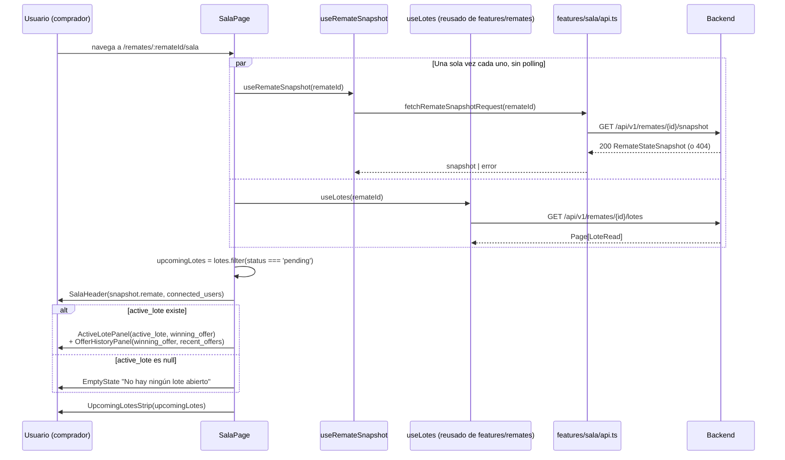

# 27 — Sala del Remate, versión inicial (Épica 4, Módulo 4.5)

Este documento es la referencia de diseño de la sala del remate: arquitectura de la
pantalla, flujo Snapshot → Render, estructura de componentes y preparación para recibir
eventos WebSocket sin reestructurar código. Complementa
[26-detalle-remate.md](26-detalle-remate.md) (de donde se llega acá) y
[ADR-030](adr/ADR-030-sala-del-remate.md) (decisiones de esta fase, con su
justificación completa).

## Alcance de este módulo

Se implementa la pantalla principal de un remate en vivo: cabecera, lote activo con
toda su información, panel de ofertas, próximos lotes y un botón "Realizar oferta"
deshabilitado. **Todo sale de una única lectura del Snapshot Service — sin
WebSockets, sin polling, sin actualización automática, sin chat, presencia, video ni
streaming.** Pedido explícito de este módulo: "En este módulo todavía NO quiero
utilizar WebSockets", a pesar de que el backend ya los tiene completos (Épica 3).

## Restricciones de esta fase (verificadas)

- **Cero cambios en `backend/`.** Consume exclusivamente `GET /remates/{id}/snapshot`
  (Épica 3, Módulo 3.6, sin tocar) y `GET /remates/{id}/lotes` (ya usado desde el
  Módulo 4.4, reutilizado tal cual vía `useLotes`).
- **No se tocó la autenticación** ni los guards.
- **No se modificaron componentes base preexistentes** (`Button`, `Card`, `Alert`,
  `Badge`, `Skeleton`, `EmptyState`, `Breadcrumb`) — se reusan tal cual.
- `app/router.tsx` cambia de forma aditiva: `/remates/:remateId/sala` deja de apuntar a
  `SalaPlaceholderPage` (Módulo 4.4) y pasa a apuntar a la sala real. El placeholder se
  eliminó (ya cumplió su propósito, documentado como reemplazable en ADR-029).

## Por qué un feature nuevo (`features/sala/`) y no una extensión de `features/remates/`

Mismo criterio de límites de módulo que ya usa el backend: `app/snapshot/` no vive
dentro de `app/modules/remates/` ni `app/modules/ofertas/` — es su propio paquete, que
**compone** los DTOs de ambos (`RemateRead`, `LoteRead`) más uno propio
(`OfertaSnapshotEntry`), sin duplicarlos. `features/sala/` hace exactamente lo mismo del
lado del frontend: `types.ts` importa `Remate`/`Lote` de `features/remates/types.ts` en
vez de redefinirlos, y agrega `OfertaSnapshotEntry`/`RemateStateSnapshot`, que no son
del dominio "remates" ni "auth" — son el snapshot en sí. Ver ADR-030 sección A para la
alternativa descartada (extender `features/remates/`) y por qué.

## Contrato del backend consumido

| Endpoint | Uso en este módulo |
|---|---|
| `GET /remates/{id}/snapshot` | Todo el estado de una vez: `remate`, `active_lote` (el único lote `OPEN`, o `null`), `winning_offer`, `recent_offers` (últimas 10), `connected_users`. Mismo criterio de visibilidad que `GET /remates/{id}` (404 si no existe o no es visible). |
| `GET /remates/{id}/lotes` | Ya usado desde el Módulo 4.4 (`useLotes`) — acá se reutiliza para la tira de "próximos lotes" (el snapshot solo trae el lote activo, no la lista completa). |

**Verificado contra una respuesta real** (no asumido): los montos (`base_price`,
`min_increment`, `reserve_price`, `final_price`, `amount`) llegan como **string**
(`"1000.00"`), no `number` — Pydantic v2 serializa `Decimal` preservando su
representación exacta en vez de convertirlo a `float` (evita el error de redondeo
binario de IEEE 754 en montos de dinero). `features/remates/types.ts::Lote` y
`features/sala/types.ts::OfertaSnapshotEntry` reflejan esto; `shared/lib/format.ts::
formatCurrency` hace el único `Number(...)` necesario, en el borde de presentación.

## Anonimato de compradores (comportamiento esperado, no una limitación)

A diferencia del rematador (cuyo `owner_id` sí es visible y solo le falta un endpoint
de perfil, ver ADR-028/ADR-029), el `buyer_id` de cada oferta llega **siempre `null`**
para un comprador — incluso para el propio autor de esa oferta
(`SnapshotService._mask_oferta`, sin cambios). No es un hueco a resolver: es la misma
política de anonimato entre postores que ya aplicaba `LeadingOfferRead` desde el
Auction Engine (Épica 2.4). La sala respeta esto mostrando "Comprador verificado" en
vez de cualquier identificador — nunca intenta inferir o mostrar una identidad que el
backend deliberadamente no entrega.

## Límite conocido: "ofertas recientes", no "ofertas totales"

`recent_offers` está acotado a las últimas 10 (`SnapshotService.
DEFAULT_RECENT_OFFERS_LIMIT`, backend, sin cambios). El panel lateral cuenta y muestra
exactamente eso — "Ofertas recientes: N" — nunca se presenta como el total histórico
del lote, que ningún endpoint expone hoy. Mismo criterio honesto que ya aplicó
`docs/25-dashboard-comprador.md` a la cantidad de lotes o `docs/26-detalle-remate.md`
al nombre del rematador: documentar la limitación en vez de disfrazarla.

## Árbol nuevo

```
frontend/src/
├── shared/lib/
│   ├── format.ts           # + formatCurrency (Decimal-como-string -> texto con moneda)
│   └── format.test.ts      # nuevo
└── features/
    ├── remates/
    │   └── types.ts         # Remate + settings (RemateSettings); Lote + attributes/precios
    └── sala/                 # feature nuevo
        ├── types.ts          # OfertaStatus, OfertaSnapshotEntry, RemateStateSnapshot
        ├── labels.ts         # OFERTA_STATUS_LABELS, OFERTA_STATUS_BADGE_VARIANTS
        ├── api.ts            # fetchRemateSnapshotRequest
        ├── hooks.ts          # useRemateSnapshot
        ├── hooks.test.ts
        ├── components/
        │   ├── icons.tsx             # UsersIcon (el resto se reusa de remates/)
        │   ├── ImageGallery.tsx      # + .test.tsx
        │   ├── SalaHeader.tsx        # cabecera
        │   ├── ActiveLotePanel.tsx   # + .test.tsx -- sección principal
        │   ├── OfferHistoryPanel.tsx # + .test.tsx -- panel lateral
        │   ├── UpcomingLotesStrip.tsx # + .test.tsx -- sección inferior
        │   └── PlaceBidButton.tsx    # botón "Realizar oferta" (deshabilitado)
        └── pages/
            ├── SalaPage.tsx          # + .test.tsx
            └── (SalaPlaceholderPage.tsx del Módulo 4.4 -- eliminado, reemplazado)
```

## Flujo Snapshot → Render



**Un único punto de entrada de datos, un único punto de salida de errores**: toda la
pantalla depende de dos fetches (`useRemateSnapshot`, `useLotes`), cada uno con su
propio estado de carga/error — mismo patrón ya establecido en `RemateDetailPage`
(Módulo 4.4) entre `useRemateDetail`/`useLotes`. Si el snapshot falla, no tiene sentido
mostrar nada (sin remate no hay sala); si solo fallan los "próximos lotes", el resto de
la sala sigue funcionando (no implementado como error bloqueante en esta versión: la
tira simplemente muestra su esqueleto mientras carga, ver `SalaPage.tsx`).

## Estructura de componentes

| Componente | Sección | Responsabilidad |
|---|---|---|
| `SalaHeader` | Cabecera | Nombre, estado, fecha, rematador (anonimizado, mismo patrón que `RemateInfoSection`), conectados. |
| `ActiveLotePanel` | Principal | Galería, título, descripción, ficha técnica (`attributes` + cantidad/unidad), categoría, precio inicial, oferta actual, incremento mínimo, estado — y embebe `PlaceBidButton`. |
| `ImageGallery` | Principal (dentro de `ActiveLotePanel`) | Imagen grande + miniaturas clickeables; sin imágenes, usa `CoverPlaceholder` (reusado de `features/remates/`). |
| `PlaceBidButton` | Principal (dentro de `ActiveLotePanel`) | El botón "Realizar oferta", deshabilitado, con el mensaje del enunciado. Aislado para que integrarlo de verdad sea reemplazar un archivo, no reescribir el panel. |
| `OfferHistoryPanel` | Lateral | Comprador líder (anonimizado), cantidad de ofertas recientes, historial. |
| `UpcomingLotesStrip` | Inferior | Lista horizontal de lotes `pending`, sin ningún elemento interactivo (`<div>`, no `<button>`/`<Link>`). |

## Optimización del renderizado

- **Colocación de estado**: `ImageGallery` guarda qué miniatura está seleccionada en su
  propio `useState`, no en `SalaPage` ni en `ActiveLotePanel` — cambiar de imagen vuelve
  a renderizar únicamente la galería, nunca la cabecera ni el panel lateral de ofertas.
- **`useMemo`** para las dos derivaciones que no dependen del render en curso: el orden
  de las imágenes por `order` (`ImageGallery`) y el filtro de lotes `pending`
  (`SalaPage`) — no se recalculan en cada render, solo cuando cambian sus datos de
  origen.
- **`React.memo`** en los componentes que se repiten dentro de una lista
  (`OfferHistoryEntry` en el panel lateral, `UpcomingLoteCard` en la tira) — sin efecto
  visible hoy (el snapshot no cambia solo, Épica 4.5 no tiene tiempo real), pero es
  exactamente lo que hace falta el día que un evento de WebSocket agregue una oferta
  nueva al arreglo: las entradas que ya estaban no se vuelven a renderizar solo porque
  el arreglo que las contiene cambió de referencia.

## Preparación para WebSockets (sin reestructurar)

1. **La forma de los datos ya es la que un evento de WebSocket va a mantener
   actualizada**: `RemateStateSnapshot` lleva `schema_version` desde el backend
   (`app/snapshot/schemas.py`, sin cambios) pensado exactamente para esto. Un futuro
   `useLiveRemateState` puede envolver `useRemateSnapshot` (la carga inicial) y aplicar
   los eventos entrantes (`LotOpened`, `LotClosed`, `BidAccepted`, `BidWinnerChanged`,
   ya catalogados en `docs/06-eventos-del-sistema.md` y ya dispatchados por el Gateway,
   Épica 3.5) sobre el mismo objeto `RemateStateSnapshot` en memoria.
2. **Ningún componente de presentación sabe de dónde salió `snapshot`**: `SalaHeader`,
   `ActiveLotePanel` y `OfferHistoryPanel` reciben datos ya resueltos como props
   (`remate`, `active_lote`, `winning_offer`, `recent_offers`, `connected_users`) — no
   llaman a `useRemateSnapshot` ellos mismos, no importan `features/sala/api.ts`. Cambiar
   la fuente (HTTP una vez → HTTP una vez + eventos) es un cambio en `SalaPage` y en
   `hooks.ts`, cero cambios en los componentes de esta tabla.
3. **`PlaceBidButton` ya está aislado**: activar ofertas reales es reemplazar ese
   componente por un formulario que dispare un mensaje WebSocket, sin tocar el resto de
   `ActiveLotePanel`.
4. **`connected_users` ya sale de `RoomManager.connection_count`**, el mismo contador
   que va a incrementar/decrementar en vivo cuando el Gateway lo empuje por WebSocket —
   hoy es una foto fija del momento en que se pidió el snapshot, mañana el mismo campo
   se actualiza solo, sin cambiar qué componente lo muestra (`SalaHeader`).
5. **`React.memo` en las listas ya está para no pagar el costo de re-render completo**
   cuando un evento agregue una sola entrada nueva al historial de ofertas — ver
   "Optimización del renderizado" arriba.

## Checklist del módulo

- [x] Cabecera: nombre, estado, fecha, rematador, cantidad de conectados.
- [x] Sección principal: imagen principal, galería, título, descripción, ficha técnica
      (peso/atributos libres), categoría, precio inicial, oferta actual, incremento
      mínimo, estado del lote.
- [x] Panel lateral: historial reciente de ofertas, comprador líder, cantidad de
      ofertas (recientes, acotadas y documentadas como tales).
- [x] Sección inferior: próximos lotes en una tira horizontal, no seleccionables.
- [x] Botón "Realizar oferta", deshabilitado, con el mensaje del enunciado.
- [x] Diseño responsive (grilla 2/3 + 1/3 en desktop, apilado en mobile — probado en
      1440px y 390px).
- [x] Sin tablas — tarjetas y paneles.
- [x] Skeleton loaders, estado vacío (sin lote activo, sin próximos lotes, sin
      ofertas), manejo de errores (snapshot).
- [x] Componentes reutilizables (`CoverPlaceholder`/`icons`/`labels` de
      `features/remates/` reusados tal cual; los nuevos de `features/sala/` con una
      responsabilidad cada uno).
- [x] Optimización de renderizado: colocación de estado, `useMemo`, `React.memo` (ver
      sección dedicada arriba).
- [x] Sin WebSockets, actualización automática, chat, presencia, video ni streaming.
- [x] Cero cambios en `backend/` ni en la autenticación.
- [x] Tests (28 nuevos: `formatCurrency`, `useRemateSnapshot`, `ImageGallery`,
      `ActiveLotePanel`, `OfferHistoryPanel`, `UpcomingLotesStrip`, `SalaPage`) —
      `npm run test`, 98/98 verdes.
- [x] Verificado de punta a punta contra el backend real en Docker Compose: sala con
      lote activo y ofertas reales, sala sin lote activo (estado vacío), layout mobile.
- [x] Documentación (este archivo) y ADR (ADR-030) actualizados.

## Trabajo futuro (fuera de alcance de este módulo)

- Cliente WebSocket + `useLiveRemateState` (ver "Preparación para WebSockets" arriba).
- Formulario real de "Realizar oferta", con validación del incremento mínimo.
- Chat, presencia detallada (quién específicamente está conectado, no solo un número),
  video y streaming.
- Endpoint de backend para un perfil público del rematador (mismo pendiente que
  ADR-028/ADR-029).
