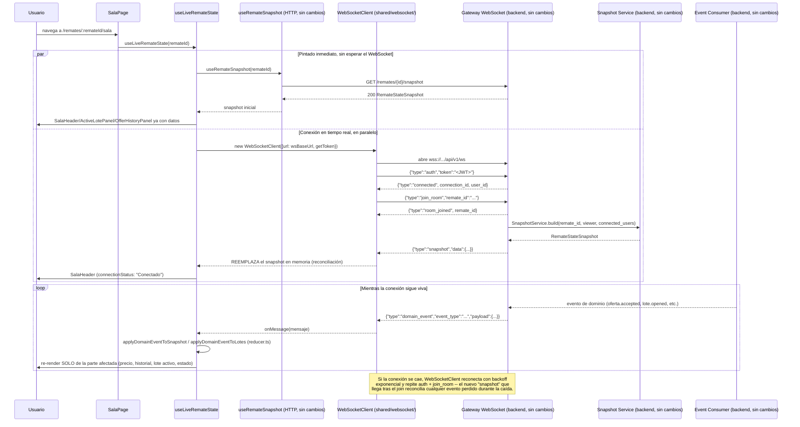

# 28 — Integración WebSocket y actualización en tiempo real (Épica 4, Módulo 4.6)

Este documento es la referencia de diseño de la integración WebSocket de la Sala del
Remate: el servicio WebSocket reutilizable, el flujo Snapshot → WebSocket → Eventos, y
cómo cada evento de dominio actualiza únicamente la parte de la pantalla que le
corresponde. Complementa [27-sala-del-remate.md](27-sala-del-remate.md) (Módulo 4.5, que
esta fase deja de lado sin reestructurar) y [ADR-031](adr/ADR-031-websocket-tiempo-real-sala.md)
(decisiones de esta fase).

## Alcance de este módulo

La Sala del Remate (Módulo 4.5) se resolvía enteramente con una única lectura del
Snapshot Service, sin WebSockets ni actualización automática (pedido explícito de esa
fase). Este módulo conecta esa misma pantalla al Gateway WebSocket que el backend ya
tiene completo desde la Épica 3: el Snapshot sigue siendo el estado inicial, pero de ahí
en más la interfaz se mantiene al día por eventos, sin polling y sin recargar la
pantalla completa.

**Restricciones verificadas**: cero cambios en `backend/` (Gateway, Snapshot Service,
Event Bus, RoomManager, Auction Engine), cero cambios en la autenticación, y cero
cambios en la arquitectura existente del frontend — `features/sala/` sigue siendo el
único feature tocado, exactamente como preveía ADR-030, sección D: "el cambio queda
contenido en `hooks.ts` (agregar un `useLiveRemateState`) y en `SalaPage.tsx`, cero
cambios en los componentes de presentación".

## Diagrama: Snapshot → WebSocket → Eventos

## El servicio WebSocket reutilizable (`shared/websocket/client.ts`)

`WebSocketClient` implementa **únicamente el protocolo de transporte** del Gateway
(`docs/20-gateway-websocket.md`, `docs/21-sistema-de-salas.md`) — no sabe qué es un
"remate", no interpreta `domain_event` ni `snapshot`. Su responsabilidad:

| Responsabilidad | Cómo |
|---|---|
| Apertura de conexión | `connect()` abre un `WebSocket` (nativo, o inyectado vía `createSocket` para tests) contra `env.wsBaseUrl`. |
| Autenticación (ADR-006) | En `onopen`, manda `{"type":"auth","token":"<JWT>"}` como primer mensaje — el JWT se lee de `getToken()` (inyectado, no capturado): cada intento de conexión, incluidos los reintentos, relee el token vigente. Reusa `getSessionAccessToken()` de `shared/api/client.ts` (misma inversión de dependencias ya establecida con el store de auth). |
| Heartbeat | Al recibir `{"type":"ping"}`, responde `{"type":"pong"}` de inmediato. El servidor cierra si no hay respuesta (`docs/20`) — este cliente nunca deja un `ping` sin responder mientras la conexión sigue abierta. |
| Reconexión con backoff exponencial | Ante cualquier cierre que no haya sido `disconnect()` explícito, reintenta con `delay = min(baseDelayMs * 2^intentos, maxDelayMs)` (default 1s → 30s, mismos valores que `REALTIME_CONSUMER_RETRY_BASE_SECONDS`/`MAX_SECONDS` del `EventConsumer` del backend — mismo patrón, ver `docs/22-sincronizacion-tiempo-real.md`). El contador se resetea a 0 apenas la conexión vuelve a autenticarse (`connected`). |
| Salas | `joinRoom(remateId)`/`leaveRoom()` — si se pide unirse antes de que termine de autenticarse, se manda automáticamente apenas llega `connected`; tras una reconexión, se vuelve a unir a la última sala pedida (el `RoomManager` del backend es por conexión, no hereda membresía de la conexión anterior). |
| Cierre limpio | `disconnect()` cierra con código `1000`, cancela cualquier reintento pendiente y no reconecta. |
| Manejo de errores | Un mensaje no-JSON se descarta silenciosamente; un `onerror` del socket no duplica lógica -- el `onclose` que el navegador dispara justo después es lo que ya decide reconectar. |

**Preparado para Chat/Presencia/Notificaciones/Streaming sin modificar este archivo**:
`onMessage(listener)` entrega **cualquier** mensaje ya parseado, sin filtrar por `type`
— es lo mismo que hoy usa `features/sala/realtime/` para reconocer `snapshot`/
`domain_event`. Un futuro Chat suscribe su propio `onMessage` y filtra
`type === 'chat_message'` con su propio criterio; `send(message)` es un canal de salida
genérico para cualquier mensaje que no sea `join_room`/`leave_room`. Ninguna extensión
futura necesita tocar `client.ts` — mismo criterio de "punto de extensión ya resuelto"
que el backend ya demostró con el Event Consumer (`docs/22`, "Cómo esta arquitectura
permitirá agregar Chat, Notificaciones y Presencia Online").

## El sistema de reconexión

1. Un cierre de conexión que **no** fue provocado por `disconnect()` (caída de red,
   `4000`/`4001`/`1006`, reinicio del backend) programa un reintento.
2. El *delay* crece exponencialmente y con un tope: 1s, 2s, 4s, 8s, 16s, 30s, 30s, ... —
   nunca satura al servidor con reconexiones instantáneas en cadena, ni deja al usuario
   esperando más de 30 segundos entre intentos.
3. Cada intento vuelve a leer `getToken()` en el momento exacto de conectar (no un valor
   capturado al construir el cliente) — si el token expiró y `apiClient` ya lo refrescó
   por su cuenta (interceptor existente, `shared/api/client.ts`) mientras la conexión
   WebSocket estaba caída, el siguiente intento usa el token nuevo automáticamente, sin
   ninguna coordinación adicional.
4. Apenas un intento se autentica (`connected`), el contador de intentos vuelve a 0 —
   una caída aislada mucho después de una reconexión estable no hereda un backoff ya
   escalado al máximo (mismo criterio que `EventConsumer._run` en el backend).
5. Tras reconectar y volver a unirse a la sala (`join_room`), el Gateway empuja un
   `snapshot` fresco (Módulo 3.6, sin cambios) que **reemplaza por completo** el estado
   en memoria del lado del frontend — esto es lo que reconcilia cualquier evento de
   dominio perdido durante la desconexión, sin que el frontend tenga que implementar su
   propio mecanismo de "qué me perdí" (RF-16/ADR-008, ya resuelto del lado del backend).
6. El indicador visual (`ConnectionStatusBadge`, en `SalaHeader`) refleja el estado real
   en todo momento: "Conectando...", "Conectado", "Reconectando...", "Desconectado" — el
   usuario nunca ve datos que podrían estar desactualizados sin saberlo.

## El manejo de eventos

### Los 12 eventos sincronizados por el backend, todos reconocidos

| Evento (nombre de la épica) | `event_type` | Efecto en la interfaz |
|---|---|---|
| `AuctionStarted` | `remate.started` | `remate.status` → `live`. |
| `AuctionPaused` | `remate.paused` | `remate.status` → `paused`. |
| `AuctionResumed` | `remate.resumed` | `remate.status` → `live`. |
| `AuctionFinished` | `remate.finished` | `remate.status` → `finished`, `finished_at`. |
| (agregado por el backend) | `remate.cancelled` | `remate.status` → `cancelled`, `cancellation_reason`, `cancelled_at`. |
| `LotOpened` | `lote.opened` | `active_lote` pasa a ser el lote recién abierto (buscado en `useLotes`, ver abajo); se limpian `winning_offer`/`recent_offers` (lote nuevo, sin ofertas todavía). |
| `LotClosed` | `lote.closed` | Si era el lote activo, `active_lote` → `null`; en la lista completa de lotes, su estado pasa a `closed_sold`/`closed_unsold` con `final_price`. |
| (agregado por el backend) | `lote.cancelled` | Igual que `lote.closed`, estado `cancelled`. |
| `BidPlaced` | `oferta.placed` | Sin efecto en el snapshot (ver "Decisión de diseño" abajo). |
| `BidAccepted` | `oferta.accepted` | Nueva entrada en `recent_offers` (tope 10, mismo límite que el backend) y `winning_offer`. |
| `BidRejected` | `oferta.rejected` | Sin efecto en el snapshot (ver "Decisión de diseño" abajo). |
| `BidWinnerChanged` | `oferta.winner_changed` | La oferta anterior pasa a `outbid` en `recent_offers`. |

### Cada evento actualiza solo su parte — nunca se recarga la pantalla

`applyDomainEventToSnapshot`/`applyDomainEventToLotes` (`features/sala/realtime/reducer.ts`)
son funciones puras: reciben el snapshot/lista actual más el evento, devuelven un objeto
nuevo que comparte referencia con todo lo que no cambió. Por ejemplo, `remate.started`
solo reconstruye `snapshot.remate`; `snapshot.active_lote`, `winning_offer` y
`recent_offers` **mantienen la misma referencia** que tenían antes del evento. Esto es lo
que permite que `React.memo` en `OfferHistoryEntry`/`UpcomingLoteCard` (ya aplicado en el
Módulo 4.5, pensado exactamente para este momento) evite re-renderizar filas que no
cambiaron.

### Por qué `lote.opened` necesita la lista de `useLotes`

El evento `lote.opened` solo trae `lote_id`/`lot_number`/`display_order` (ver
`backend/app/modules/remates/lotes/events.py::LoteOpened`) — no el lote completo
(imágenes, atributos, precios). `useLiveRemateState` ya mantiene una copia local de
`useLotes` (reusado tal cual de `features/remates/`, sin cambios) para la tira de
"próximos lotes"; al llegar `lote.opened`, se busca ahí el lote completo y se usa como
`active_lote`. Si todavía no estuviera cargado (carrera improbable, `useLotes` trae hasta
300 lotes en una sola tanda al montar), el snapshot queda sin cambios hasta la próxima
reconciliación por reconexión — no rompe, solo se demora.

### Decisión de diseño: `oferta.placed` y `oferta.rejected` no mutan el snapshot

- **`oferta.placed`**: se publica ante cualquier intento de oferta, aceptada o no — el
  resultado definitivo llega por `oferta.accepted`/`oferta.rejected` un instante después.
  Mutar el snapshot acá sería mostrar un estado transitorio que se corrige solo enseguida
  (parpadeo sin valor para el usuario).
- **`oferta.rejected`**: en este módulo, `PlaceBidButton` sigue deshabilitado (el
  formulario real de "Realizar oferta" es un módulo futuro) — ningún usuario de esta
  pantalla puede ser el autor de una oferta rechazada. Además, a diferencia del Snapshot
  Service (que enmascara `buyer_id` vía `SnapshotService._mask_oferta`), el Event
  Dispatcher del backend reenvía el evento crudo **sin enmascarar** `buyer_id` a toda la
  sala (`app/realtime/dispatcher.py`, sin cambios) — mostrarlo filtraría a cualquier
  conectado el intento fallido de otro comprador, exactamente lo que
  [06-eventos-del-sistema.md](06-eventos-del-sistema.md) ("notas de diseño") ya advertía
  que nunca debía pasar. Se descarta el evento en vez de renderizarlo. El día que exista
  el formulario real de ofertas, ese módulo puede comparar `buyer_id` contra el usuario
  autenticado y mostrar el rechazo solo al propio emisor, sin tocar el servicio
  WebSocket ni este reducer en su forma general.

### Anonimato de compradores, preservado también en eventos en vivo

`oferta.accepted`/`oferta.winner_changed` sí actualizan la interfaz, pero
`toOfertaSnapshotEntry` (`reducer.ts`) fuerza `buyer_id: null` siempre, sin importar el
valor real que traiga el evento crudo — misma política de anonimato entre postores que
ya aplicaba el Snapshot Service (`docs/27-sala-del-remate.md`, "Anonimato de
compradores"). El backend enmascara en el snapshot pero no en el evento; el frontend
vuelve a aplicar la misma máscara acá, en el único punto donde un evento en vivo entra a
la interfaz.

## Indicadores visuales de conexión

`ConnectionStatusBadge` (`features/sala/components/`) traduce `ConnectionStatus` (`idle`
| `connecting` | `open` | `reconnecting` | `closed`) a una etiqueta y un color
consistente con el resto de la UI (reusa `Badge`, mismas variantes que ya usa el estado
del remate/lote): "Conectando...", "Conectado", "Reconectando...", "Desconectado". Vive
en `SalaHeader`, junto al badge de estado del remate — el usuario nunca tiene que
adivinar si lo que ve está actualizado.

## Limitaciones conocidas (documentadas, no huecos)

- **`connected_users` no se actualiza evento a evento.** El backend todavía no publica
  presencia en tiempo real (`docs/20-gateway-websocket.md`, `docs/21-sistema-de-salas.md`,
  "Qué NO se implementa"/"Qué queda para el módulo de salas": presencia sigue pendiente).
  El número se actualiza en cada reconexión (nuevo `snapshot`, que sí recalcula
  `RoomManager.connection_count`), pero no en vivo mientras la conexión sigue abierta.
  Agregar polling para esto contradiría la misma decisión que ya tomó ADR-030, sección C
  ("sin polling, una sola carga") — se prefiere ser honesto sobre la limitación a simular
  tiempo real a medias.
- **La ventana entre el snapshot HTTP inicial y el snapshot por WebSocket.** `SalaPage`
  pinta con el snapshot HTTP (rápido, sin esperar el handshake) y lo reemplaza apenas
  llega el snapshot por WebSocket -- un evento ocurrido en esa ventana breve se recibe de
  todos modos por el canal normal de eventos apenas la sala está unida (mismo argumento
  que ya documenta `docs/23-snapshot-service.md`, "Por qué hace falta combinar Snapshot +
  Eventos"): en el peor caso, un re-render redundante, nunca un dato faltante.
- **Sin mensaje `place_bid` en el protocolo.** El formulario real de "Realizar oferta"
  (módulo futuro) sigue sin definirse en este módulo -- `PlaceBidButton` queda igual de
  aislado que en el Módulo 4.5.

## Checklist del módulo

- [x] Servicio WebSocket reutilizable (`shared/websocket/client.ts`): apertura,
      autenticación (JWT en el primer mensaje, ADR-006), heartbeat, reconexión con
      backoff exponencial, cierre limpio, manejo de errores.
- [x] Los 10 eventos pedidos + los 2 adicionales que ya sincroniza el backend
      (`remate.cancelled`, `lote.cancelled`), reconocidos y tipados.
- [x] Soporte para eventos nuevos sin modificar la arquitectura: agregar un `event_type`
      es una rama nueva en el `switch` de `reducer.ts`, no una reestructuración (mismo
      criterio "whitelist" que ya usa `registry.py` del backend).
- [x] Cada evento actualiza únicamente la parte correspondiente de la interfaz (precio
      actual, historial de ofertas, comprador líder, lote activo, estado del remate) --
      verificado con `React.memo` preservando referencia en las filas no afectadas.
- [x] Indicadores visuales de conexión (Conectando.../Conectado/Reconectando.../
      Desconectado), en `SalaHeader`.
- [x] Arquitectura preparada para Chat/Presencia/Notificaciones/Streaming sin modificar
      `shared/websocket/client.ts` (`onMessage`/`send` genéricos, sin conocer dominio).
- [x] Documentación (este archivo) y ADR (ADR-031) actualizados.
- [x] Tests: `client.test.ts` (12), `reducer.test.ts` (17), `hooks.test.ts` (agregados a
      los existentes), `ConnectionStatusBadge.test.tsx`, `SalaHeader.test.tsx` (nuevo),
      `SalaPage.test.tsx` (actualizado) -- 141/141 verdes en la suite completa del
      frontend, `tsc -b` y `oxlint` sin errores.
- [x] Cero cambios en `backend/`, en la autenticación, en el Snapshot Service, el
      Gateway WebSocket ni el Event Bus.
- [x] Cero cambios en los componentes de presentación de la Módulo 4.5
      (`ActiveLotePanel`, `OfferHistoryPanel`, `UpcomingLotesStrip`, `ImageGallery`,
      `PlaceBidButton`) -- solo `SalaHeader` gana el prop `connectionStatus`, aditivo.

## Trabajo futuro (fuera de alcance de este módulo)

- Formulario real de "Realizar oferta" (`PlaceBidButton` sigue aislado para esto), que
  además podría usar `oferta.rejected` para notificar al propio emisor.
- Chat por sala, presencia detallada (quién específicamente está conectado), video y
  streaming -- todos construibles sobre `shared/websocket/client.ts` sin modificarlo
  (ver "Preparado para Chat/Presencia/Notificaciones/Streaming" arriba).
- Presencia en tiempo real de `connected_users` (requiere que el backend publique
  `presencia.usuario_conectado`/`desconectado`, ver "Limitaciones conocidas").
