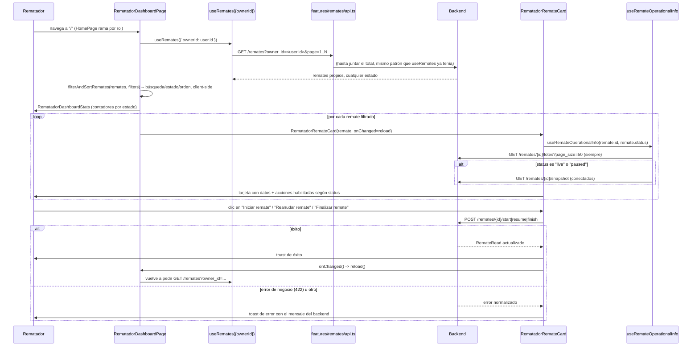

# 29 — Dashboard del Rematador (Épica 5, Módulo 5.1)

Este documento es la referencia de diseño del Dashboard del Rematador: la consola desde
donde un usuario con rol `rematador` administra sus propios remates. Complementa
[25-dashboard-comprador.md](25-dashboard-comprador.md) (Épica 4.3, la infraestructura que
este módulo reutiliza) y [ADR-032](adr/ADR-032-dashboard-rematador.md) (decisiones de
esta fase).

## Alcance de este módulo

Se implementa la pantalla principal del rematador: una consola de tarjetas con sus
remates propios (en cualquier estado, incluidos los borradores), indicadores operativos
por tarjeta (cantidad de lotes, lote activo/próximo, compradores conectados si el dato
está disponible), y las acciones de ciclo de vida que el motor de estados del backend ya
expone (iniciar, reanudar, finalizar). **No** se implementan todavía: apertura/cierre de
lotes, gestión de ofertas, chat ni streaming — esos son la Consola Operativa del
Rematador (Módulo 5.2), para la que este módulo ya deja la ruta de entrada resuelta (ver
"Preparación para el Módulo 5.2" más abajo).

## Restricciones de esta fase (verificadas)

- **Cero cambios en `backend/`.** Consume exclusivamente endpoints ya existentes:
  `GET /remates?owner_id=...` (Épica 2.1), `POST /remates/{id}/start|resume|finish`
  (Épica 2.3, Módulo 2.3, ver `docs/16-motor-de-estados.md`), `GET /remates/{id}/lotes`
  (Épica 2.2) y `GET /remates/{id}/snapshot` (Épica 3.6) — este último ya funcionaba para
  el dueño de un remate en cualquier estado, no solo `live` (`SnapshotService.build` usa
  el mismo criterio de visibilidad que `GET /remates/{id}`).
- **No se tocó la autenticación** ni los guards existentes.
- **No se modificó la Sala del Remate del comprador** (`features/sala/`) ni ningún
  componente de presentación de `features/remates/` usado por el dashboard del
  comprador — `CompradorDashboardPage`, `RemateCard`, `RemateCardSkeleton` quedan
  exactamente como estaban.
- `HomePage.tsx` cambia de forma aditiva: se agrega una rama `user.role === 'rematador'`
  antes del placeholder genérico, que sigue intacto para `admin`.
- `app/router.tsx` gana una ruta nueva, `/remates/:remateId/gestionar` (destino de
  "Administrar"), sin tocar ninguna ruta existente.

## Por qué se extendió `features/remates/` en vez de duplicarlo, y por qué el dashboard en sí es un feature nuevo

A diferencia de la Sala del Remate (Épica 4.5, que se separó en `features/sala/` porque
compone DTOs de un paquete de backend genuinamente distinto, `app/snapshot/`), las
acciones de ciclo de vida (`start`/`resume`/`finish`) viven en el **mismo**
`app/modules/remates/router.py` que el resto del CRUD de `Remate` — el propio backend no
traza ahí un límite de módulo nuevo. Por eso:

- `startRemateRequest`/`resumeRemateRequest`/`finishRemateRequest` se agregaron a
  `features/remates/api.ts` (mismo archivo que ya tenía `fetchRemateByIdRequest`, etc.),
  no a un `api.ts` nuevo.
- `useRemates` (ya existente) se **amplió** con un parámetro opcional `ownerId` en vez de
  crear un hook paralelo — `CompradorDashboardPage` sigue llamándolo sin argumentos y se
  comporta exactamente igual que antes.
- `DashboardToolbar` (ya existente) ganó un prop opcional `statusOptions`, con el mismo
  default de siempre (`VISIBLE_STATUS_OPTIONS`) — el dashboard del rematador es el único
  que pasa `ALL_STATUS_OPTIONS` (incluye `draft`).
- `RemateFilters.status` se amplió de `VisibleRemateStatus | 'all'` a
  `RemateStatus | 'all'` (un ensanchamiento de tipo, retrocompatible: todo lo que ya
  compilaba sigue compilando).

Lo que **sí** es nuevo es `features/rematador/`: la página, las tarjetas y el hook de
información operativa son una experiencia de producto distinta ("administrar mis
remates", no "explorar remates ajenos") que va a seguir creciendo en la Consola Operativa
(Módulo 5.2) sin mezclarse con el dominio de navegación del comprador — mismo criterio de
crecimiento futuro que ya justificó separar `features/sala/` en ADR-030, aplicado acá al
lado del feature (páginas/componentes propios), no a las llamadas HTTP del recurso
`Remate` (que siguen en `features/remates/`).

## Flujo del dashboard

## Componentes reutilizables

| Componente | Origen | Rol en este módulo |
|---|---|---|
| `DashboardToolbar` | `features/remates/components/` (Épica 4.3, extendido) | Búsqueda, filtro de estado (ahora con `draft` vía `statusOptions`), filtro de categoría, orden. |
| `filterAndSortRemates`/`DEFAULT_FILTERS` | `features/remates/filtering.ts` (Épica 4.3, tipo ensanchado) | Búsqueda/filtro/orden client-side, sin cambios de comportamiento. |
| `Alert`, `Button`, `EmptyState`, `Badge`, `Skeleton` | `shared/components/` (Épica 4.1) | Estados de error/vacío/carga, badges de estado — sin ningún cambio. |
| `useToastStore` | `shared/toast/` (Épica 4.1, primer uso real) | Feedback de éxito/error de las acciones de ciclo de vida — existía desde la fundación del frontend pero ningún módulo lo había usado todavía. |
| `STATUS_LABELS`/`STATUS_BADGE_VARIANTS`/`CATEGORY_LABELS` | `features/remates/labels.ts` | Reusados tal cual (ya cubrían los 6 estados, incluido `draft`, desde la Épica 4.3). |

Componentes nuevos, todos en `features/rematador/`:

- **`RematadorRemateCard`**: la pieza central. Recibe `remate` + `onChanged` (callback
  para recargar la lista tras una acción exitosa) — no sabe nada de la lista que la
  contiene, mismo criterio de desacople que el resto del proyecto usa para `reload()`.
  Usa `useRemateOperationalInfo` para los datos derivados y expone hasta tres botones de
  ciclo de vida, condicionados al `status` actual y a precondiciones del backend (ver
  "Acciones de ciclo de vida" abajo).
- **`RematadorDashboardStats`**: fila de indicadores (total + un contador por estado),
  calculada client-side con `useMemo` sobre la misma lista que ya trajo `useRemates` — sin
  ningún endpoint nuevo. Es lo que le da al dashboard su "apariencia de consola
  profesional" pedida explícitamente, sin tablas.
- **`RematadorRemateCardSkeleton`**: misma forma que la tarjeta real, para el estado de
  carga.
- **`useRemateOperationalInfo(remateId, status)`**: hook con dos requests
  independientes y cada una con su propio fallo silencioso (mismo patrón que
  `useLoteCount`, Épica 4.3): `GET /remates/{id}/lotes` (siempre, para la cantidad de
  lotes y el lote activo/próximo) y `GET /remates/{id}/snapshot` (solo si el remate está
  `live`/`paused`, para "conectados" — pedirlo para un remate que no está en curso
  siempre daría `0` sin aportar nada real).

## Acciones de ciclo de vida

| Acción | Cuándo se muestra | Precondición de UI (antes de llamar al backend) | Endpoint |
|---|---|---|---|
| Iniciar remate | `status === 'scheduled'` | Al menos un lote cargado (`loteCount > 0`) — si no, el botón queda deshabilitado con un `title` explicativo en vez de dejar que el backend lo rechace con 422. | `POST /remates/{id}/start` |
| Reanudar remate | `status === 'paused'` | Ninguna. | `POST /remates/{id}/resume` |
| Finalizar remate | `status === 'live'` | Que no haya un lote `open` (`activeLote === null`) — mismo criterio, deshabilitado con `title` en vez de dejar pasar un 422. Pide confirmación (`window.confirm`) por ser irreversible. | `POST /remates/{id}/finish` |

**Por qué no hay botón "Pausar" en este dashboard**: pausar un remate es una acción de
control **en vivo** (se hace mientras se está operando el remate, viendo ofertas en
tiempo real) — corresponde a la Consola Operativa del Rematador (Módulo 5.2), no a esta
consola de repaso/administración general. "Reanudar" sí tiene sentido acá: retoma un
remate que quedó pausado de una sesión anterior, sin necesidad de abrir la consola en
vivo solo para eso. Ver ADR-032 para la justificación completa (es una decisión
deliberada, no un olvido: el enunciado de este módulo tampoco la pedía explícitamente).

Cualquier error de negocio (422 `BusinessRuleError`, ya validado además preventivamente
en la UI) o de cualquier otro tipo se muestra con `useToastStore` — primer uso real de
ese store en la aplicación (existía desde la fundación del frontend, Épica 4.1, sin
ningún consumidor hasta ahora).

## Preparación para el Módulo 5.2 (Consola Operativa del Rematador)

1. **Ruta ya resuelta**: `/remates/:remateId/gestionar` existe desde este módulo,
   apuntando a `GestionRematePlaceholderPage` — mismo patrón que
   `/remates/:remateId/sala` tuvo entre los Módulos 4.4 y 4.5 (un placeholder con la
   ruta ya montada, reemplazado sin tocar el árbol de rutas). El botón "Administrar" de
   `RematadorRemateCard` ya navega ahí.
2. **"Pausar" y "Cancelar" tienen un lugar natural**: la Consola Operativa es donde un
   rematador va a pasar el tiempo real de su remate — pausar (control en vivo) y
   cancelar (con motivo obligatorio, `POST /remates/{id}/cancel`, ya expuesto por el
   backend pero no usado todavía en el frontend) encajan ahí, no en esta consola de
   repaso.
3. **`useRemateOperationalInfo` ya resuelve lote activo/próximo**: la Consola Operativa
   puede reusar ese mismo hook (o una versión ampliada) para saber qué lote mostrar sin
   rediseñar la resolución de "qué lote está pasando ahora".
4. **El mismo patrón de acciones (`runAction` + `useToastStore` + `onChanged`) ya está
   probado**: abrir/cerrar un lote es, mecánicamente, la misma forma (POST sin o con
   body, éxito → toast + refrescar, error → toast) que `start`/`resume`/`finish` ya
   usan acá.

## Limitaciones conocidas (documentadas, no huecos)

- **Sin creación de remates desde este dashboard.** El enunciado de este módulo pide
  administrar remates ya existentes, no crearlos — el estado vacío lo dice
  explícitamente en vez de mostrar un botón que no lleva a ningún lado.
- **"Compradores conectados" depende de que alguien esté con el WebSocket abierto en
  ese remate.** Es el mismo dato que ya usa la Sala del Remate
  (`RoomManager.connection_count`, en memoria, por instancia de backend) — no persiste
  entre pedidos ni se actualiza en vivo dentro de esta pantalla (no hay WebSocket acá,
  solo el valor de la última vez que se pidió el snapshot). Ver
  `docs/28-websocket-tiempo-real-sala.md`, "Limitaciones conocidas", mismo argumento.
- **"Próximo lote" puede no encontrarse en remates con más de 50 lotes** (algo
  extremadamente inusual en la práctica): `useRemateOperationalInfo` pide solo la
  primera tanda de lotes (`page_size: 50`) para no pagar el costo de `useLotes` (hasta
  300, con múltiples pedidos) en una tarjeta de resumen. La cantidad total (`loteCount`)
  siempre es exacta (viene de `total` del envelope de paginación, no de cuántos items se
  pidieron).

## Checklist del módulo

- [x] Consume únicamente endpoints existentes del backend, sin cambios ahí.
- [x] Muestra únicamente los remates del rematador autenticado (`owner_id`), en
      cualquier estado.
- [x] Tarjeta con: nombre, estado, fecha, cantidad de lotes, compradores conectados (si
      disponible), lote activo o próximo lote.
- [x] Acciones: Ver remate, Administrar remate, Iniciar (si corresponde), Reanudar (si
      pausado), Finalizar (si corresponde).
- [x] Buscador, filtro por estado (incluido `draft`), filtro por categoría, ordenamiento.
- [x] Skeleton loaders, estado vacío (sin remates propios, y sin resultados de filtro),
      manejo de errores con reintentar.
- [x] Diseño de consola: fila de indicadores, tarjetas (sin tablas), responsive (probado
      en grilla 1/2/3 columnas).
- [x] Sin apertura/cierre de lotes, gestión de ofertas, chat ni streaming.
- [x] Documentación (este archivo) y ADR (ADR-032) actualizados.
- [x] Tests: `hooks.test.ts` (5), `RematadorRemateCard.test.tsx` (11),
      `RematadorDashboardStats.test.tsx` (2), `RematadorDashboardPage.test.tsx` (6),
      `GestionRematePlaceholderPage.test.tsx` (1), `DashboardToolbar.test.tsx` (2, la
      extensión de `statusOptions`) — 171/171 verdes en la suite completa del frontend,
      `tsc -b` y `oxlint` sin errores.
- [x] Verificado de punta a punta contra el backend real (Docker Compose): registro de
      un rematador, creación de remates en `draft`/`scheduled` con y sin lotes, "Iniciar
      remate" desde la UI (toast, cambio de estado, aparición de "Finalizar remate"),
      navegación a "Administrar" -- sin errores de consola.
- [x] Cero cambios en `backend/`, en la autenticación, ni en `features/sala/`.

## Trabajo futuro (fuera de alcance de este módulo)

- Consola Operativa del Rematador (Módulo 5.2): abrir/cerrar lotes, seguir ofertas en
  vivo, pausar el remate -- reemplaza `GestionRematePlaceholderPage` sin tocar la ruta.
- Botón "Cancelar remate" (`POST /remates/{id}/cancel`, ya expuesto por el backend).
- Creación de remates desde el frontend (`POST /remates`, ya expuesto, sin consumidor en
  el frontend todavía).
- Edición de un remate propio (`PATCH /remates/{id}`, solo en `draft`/`scheduled`).
