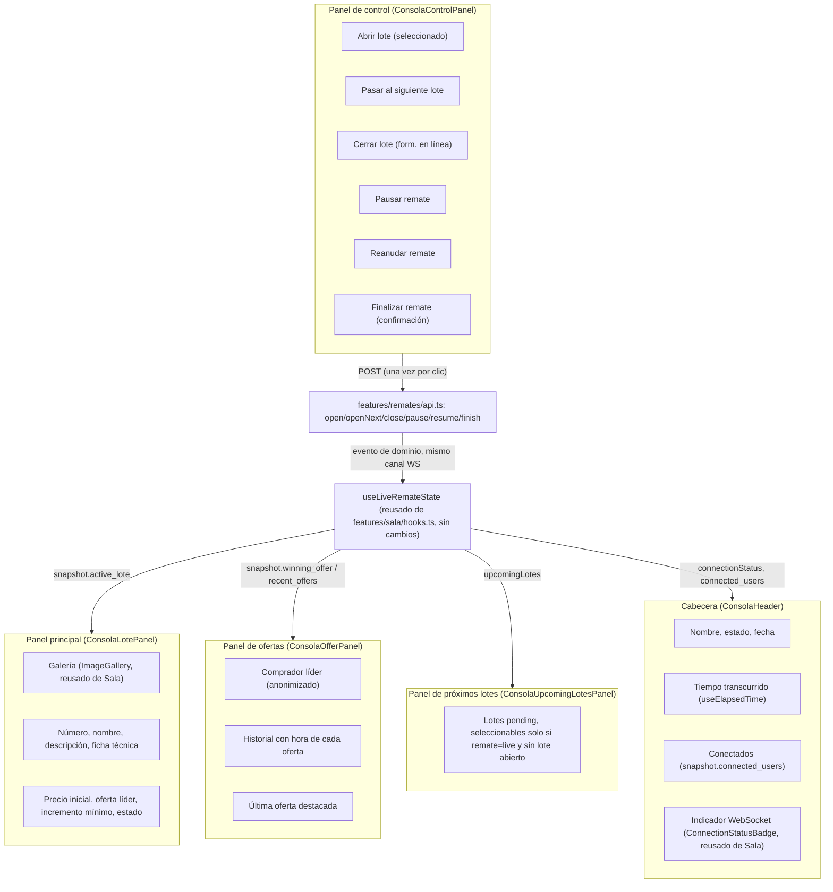

# 30 — Consola Operativa del Rematador (Épica 5, Módulo 5.2)

Este documento es la referencia de diseño de la Consola Operativa: la pantalla desde
donde el rematador controla un remate en vivo durante toda su operación. Complementa
[29-dashboard-rematador.md](29-dashboard-rematador.md) (Épica 5.1, el dashboard desde el
que se llega acá) y [28-websocket-tiempo-real-sala.md](28-websocket-tiempo-real-sala.md)
(Épica 4.6, cuya infraestructura este módulo reutiliza sin modificarla). Ver
[ADR-033](adr/ADR-033-consola-operativa-rematador.md) para las decisiones de esta fase.

## Alcance de este módulo

Se implementa la pantalla operativa completa: cabecera con estado en vivo, panel
principal con el lote activo, panel de control con las seis acciones del motor de
estados, panel de ofertas en tiempo real, y panel de próximos lotes con selección.
**No** se implementan todavía: chat, streaming de video, compartir pantalla ni
moderación — quedan, junto con la gestión estructural de remates/lotes (crear, editar,
reordenar), para el módulo siguiente.

## Restricciones de esta fase (verificadas)

- **Cero cambios en `backend/`.** Consume exclusivamente endpoints ya existentes:
  `POST /remates/{id}/pause` (nuevo consumidor, el endpoint ya existía desde la Épica
  2.3), `POST /remates/{id}/lotes/{lote_id}/open`, `POST /remates/{id}/lotes/next`,
  `POST /remates/{id}/lotes/{lote_id}/close` (Épica 2.3), más todo lo que Épica 5.1 ya
  consumía (`start`/`resume`/`finish`) y toda la infraestructura de tiempo real de la
  Épica 3/4.6 (Gateway WebSocket, salas, Event Consumer, Snapshot Service).
- **Cero cambios en `features/sala/`** (la experiencia del comprador): `useLiveRemateState`,
  `ImageGallery`, `ConnectionStatusBadge` se **reutilizan tal cual**, importados sin
  modificar un carácter. Los paneles que sí necesitaban comportamiento distinto al de la
  Sala (control de acciones, selección de próximo lote, destacar la última oferta) se
  construyeron como componentes nuevos y propios de `features/rematador/`, en vez de
  extender los del comprador — ver ADR-033, sección A.
- **No se modificó la arquitectura del frontend.** `features/rematador/` (creado en la
  Épica 5.1) gana componentes y una página nueva; `features/remates/api.ts` gana las
  llamadas HTTP nuevas (mismo patrón aditivo que ya usó ADR-032).

## Diagrama de la consola

## Flujo de cada acción

Las seis acciones del panel de control llaman un endpoint del motor de estados
(`docs/16-motor-de-estados.md`) y **no refrescan nada manualmente**: la propia consola
está unida a la sala del remate por WebSocket (misma conexión que ya usa
`useLiveRemateState`), así que el evento de dominio que la acción dispara vuelve por el
mismo canal, normalmente antes incluso de que la respuesta HTTP de la propia acción
termine de resolver (verificado empíricamente, ver "Hallazgo" más abajo). Cada botón
valida en el cliente la misma precondición que el backend ya exige, para no dejar pasar
un clic que va a volver con un 422:

| Acción | Habilitada cuando | Precondición adicional (backend, ya validada en el cliente) | Endpoint |
|---|---|---|---|
| Abrir lote | `status=live`, sin lote abierto, hay un lote seleccionado en "Próximos lotes" | — | `POST .../lotes/{lote_id}/open` |
| Pasar al siguiente lote | `status=live`, sin lote abierto, hay al menos un lote pendiente | — | `POST .../lotes/next` |
| Cerrar lote | `status` es `live` o `paused`, hay un lote abierto | Formulario: resultado (vendido/desierto) + precio final (solo si vendido, validado `>= precio inicial` antes de habilitar "Confirmar cierre") | `POST .../lotes/{lote_id}/close` |
| Pausar remate | `status=live` | — | `POST /remates/{id}/pause` |
| Reanudar remate | `status=paused` | — | `POST /remates/{id}/resume` |
| Finalizar remate | `status=live`, sin lote abierto | `window.confirm` (única acción de un solo clic que termina el remate) | `POST /remates/{id}/finish` |

**Por qué no hay botón "Pausar" en el Dashboard (Épica 5.1) pero sí acá**: ADR-032 ya
anticipó esta decisión — pausar es control en vivo, exclusivo de esta consola.

**Por qué "Cerrar lote" no usa `window.confirm`**: el formulario en línea (elegir
resultado, tipear el precio, un botón "Confirmar cierre" distinto del que abrió el
formulario) ya es la confirmación explícita — agregar un `window.confirm` encima sería
redundante. "Finalizar remate" sí lo usa porque es un único clic sin ningún paso
intermedio.

**Selección de "próximo lote"**: `ConsolaUpcomingLotesPanel` solo permite clickear una
tarjeta cuando `remate.status === 'live' && !activeLote` (pedido explícito: "permitir
seleccionar únicamente cuando el estado del remate lo permita") — con la selección
deshabilitada, las tarjetas vuelven a ser `
` no interactivos, mismo criterio que la
tira de próximos lotes del comprador. La selección se limpia sola (`useEffect` en
`ConsolaOperativaPage`) apenas el lote seleccionado deja de estar `pending` -- se abrió,
o dejó de listarse por cualquier otro motivo.

## Integración con WebSockets

**Reutilización, no reimplementación**: `ConsolaOperativaPage` llama a
`useLiveRemateState(remateId)` -- el mismo hook de `features/sala/hooks.ts` que ya
construyó y probó la Épica 4.6 para el comprador, sin tocarlo. La consola es, en los
hechos, **una segunda conexión a la misma sala**: cuando el rematador abre la consola de
un remate que un comprador está viendo en la Sala, ambas conexiones están unidas al mismo
`remate_id` en el `RoomManager` del backend y reciben exactamente los mismos eventos.
Esto significa que:

- Si un comprador oferta mientras el rematador tiene la consola abierta, la oferta
  aparece en el panel de ofertas de la consola al instante, sin ninguna acción del
  rematador -- verificado en vivo contra el backend real (ver "Verificado" en el
  checklist).
- Si el rematador abre/cierra un lote desde la consola, cualquier comprador con la Sala
  abierta ve el cambio al instante, por el mismo mecanismo -- la consola no le avisa nada
  "directamente" a nadie, solo llama al mismo endpoint HTTP que dispara el mismo evento
  de dominio que el resto de la arquitectura de tiempo real ya sabe repartir (Event Bus →
  Redis Pub/Sub → Event Consumer → Room → cada conexión unida, Épica 3.5).

### Hallazgo no anticipado: un refresco HTTP "de respaldo" después de una acción puede traer datos desactualizados

Durante la verificación en vivo de este módulo se probó, inicialmente, llamar a
`reload()` (de `useRemateSnapshot`, HTTP) después de cada acción exitosa del panel de
control, como respaldo "por las dudas" ante una conexión WebSocket caída en ese momento
puntual. Esto introdujo un bug real: `SnapshotService` (backend, Épica 3.6, sin cambios)
cachea el estado crudo en Redis por `SNAPSHOT_CACHE_TTL_SECONDS` (2 segundos, ver
`docs/23-snapshot-service.md`) -- un `reload()` disparado inmediatamente después de, por
ejemplo, abrir un lote podía traer de vuelta la respuesta **cacheada de antes de la
acción** (`active_lote: null`), pisando el estado correcto que el evento de WebSocket ya
había aplicado un instante antes. Se reprodujo de punta a punta contra el backend real
(no en tests unitarios, que mockean el transporte): el botón "Abrir lote" quedaba
funcionalmente atascado -- la acción sí se ejecutaba en el backend, pero la interfaz
volvía a mostrar "sin lote activo".

**Decisión**: se eliminó el refresco de respaldo. `ConsolaControlPanel` no llama a
ningún `reload()` tras una acción -- confía enteramente en el evento de WebSocket, que ya
demostró llegar de forma confiable y, en la práctica, más rápido que la propia respuesta
HTTP de la acción que lo disparó. Ver ADR-033, sección B, para el detalle completo y las
alternativas consideradas.

## Componentes reutilizables

| Componente | Origen | Uso en este módulo |
|---|---|---|
| `useLiveRemateState` | `features/sala/hooks.ts` (Épica 4.6) | Snapshot en vivo, `upcomingLotes`, `connectionStatus` -- sin modificar. |
| `ImageGallery` | `features/sala/components/` (Épica 4.5) | Galería del lote activo en `ConsolaLotePanel` -- componente puro, sin ninguna acción de comprador embebida. |
| `ConnectionStatusBadge` | `features/sala/components/` (Épica 4.6) | Indicador de conexión en `ConsolaHeader`. |
| `Badge`/`Button`/`Input`/`Alert`/`EmptyState`/`Skeleton`/`Breadcrumb` | `shared/components/` | Sin ningún cambio. |
| `useToastStore` | `shared/toast/` | Feedback de las seis acciones (ya en uso desde la Épica 5.1). |
| `STATUS_LABELS`/`LOTE_STATUS_LABELS`/`CATEGORY_LABELS`/`OFERTA_STATUS_LABELS` | `features/remates/labels.ts`, `features/sala/labels.ts` | Reusados tal cual. |

Componentes nuevos (`features/rematador/`): `ConsolaHeader`, `ConsolaLotePanel`,
`ConsolaControlPanel`, `ConsolaOfferPanel`, `ConsolaUpcomingLotesPanel`,
`ConsolaOperativaPage`. Ninguno reimplementa `ActiveLotePanel`/`OfferHistoryPanel`/
`UpcomingLotesStrip` del comprador tal cual: los reconstruye con la misma identidad
visual (mismos tokens de color, mismos badges) pero con la semántica que este módulo
necesita (sin `PlaceBidButton`, con selección, con destacado de la última oferta) -- ver
ADR-033, sección A, para por qué no se extendieron los del comprador en su lugar.

## Optimización del renderizado

- `OfferEntry` (`ConsolaOfferPanel`) y `UpcomingLoteCard` (`ConsolaUpcomingLotesPanel`)
  están en `React.memo`, mismo criterio que sus equivalentes de la Sala (Épica 4.5): un
  evento que solo afecta a una oferta o a un lote no re-renderiza el resto de la lista.
- El reducer de `features/sala/realtime/reducer.ts` (sin cambios) ya devuelve objetos que
  comparten referencia con todo lo que no cambió -- la consola hereda esa optimización
  gratis, sin ningún trabajo adicional.
- `useElapsedTime` solo activa su intervalo de un segundo mientras el remate está
  `live`/`paused` -- no hay un timer corriendo de fondo para un remate `finished`/
  `cancelled`/`scheduled`/`draft`.

## Limitaciones conocidas

- **"Tiempo transcurrido" es una aproximación**, no un cronómetro exacto desde el
  momento real de inicio: `Remate` no tiene una columna `started_at` (no se agrega acá,
  "no modificar el backend") -- se calcula desde `starts_at` (la fecha programada). Documentado
  en `useElapsedTime` y en el propio `title` del ícono en la cabecera.
- **Sin "Cancelar lote"/"Cancelar remate"/"Editar lote" en esta consola** -- no estaban
  en la lista de acciones pedidas por este módulo; quedan para "Gestión completa de
  remates y lotes" (próximo módulo).
- **Compradores conectados no se actualiza evento a evento** dentro de la misma sesión
  de la consola (mismo argumento ya documentado en `docs/28`, "Limitaciones conocidas":
  el backend todavía no publica presencia en tiempo real) -- se actualiza en cada
  reconexión del WebSocket (nuevo snapshot), no en vivo.

## Checklist del módulo

- [x] Cabecera: nombre, estado, fecha, tiempo transcurrido, conectados, indicador de
      conexión WebSocket.
- [x] Panel principal: imagen principal, galería, número, nombre, descripción, ficha
      técnica, precio inicial, oferta líder, incremento mínimo, estado del lote.
- [x] Panel de control: abrir lote, pausar remate, reanudar remate, cerrar lote, pasar
      al siguiente lote, finalizar remate -- las seis consumiendo endpoints existentes.
- [x] Panel de ofertas en tiempo real: historial, comprador líder (anonimizado), hora de
      cada oferta, última oferta destacada visualmente.
- [x] Panel de próximos lotes: selección condicionada al estado del remate.
- [x] Diseño de centro de control: indicadores claros, jerarquía visual definida,
      responsive (grilla 2/3 + 1/3 en desktop, apilado en mobile).
- [x] Skeleton loaders, estados vacíos (sin lote activo, sin próximos lotes, remate no
      operativo), manejo de errores con reintentar.
- [x] Confirmaciones para acciones críticas (`window.confirm` en Finalizar; formulario
      explícito en Cerrar lote).
- [x] Componentes reutilizables (`useLiveRemateState`/`ImageGallery`/
      `ConnectionStatusBadge` de `features/sala/`, sin modificarlos).
- [x] Optimización de renderizado (`React.memo`, referencias estables del reducer ya
      existente, `useElapsedTime` sin timers innecesarios).
- [x] Sin chat, streaming, compartir pantalla ni moderación.
- [x] Documentación (este archivo) y ADR (ADR-033) actualizados.
- [x] Tests: `ConsolaHeader` (3), `ConsolaLotePanel` (5), `ConsolaOfferPanel` (4),
      `ConsolaUpcomingLotesPanel` (4), `ConsolaControlPanel` (14), `ConsolaOperativaPage`
      (6), `useElapsedTime` (5, en `features/rematador/hooks.test.ts`) -- 216/216 verdes
      en la suite completa del frontend, `tsc -b` y `oxlint` sin errores.
- [x] Verificado de punta a punta contra el backend real (Docker Compose): abrir lote
      seleccionado, pasar al siguiente lote, cerrar lote vendido y desierto (en vivo y en
      pausa), pausar/reanudar, finalizar (con confirmación), una oferta real de un
      comprador reflejada en el panel de ofertas sin recargar la página, y finalización
      automática del remate al cerrarse el último lote (RF-10) reflejada en vivo -- sin
      errores de consola en ningún escenario.
- [x] Cero cambios en `backend/`, en la autenticación, ni en `features/sala/`.

## Trabajo futuro (fuera de alcance de este módulo)

- Gestión completa de remates y lotes (próximo módulo): crear/editar/reordenar lotes,
  crear/editar/cancelar remates, subida de imágenes.
- Chat por sala, streaming de video, compartir pantalla, moderación.
- Presencia en tiempo real de conectados (mismo pendiente que `docs/28`, requiere que el
  backend publique eventos de presencia).
- "Cancelar lote"/"Cancelar remate" desde la consola (endpoints ya existentes,
  `POST .../cancel`, sin consumidor todavía).
