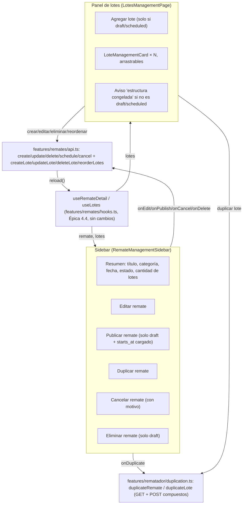

# 31 — Gestión completa de Remates y Lotes (Épica 5, Módulo 5.3)

Este documento es la referencia de diseño de la pantalla donde el rematador prepara un
remate completo antes de que empiece: crear/editar/eliminar/duplicar/publicar/cancelar el
remate, y crear/editar/eliminar/duplicar/reordenar sus lotes. Complementa
[29-dashboard-rematador.md](29-dashboard-rematador.md) (Épica 5.1, desde donde se llega
acá) y [30-consola-operativa-rematador.md](30-consola-operativa-rematador.md) (Épica 5.2,
la pantalla de control una vez el remate está en vivo). Ver
[ADR-034](adr/ADR-034-gestion-remates-lotes.md) para las decisiones de esta fase.

## Alcance de este módulo

Se implementa la preparación estructural completa de un remate: alta/baja/edición/
duplicado del remate, publicación (única transición `draft` → `scheduled`), cancelación
con motivo, y alta/baja/edición/duplicado/reordenamiento (drag & drop + botones ↑/↓) de
sus lotes. **No** se implementan todavía: chat, streaming de video, ni notificaciones —
quedan para módulos futuros.

## Restricciones de esta fase (verificadas)

- **Cero cambios en `backend/`.** Todo se resuelve con endpoints ya existentes: CRUD de
  Remate (Épica 2.1) y de Lote (Épica 2.2), `POST .../schedule` y `POST .../cancel`
  (motor de estados, Épica 2.3), `PATCH .../lotes/reorder` (Épica 2.2). No existe
  "duplicar" en el backend — se compone en el cliente (ADR-034, sección B).
- **No se modificó la arquitectura del frontend.** `features/remates/api.ts` gana las
  llamadas HTTP nuevas del recurso (mismo patrón aditivo de ADR-032/ADR-033);
  `features/rematador/` (creado en la Épica 5.1) gana componentes, hooks de formulario y
  una página nueva (`LotesManagementPage`, en `/remates/:remateId/lotes`, reemplazando el
  placeholder que dejó la Épica 5.1 en esa ruta); `shared/components/` gana `Modal`/
  `ConfirmModal`/`Textarea`/`Select`/`DropdownMenu`, genéricos y sin ningún conocimiento
  del dominio Remate/Lote.
- **Sin tablas tradicionales.** Todo listado (remates en el dashboard, lotes en esta
  pantalla) es de tarjetas; toda edición ocurre en un modal, nunca en una fila editable
  inline ni en una página de formulario aparte.

## Diagrama de la pantalla

## Flujo de creación

**Remate**: desde `RematadorDashboardPage`, el botón "Crear remate" (en el header y en el
estado vacío) abre `RemateFormModal` sin prop `remate` (modo creación). Al enviar,
`createRemateRequest` (`POST /remates`) crea el remate en `draft`; el modal navega
directo a `/remates/:id/lotes` — el flujo natural es crear el remate y pasar
inmediatamente a cargarle lotes, no volver al dashboard para hacer un segundo clic.

**Lote**: desde `LotesManagementPage`, "Agregar lote" (visible solo si
`isStructureEditable`) abre `LoteFormModal` sin prop `lote`. El formulario (`loteForm.ts`)
valida número/nombre/categoría/precio inicial/incremento mínimo (obligatorios) y
peso/cantidad/unidad/precio de reserva/atributos dinámicos/imagen (opcionales) antes de
habilitar el submit; `buildLoteFormPayload` arma el `LoteFormPayload` (incluyendo
`attributes.peso_kg` si se cargó peso) y `createLoteRequest` lo envía. Al guardar, la
página llama `reloadLotes()` — mismo criterio `reload()` usado en todo el proyecto — y la
nueva tarjeta aparece al final de la lista (orden de creación = orden de exhibición
inicial, coincide con el criterio del backend).

Ambos formularios comparten el mismo componente para crear y editar: la presencia o
ausencia de la prop `remate`/`lote` decide el modo (título del modal, texto del botón,
`updateXRequest` vs `createXRequest`) — ver ADR-034, sección D.

## Flujo de edición

**Remate**: "Editar" (menú "⋯" de la tarjeta en el dashboard, o el botón dedicado de la
sidebar en esta pantalla) abre el mismo `RemateFormModal`, ahora con `remate` presente;
`remateToFormValues` pre-carga el formulario (incluyendo la conversión de las fechas ISO
a `datetime-local` en huso horario local, no UTC naive — ver `toDatetimeLocalValue` en
`remateForm.ts`). Deshabilitado salvo `status` `draft`/`scheduled` (`isEditableStructure`)
— coincide exactamente con `_assert_structure_editable` del backend, para no dejar pasar
un clic que volvería con un 422.

**Lote**: "Editar" en el menú "⋯" de `LoteManagementCard` abre `LoteFormModal` con `lote`
presente; `loteToFormValues` separa `attributes.peso_kg` al campo dedicado "Peso" y deja
el resto de `attributes` como filas dinámicas de "Información técnica". El campo "Estado"
no es editable — se muestra como un `Badge` de solo lectura (`LOTE_STATUS_LABELS`) porque,
mientras la estructura es editable, todo lote está siempre en `pending`: no hay ninguna
transición que el rematador pueda disparar desde este formulario (ver ADR-034, sección
E).

## Drag & drop (reordenamiento de lotes)

Implementado con la API nativa de HTML5 Drag and Drop, sin librería (ADR-034, sección C):

1. `LoteManagementCard` es `draggable` solo si `isEditable`. Al arrastrar
   (`onDragStart`), `LotesManagementPage` guarda el `id` arrastrado; al pasar sobre otra
   tarjeta (`onDragEnter`), guarda el `id` "destino" (usado solo para el resaltado visual
   — anillo azul); `onDragOver` llama `preventDefault()` (requerido por la especificación
   HTML5 para que `onDrop` dispare); al soltar (`onDrop`), `handleDrop` calcula el nuevo
   arreglo con `splice` (saca el lote arrastrado de su posición, lo inserta en la del
   destino) y llama a `persistReorder`.
2. `persistReorder` es **optimista**: actualiza el estado local (`setLotes`) de
   inmediato, llama a `reorderLotesRequest` (`PATCH /remates/{id}/lotes/reorder`,
   ya existente) con los IDs en el nuevo orden, y si la request falla **revierte** al
   arreglo anterior y muestra el error por toast — el usuario nunca ve un orden que el
   backend terminó rechazando.
3. Los botones ↑/↓ de cada tarjeta (`onMoveUp`/`onMoveDown`) llaman a la misma
   `persistReorder` con un intercambio de posiciones adyacentes calculado en
   `moveLote`. **No son un fallback secundario**: HTML5 Drag and Drop no funciona en
   ningún navegador móvil para elementos arbitrarios, así que son el único mecanismo de
   reordenamiento disponible en touch, por teclado, o con un lector de pantalla — de ahí
   que estén siempre visibles (no ocultos detrás de un menú) mientras
   `isStructureEditable`.

## Hallazgo verificado en vivo: `page_size` fuera del rango que acepta el backend

La primera versión de `duplicateRemate` pedía los lotes del remate origen con
`page_size=300` (`GET /remates/{id}/lotes`), asumiendo que alcanzaba para traerlos todos
en una sola página. Verificado contra el backend real (no en los tests unitarios, que
mockean la respuesta): el endpoint limita `page_size` a 100
(`Query(default=20, ge=1, le=100)`, `backend/app/modules/remates/lotes/router.py`) --
cualquier valor mayor devuelve un 422 antes de ejecutar la consulta. El síntoma
observado: "Duplicar remate" fallaba el 100% de las veces (con cualquier cantidad de
lotes, incluso cero), mostrando un toast genérico ("Los datos enviados no son
válidos.") y dejando un `DRAFT` "(copia)" vacío y huérfano ya creado antes del fallo --
comportamiento aceptado por diseño para un fallo a mitad de copia (ver el docstring de
`duplicateRemate`), pero que con este bug se disparaba en *todos* los intentos, no solo
en el caso raro.

**Decisión**: `duplication.ts` ahora pide `page_size=100` (el tope real del backend) y
pagina (`fetchAllLotes`, incrementando `page` mientras `total` indique que faltan lotes
por traer) -- ningún remate, sin importar cuántos lotes tenga, pierde lotes silenciosamente
por asumir que entraban en una sola página.

## Componentes reutilizables

| Componente | Origen | Uso en este módulo |
|---|---|---|
| `useRemateDetail` / `useLotes` | `features/remates/hooks.ts` (Épica 4.4) | Carga del remate y sus lotes -- sin modificar, misma fuente que usa `RemateDetailPage` del comprador. |
| `Badge`/`Button`/`Input`/`Alert`/`EmptyState`/`Skeleton`/`Breadcrumb` | `shared/components/` | Sin ningún cambio. |
| `useToastStore` | `shared/toast/` | Feedback de éxito/error de cada acción (ya en uso desde la Épica 5.1). |
| `CATEGORY_LABELS`/`LOTE_STATUS_LABELS`/`LOTE_STATUS_BADGE_VARIANTS` | `features/remates/labels.ts` | Reusados tal cual. |
| `CoverPlaceholder` | `features/remates/components/` | Miniatura de lote sin imagen cargada. |

Componentes nuevos y genéricos (`shared/components/`, sin ningún conocimiento de Remate/
Lote): `Modal`, `ConfirmModal`, `Textarea`, `Select`, `DropdownMenu`.

Componentes/módulos nuevos y propios de este módulo (`features/rematador/`):
`remateForm.ts`/`loteForm.ts` (validación y mapeo de formularios), `duplication.ts`
(`duplicateRemate`/`duplicateLote`), `RemateFormModal`, `CancelRemateModal`,
`LoteFormModal`, `LoteManagementCard` (+ skeleton), `RemateManagementSidebar`,
`LotesManagementPage`. `RematadorRemateCard` (Épica 5.1) y `RematadorDashboardPage`
(Épica 5.1) se extienden de forma aditiva: el menú "⋯" de acciones, el botón "Crear
remate", y el ruteo condicional de "Administrar"/"Preparar lotes" según el `status` del
remate.

## Optimización del renderizado

- El reordenamiento es optimista (ver "Drag & drop" arriba): la interfaz se actualiza al
  instante, sin esperar la respuesta del servidor, y solo reacciona (revirtiendo) en el
  camino de error.
- `DropdownMenu` monta su lista de opciones solo mientras está abierto y se cierra con un
  único listener de click/`keydown` agregado/quitado en el propio ciclo de vida del
  componente (sin listeners globales acumulándose por cada tarjeta montada).
- Los modales (`Modal`, y por extensión `ConfirmModal`/`RemateFormModal`/
  `LoteFormModal`/`CancelRemateModal`) no renderizan absolutamente nada (`return null`)
  mientras `isOpen` es `false` -- ninguna tarjeta paga el costo de un formulario montado
  en el DOM si su modal nunca se abrió.

## Limitaciones conocidas

- **Duplicar un remate con muchos lotes hace una llamada `POST` por lote, en secuencia**
  (no en paralelo) -- ver ADR-034, sección B y "Consecuencias", para la justificación
  (preservar el orden de exhibición) y el volumen de lotes para el que esto es aceptable.
- **El drag & drop nativo no tiene animación de reordenamiento suave** ("out of the box",
  a diferencia de una librería dedicada) -- se aceptó a cambio de no sumar una
  dependencia (ADR-034).
- **"Estado" del lote es de solo lectura en el formulario** -- no hay ninguna transición
  que disparar desde acá mientras el remate no arrancó; ver ADR-034, sección E.
- **Sin subida de imágenes**: el campo de imagen del lote sigue siendo una URL de texto
  (mismo criterio ya usado en `RemateFormModal` para `cover_image_url` desde la Épica
  5.1) -- un selector de archivos con subida real queda fuera de alcance de este módulo.

## Checklist del módulo

- [x] Gestión de Remates: crear, editar, eliminar, duplicar, publicar (única transición
      de programación, ver ADR-034 sección A), cancelar.
- [x] Gestión de Lotes: crear, editar, eliminar, duplicar, cambiar el orden.
- [x] Campos del lote: número, nombre, descripción, categoría, peso, información técnica
      (atributos dinámicos), precio inicial, incremento mínimo, estado (solo lectura).
- [x] Reordenamiento con drag & drop (HTML5 nativo) persistido con el endpoint existente,
      con botones ↑/↓ como mecanismo siempre disponible (no cosmético).
- [x] Sin tablas tradicionales: tarjetas, sidebar, modales, componentes reutilizables.
- [x] Diseño responsive (sidebar + panel principal en columnas en desktop, apilado en
      mobile).
- [x] Formularios reutilizables (un solo componente para crear y editar, tanto de Remate
      como de Lote), validaciones, confirmaciones (`ConfirmModal` para eliminar,
      `CancelRemateModal` para cancelar con motivo obligatorio).
- [x] Skeleton loaders, estados vacíos, manejo de errores con reintentar.
- [x] Optimización del renderizado (actualización optimista del reordenamiento, modales
      que no renderizan nada cerrados).
- [x] Sin chat, streaming ni notificaciones.
- [x] Documentación (este archivo) y ADR (ADR-034) actualizados.
- [x] Tests: 138 tests nuevos/extendidos entre componentes compartidos (`Modal`,
      `ConfirmModal`, `Textarea`, `Select`, `DropdownMenu`), lógica de formularios
      (`remateForm`, `loteForm`, `duplication` -- incluye el caso de paginación de más de
      100 lotes, ver "Hallazgo verificado en vivo" abajo), componentes propios
      (`RemateFormModal`, `CancelRemateModal`, `LoteFormModal`, `LoteManagementCard`,
      `RemateManagementSidebar`) y las páginas (`LotesManagementPage`,
      `RematadorDashboardPage`, `RematadorRemateCard`) -- 337/337 verdes en la suite
      completa del frontend, `tsc -b` y `oxlint .` sin errores.
- [x] Verificado de punta a punta contra el backend real (Docker Compose): crear un
      remate y navegar a su gestión de lotes, agregar/editar/duplicar/eliminar lotes,
      reordenar con drag & drop y con los botones ↑/↓ (persistido tras recargar la
      página), editar el remate, publicarlo, congelar la estructura al pasar a estado en
      vivo, duplicar el remate completo, cancelar con motivo, eliminar un borrador -- sin
      errores de consola en ningún escenario. Esta misma verificación encontró y permitió
      corregir el bug de `page_size` descripto arriba -- "Duplicar remate" se re-verificó
      después del fix, confirmando navegación a la copia y ausencia del 422.
- [x] Cero cambios en `backend/` ni en la autenticación.

## Trabajo futuro (fuera de alcance de este módulo)

- ~~Chat por sala~~ -- implementado en el Módulo 6.4, ver
  [34-chat-del-remate.md](34-chat-del-remate.md). Streaming de video y notificaciones
  siguen sin implementar.
- Subida real de imágenes para lotes y portada de remate (hoy, URL de texto).
- Un endpoint de duplicación real en el backend, si el volumen de lotes por remate
  creciera lo suficiente para que la composición cliente-side (GET + POST secuencial)
  deje de ser aceptable (ver ADR-034, "Consecuencias").
