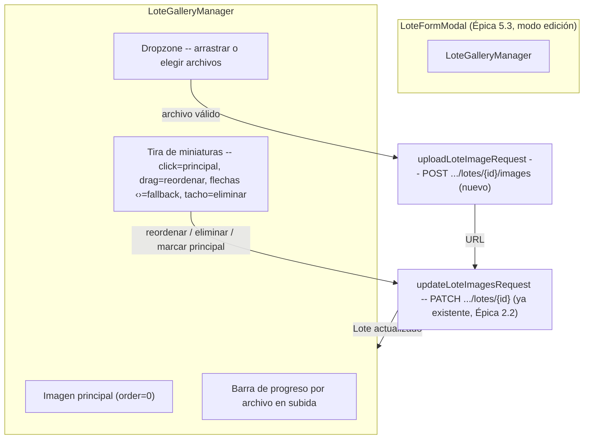

# 32 — Gestión multimedia de los lotes (Épica 6, Módulo 6.1)

Este documento es la referencia de diseño de la galería multimedia de un lote: subida de
imágenes con progreso, selección de principal, reordenamiento y eliminación. Complementa
[31-gestion-remates-lotes.md](31-gestion-remates-lotes.md) (Épica 5.3, el formulario de
Lote donde esta galería vive embebida) y [15-modulo-lote.md](15-modulo-lote.md) (diseño
original de `Lote.images` como JSONB de URLs, Épica 2.2). Ver
[ADR-035](adr/ADR-035-gestion-multimedia-lotes.md) para las decisiones de esta fase.

## Alcance de este módulo

Se implementa la galería completa de **imágenes** de un lote: subida múltiple con
drag & drop y barra de progreso, vista previa antes de que termine de subirse,
selección de imagen principal, reordenamiento (drag & drop + flechas de fallback),
eliminación con confirmación, validación de formato/tamaño, y los estados de
carga/vacío/error correspondientes. **No** se implementan todavía video, PDF,
certificados sanitarios ni archivos técnicos -- la arquitectura queda preparada para
agregarlos sin rediseñar (ver más abajo), pero quedan fuera de esta fase.

## Brecha de backend detectada y resuelta (documentada antes de implementar)

El backend no tenía, hasta este módulo, ninguna capacidad de subida binaria: `Lote.images`
era JSONB de `{url, order, caption}` con `url` validado como `HttpUrl` de texto, sin
storage propio (mismo alcance que `Remate.cover_image_url`). Se presentó esta brecha al
usuario antes de escribir código, con tres alternativas (disco local, solo-URLs sin
subida real, storage externo S3/Cloudinary) -- se eligió **disco local + endpoint
nuevo**, el único cambio de backend de todo este módulo:

```
POST /api/v1/remates/{remate_id}/lotes/{lote_id}/images   (multipart, campo "file")
```

Valida `Content-Type` (`image/jpeg`/`image/png`/`image/webp`) y tamaño (5 MB), guarda el
archivo en `MEDIA_ROOT/lotes/{lote_id}/{uuid}.ext` (disco local, dentro del volumen que
`docker-compose.yml` ya monta para `backend/`) y lo sirve vía `StaticFiles` en `/static`.
Devuelve `{"url": "..."}` -- no toca la fila del lote. Mismos permisos que
`create`/`update`/`soft_delete` de Lote: dueño del remate padre, y solo mientras el
remate está `draft`/`scheduled`. Ver ADR-035, sección A, para la comparación completa
contra las alternativas descartadas.

## Diagrama de la galería



## Flujo de carga de archivos

1. El usuario arrastra o elige uno o más archivos en el `Dropzone` (genérico,
   `shared/components/Dropzone.tsx`, drag & drop nativo HTML5 sin librería -- mismo
   criterio que el reordenamiento de lotes, ADR-034).
2. Cada archivo se valida del lado del cliente (`validateImageFile`,
   `features/rematador/media.ts`): mismo Content-Type/tamaño máximo que el backend. Un
   archivo inválido se rechaza al instante con un toast de error y **nunca** llega a
   generar una request -- feedback inmediato, aunque el backend vuelve a validar igual
   (esta es una optimización de UX, no la única barrera real).
3. Cada archivo válido obtiene de inmediato una **vista previa local**
   (`URL.createObjectURL(file)`) -- se ve en la tira de miniaturas *antes* de que la
   subida termine, satisfaciendo "vista previa antes de guardar" incluso mientras todavía
   está en curso.
4. Todos los archivos válidos se suben **en paralelo** (`uploadLoteImageRequest`, un
   `POST` multipart por archivo), cada uno con su propia barra de progreso
   (`ProgressBar`, genérico, alimentado por `onUploadProgress` de Axios).
5. Cuando todas las subidas de ese lote terminan (con éxito o error), se arma el array
   `images` final (las imágenes ya existentes + las URLs recién subidas, con `order`
   recalculado secuencialmente) y se persiste con **una única** llamada a
   `updateLoteImagesRequest` (`PATCH` ya existente desde la Épica 2.2) -- subir varios
   archivos en paralelo pero persistir en un solo `PATCH` evita que dos actualizaciones
   concurrentes del mismo array JSONB se pisen entre sí (ver ADR-035, sección B).
6. Si alguna subida individual falla, se avisa por toast con el mensaje normalizado del
   error (`normalizeApiError`) y esa imagen simplemente no se agrega al array -- las que
   sí tuvieron éxito se persisten igual.

## Gestión de la galería

Una vez que el lote ya tiene imágenes, cuatro acciones -- todas persisten de inmediato,
sin un botón "Guardar" propio (ver ADR-035, sección C):

- **Marcar como principal**: click/tap sobre una miniatura la mueve a la posición 0
  (`order` recalculado); no necesita ningún fallback porque un tap ya es
  nativamente accesible en touch.
- **Reordenar**: arrastrar una miniatura (HTML5 Drag and Drop nativo) o usar las
  flechas ‹ › siempre visibles bajo cada miniatura -- el fallback obligatorio para touch,
  teclado y lectores de pantalla, mismo criterio que el reordenamiento de lotes
  (ADR-034, sección C): HTML5 DnD no funciona en absoluto en pantallas táctiles.
- **Eliminar**: el tacho en la esquina de cada miniatura abre un `ConfirmModal`
  (`shared/components/`, reutilizado tal cual de la Épica 5.3) antes de quitarla del
  array.
- Las cuatro acciones actualizan el estado local de inmediato (optimista) y llaman a
  `updateLoteImagesRequest`; si falla, revierten al estado anterior y avisan por toast --
  exactamente el mismo patrón ya usado por `persistReorder` en `LotesManagementPage`
  (Épica 5.3).

**Estado vacío**: sin imágenes, el área principal muestra `CoverPlaceholder` (reusado tal
cual de `features/remates/components/`, mismo componente que ya usa `ImageGallery` de la
Sala del comprador) y la tira de miniaturas no se renderiza -- el `Dropzone` sigue visible
para agregar la primera imagen.

## Estructura de componentes

| Componente | Tipo | Rol |
|---|---|---|
| `Dropzone` | `shared/components/`, nuevo | Área genérica de arrastrar/elegir archivos -- sin ningún conocimiento de imágenes ni de ningún dominio. |
| `ProgressBar` | `shared/components/`, nuevo | Barra de progreso 0-100 genérica. |
| `ConfirmModal` | `shared/components/`, Épica 5.3, reusado | Confirmación antes de eliminar una imagen. |
| `CoverPlaceholder`/`BoxIcon` | `features/remates/components/`, reusados | Estado vacío de la imagen principal, misma identidad visual que la Sala del comprador. |
| `validateImageFile` | `features/rematador/media.ts`, nuevo | Validación de Content-Type/tamaño, espeja las reglas del backend. |
| `uploadLoteImageRequest`/`updateLoteImagesRequest` | `features/remates/api.ts`, nuevo | Las dos llamadas HTTP de este módulo (ver "Brecha de backend" arriba). |
| `LoteGalleryManager` | `features/rematador/components/`, nuevo | Orquesta todo lo anterior: imagen principal, tira de miniaturas, subida, persistencia optimista. |
| `LoteFormModal` | Épica 5.3, extendido | Embebe `LoteGalleryManager` solo en modo edición (ver ADR-035, sección E); en modo creación muestra un aviso. |

## Preparación para video/PDF/certificados/archivos técnicos

`Lote.documents` (JSONB, `{url, title, document_type}`) ya existe en el modelo desde la
Épica 2.2, sin consumidor todavía. El mismo patrón de este módulo -- endpoint de subida
por tipo de archivo + `PATCH` existente para persistir el array -- se extiende sin
rediseñar: un `POST .../lotes/{id}/documents` análogo (lista blanca de Content-Types
propia, ej. `application/pdf`) y un `LoteDocumentManager` que reutilizaría `Dropzone`/
`ProgressBar` tal cual (ninguno de los dos asume "imagen"). Ver ADR-035 para el detalle.

## Limitaciones conocidas

- **Archivos huérfanos en disco**: si una subida se completa pero el `PATCH` posterior
  que la persiste falla o nunca llega (el usuario cierra el modal, pierde conexión), el
  archivo queda en disco sin ninguna referencia -- sin limpieza automática en esta fase,
  mismo criterio ya aceptado en ADR-034 para la duplicación de remates.
- **Sin galería durante la creación de un lote**: subir una imagen requiere un `lote_id`
  real; el modal muestra "Guardá el lote para poder agregarle imágenes." mientras se
  está creando, y la galería completa aparece de inmediato al reabrir en modo "Editar"
  (ver ADR-035, sección E).
- **Sin storage externo**: las imágenes viven en el disco del contenedor/host de
  `backend/`, no en un servicio de almacenamiento dedicado -- suficiente para el volumen
  de este proyecto; migrar a S3/Cloudinary el día que hiciera falta no requeriría tocar
  `LoteImage` ni el `PATCH` existente (ver ADR-035, "Consecuencias").
- **Un refetch completo de la lista de lotes por cada acción de la galería**:
  `LoteFormModal` reutiliza el mismo `onSaved` del resto del formulario para avisarle a
  `LotesManagementPage` que algo cambió (mismo criterio "avisá, no sepas por qué" del
  resto del módulo) -- esto significa que subir/eliminar/reordenar/marcar principal
  disparan, además de su propio `PATCH`, un `GET .../lotes` completo de la página
  contenedora. Detectado en la verificación en vivo de este módulo: inofensivo (sin
  requests duplicados, sin parpadeo visible -- la propia galería ya se actualiza con la
  respuesta del `PATCH`, no espera a ese refetch) pero es una llamada de más por acción;
  se acepta por ahora y quedaría como optimización futura si el volumen de imágenes por
  lote lo justificara.

## Checklist del módulo

- [x] Subida de múltiples imágenes (en paralelo, con barra de progreso por archivo).
- [x] Selección de imagen principal (click/tap en una miniatura).
- [x] Reordenamiento por drag & drop (HTML5 nativo) con flechas ‹ › como fallback
      obligatorio (no cosmético) para touch/teclado.
- [x] Eliminación de imágenes con confirmación (`ConfirmModal`).
- [x] Vista previa antes de que termine de subirse (`URL.createObjectURL`).
- [x] Indicador de carga durante la subida (`ProgressBar` por archivo).
- [x] Validación de formato (`image/jpeg`/`image/png`/`image/webp`) y tamaño (5 MB),
      espejada en cliente y en servidor.
- [x] Galería: imagen principal, miniaturas, cambio de principal al click, estado vacío.
- [x] Diseño responsive, componentes reutilizables (`Dropzone`/`ProgressBar` sin ningún
      conocimiento de dominio).
- [x] Arquitectura preparada para video/PDF/certificados/archivos técnicos sin
      rediseñar (`Lote.documents` ya existente, mismo patrón subida+PATCH).
- [x] Documentación (este archivo) y ADR (ADR-035) actualizados.
- [x] Tests: `Dropzone` (4), `ProgressBar` (3), `validateImageFile` (4),
      `LoteGalleryManager` (8), `LoteFormModal` (2 nuevos, aviso de creación/galería en
      edición) -- backend: 6 tests nuevos del endpoint de subida (éxito, Content-Type
      inválido, tamaño excedido, no-dueño, estructura congelada, lote inexistente) --
      218/218 tests de backend y 356/356 de frontend verdes, `tsc -b`/`oxlint`/`pytest`
      sin errores.
- [x] Verificado de punta a punta contra el backend real (Docker Compose): crear un
      lote, editarlo para subir imágenes reales, marcar principal, reordenar por drag y
      por flechas, eliminar con confirmación, recargar la página y confirmar que
      persiste, y rechazo de archivos con formato/tamaño inválido -- ver detalle abajo.
- [x] Cero cambios en `Lote.images`/`LoteImage`, en el `PATCH` existente, ni en ninguna
      otra pantalla (Sala del comprador, Consola Operativa) -- un único endpoint nuevo,
      aditivo.

## Trabajo futuro (fuera de alcance de este módulo)

- Subida de video, PDF, certificados sanitarios y archivos técnicos sobre
  `Lote.documents`, con el mismo patrón (ver "Preparación" arriba).
- Storage externo (S3/Cloudinary) si el volumen de imágenes lo justificara.
- Limpieza automática de archivos huérfanos en disco (subidos pero nunca persistidos en
  ningún lote).
