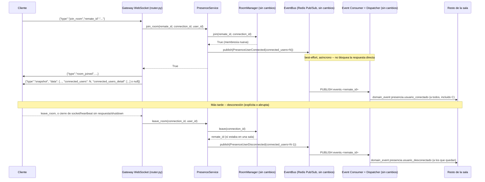

# 33 — Sistema de Presencia de Usuarios (Épica 6, Módulo 6.2)

Este documento es la referencia de diseño del Presence Service: cómo se registra el
ingreso/salida de una sala, cómo se anuncia en tiempo real a los demás conectados, y
cómo se calculan los contadores por remate y globales. Complementa
[18-integracion-redis.md](18-integracion-redis.md) (Módulo 3.1),
[19-arquitectura-de-eventos.md](19-arquitectura-de-eventos.md) (Módulo 3.2),
[20-gateway-websocket.md](20-gateway-websocket.md) (Módulo 3.3),
[21-sistema-de-salas.md](21-sistema-de-salas.md) (Módulo 3.4),
[22-sincronizacion-tiempo-real.md](22-sincronizacion-tiempo-real.md) (Módulo 3.5) y
[23-snapshot-service.md](23-snapshot-service.md) (Módulo 3.6) — toda infraestructura de
tiempo real que este módulo reutiliza tal cual, sin modificarla en su lógica interna. Ver
[ADR-036](adr/ADR-036-sistema-de-presencia.md) para el razonamiento completo de las
decisiones tomadas acá.

## Alcance de este módulo

Se implementa un `PresenceService` (`app/presence/`) que centraliza:

- Registro de ingreso a una sala (con publicación de `presencia.usuario_conectado`).
- Registro de salida de una sala, explícita (`leave_room`) o por desconexión abrupta
  (con publicación de `presencia.usuario_desconectado`).
- Conteo de conectados por remate (ya existía como método de `RoomManager`, ahora
  además se anuncia en tiempo real).
- Conteo global de usuarios conectados (`GET /presence/global`).
- Un detalle de quién está conectado, visible únicamente al dueño del remate o un
  admin, embebido en el snapshot.

**No se implementa** (fuera de alcance, quedan como candidatos naturales para módulos
futuros, mismo criterio de "preparado, no construido" que ya usó cada fase anterior):
chat, moderación, seguimiento de usuarios ("seguir" un remate), estadísticas históricas
de presencia, nombre/email visible de cada conectado.

## Dónde vive el código

`app/presence/` — paquete transversal nuevo, al mismo nivel que `app/snapshot/` y
`app/realtime/`. No es un módulo de dominio: no tiene modelo de base de datos, no
importa nada de `app/modules/remates/` ni `app/modules/ofertas/`.

| Archivo | Responsabilidad |
|---|---|
| `events.py` | `PresenceUserConnected`/`PresenceUserDisconnected` (`RemateScopedEvent`) — nombres ya reservados desde Fase 0 en `docs/06-eventos-del-sistema.md`. |
| `schemas.py` | `ConnectedUserSummary` (una conexión activa) y `PresenceGlobalStats` (conteo agregado del proceso). |
| `service.py` | `PresenceService` — el punto central: join/leave de sala + publicación de eventos + métricas. |
| `dependencies.py` | `get_presence_service`, mismo patrón `HTTPConnection` que `app/snapshot/dependencies.py` (funciona desde HTTP y desde el Gateway WebSocket). |
| `router.py` | `GET /presence/global`. |

**Archivos existentes tocados**, todos puntos de extensión ya identificados por
módulos anteriores:

- `app/websocket/router.py`: el join/leave de sala pasa por `PresenceService` en vez de
  por `RoomManager` directamente — segunda excepción deliberada a "el Gateway no conoce
  dominio" (la primera fue `SnapshotService`, Módulo 3.6).
- `app/snapshot/schemas.py`/`service.py`/`router.py`: `RemateStateSnapshot` gana
  `connected_users_detail` (enmascarado igual que `reserve_price`/`buyer_id`).
- `app/realtime/registry.py`: los dos eventos nuevos se agregan a `SYNCED_EVENTS` — una
  línea, **cero cambios** en `dispatcher.py`/`consumer.py`.
- `app/api/router.py`: una línea, `include_router(presence_router)`.

**Cero cambios** en `app/websocket/rooms.py` (`RoomManager`), `app/websocket/manager.py`
(`ConnectionManager`), `app/realtime/dispatcher.py`, `app/realtime/consumer.py` ni
`app/events/` — todo el pipeline de tiempo real (Redis Pub/Sub → Event Consumer → Event
Dispatcher → sala) se reutiliza sin tocarlo, exactamente como anticipaba
`docs/22-sincronizacion-tiempo-real.md`, sección "Cómo esta arquitectura permitirá
agregar... Presencia Online".

## El Presence Service

```python
class PresenceService:
    def __init__(self, room_manager: RoomManager, connection_manager: ConnectionManager, event_bus: EventBus) -> None: ...

    async def join_room(self, remate_id: UUID, connection_id: UUID, user_id: UUID) -> bool: ...
    async def leave_room(self, connection_id: UUID, user_id: UUID) -> UUID | None: ...
    def connected_users_summary(self, remate_id: UUID) -> list[ConnectedUserSummary]: ...
    def global_stats(self) -> PresenceGlobalStats: ...
```

Es un **compositor**, no un reemplazo de `RoomManager`/`ConnectionManager`: delega en
ellos para el estado en memoria (sin cambiarles una línea) y agrega, encima, la
publicación de eventos de presencia sobre el `EventBus` ya existente
(`app/events/bus.py`, Módulo 3.2). Mismo patrón arquitectónico que `SnapshotService`
(Módulo 3.6): un paquete nuevo que orquesta infraestructura ya construida, en vez de
inyectarle nuevas dependencias a piezas que otros módulos y tests ya dan por "tontas" y
sin efectos secundarios (ver ADR-036, sección "Por qué no se tocó `RoomManager`
directamente", para la comparación explícita con lo que `docs/20`/`docs/22` habían
anticipado).

**Por qué el conteo se deriva siempre de `connected_users_summary`, nunca de
`RoomManager.connection_count` por separado**: es la misma lista, `len(...)` de ella —
así el conteo (`int`, visible para cualquiera) y el detalle (`list[ConnectedUserSummary]`,
visible solo para privilegiados) nunca pueden discrepar entre sí.

## Flujo de conexión y desconexión



**Re-join idempotente, sin ruido**: `PresenceService.join_room` chequea
`room_manager.room_id_for_connection(connection_id) == remate_id` **antes** de llamar a
`RoomManager.join` — si la conexión ya estaba en esa misma sala (pedir unirse de nuevo,
`RoomManager` lo trata como no-op), no se publica un segundo evento. Solo una membresía
**nueva** genera presencia.

**Desconexión abrupta cubierta igual que una explícita**: el `finally` del endpoint
principal del Gateway (`app/websocket/router.py`, sin cambios en su estructura desde el
Módulo 3.3) ya cubre los cuatro casos de cierre (cliente desconecta, heartbeat sin
respuesta, error interno, shutdown del servidor) — ahí, en vez de
`room_manager.leave(...)`, ahora se llama `presence_service.leave_room(...)`, así que
los cuatro casos publican su evento de presencia sin necesitar lógica nueva.

## Cómo se reutiliza el pipeline de sincronización sin tocarlo

`PresenceUserConnected`/`PresenceUserDisconnected` son `RemateScopedEvent` como
cualquier otro (`remate_id`, `topic = f"events.{remate_id}"`) — agregarlos a
`SYNCED_EVENTS` en `app/realtime/registry.py` es la única integración necesaria:

1. `PresenceService` publica sobre el mismo `EventBus`/`RedisEventBus` que ya usa el
   dominio (`RemateService`/`LoteService`/`AuctionEngine`, Módulo 3.2).
2. `EventConsumer` (Módulo 3.5, `psubscribe("events.*")`, sin cambios) ya escucha
   cualquier canal `events.<remate_id>`, incluidos los eventos de presencia.
3. `EventDispatcher` (sin cambios) revalida el payload contra `EVENT_REGISTRY`, resuelve
   `RoomManager.connections_in_room(remate_id)` y entrega a cada conexión — exactamente
   el mismo camino que ya usa `OfertaAccepted`/`LoteOpened`.

## `connected_users_detail` en el Snapshot — enmascarado, mismo criterio que siempre

`SnapshotService.build` (`app/snapshot/service.py`) gana un parámetro
`connected_users_detail: list[ConnectedUserSummary] | None`, enmascarado a `None` para
cualquier viewer que no sea dueño del remate ni admin — mismo método
(`_is_privileged`) y mismo patrón que ya aplica a `reserve_price`
(`_mask_lote`)/`buyer_id` (`_mask_oferta`). El **conteo** (`connected_users: int`) sigue
visible para cualquiera, sin cambios de visibilidad — solo el detalle (quién,
específicamente) es privado.

`ConnectedUserSummary` no incluye nombre ni email: `PresenceService` solo conoce
`user_id` (vía `ConnectionContext.user_id`, Módulo 3.3) — nunca importó
`app.modules.users`, deliberado (ver "Limitaciones conocidas" abajo).

Tanto el Gateway WebSocket (al enviar el `snapshot` inicial de una sala) como el
endpoint HTTP `GET /remates/{remate_id}/snapshot` (`app/snapshot/router.py`) inyectan
`PresenceService` para calcular `connected_users`/`connected_users_detail` de la misma
forma — un único punto de cálculo, dos transportes, mismo criterio que ya demostró el
propio Snapshot Service desde el Módulo 3.6.

## Interfaz — componentes reutilizables (frontend)

| Componente | Dónde vive | Qué muestra |
|---|---|---|
| `ConnectionStatusBadge` | `features/sala/components/` (Módulo 4.6, sin cambios) | "Conectando.../Conectado/Reconectando.../Desconectado". |
| `PresenceCounter` | `features/sala/components/` (nuevo) | "N conectado(s)", con una transición de color breve cuando el número cambia. Reemplaza el `<span>` que antes duplicaban `SalaHeader` y `ConsolaHeader`. |
| `ConnectedUsersList` | `features/rematador/components/` (nuevo) | Lista resumida de conexiones activas (identificador truncado + hora de conexión) — solo se monta si `connected_users_detail` no es `null`, es decir, únicamente en la Consola Operativa del rematador dueño. |

**Indicador de actividad del remate (comprador)**: no se agregó un componente ni un
dato nuevo — `SalaHeader` refuerza visualmente el badge de estado ya existente con un
pulso sutil (`animate-ping`) cuando `remate.status === 'live'`.

`features/sala/realtime/reducer.ts` gana dos `case` nuevos
(`presencia.usuario_conectado`/`desconectado`) en `applyDomainEventToSnapshot`: actualizan
`connected_users` siempre, y hacen upsert/remove en `connected_users_detail` **indexado
por `connection_id`**, nunca por `user_id` — necesario porque dos pestañas del mismo
usuario son dos conexiones distintas (`RoomManager`/`ConnectionManager`, Módulos
3.3/3.4): remover por `user_id` habría hecho desaparecer a un comprador con dos
pestañas abiertas cuando cierra solo una.

`features/sala/hooks.ts` (`useLiveRemateState`) no necesitó ningún cambio: el reducer ya
intercepta genéricamente por `event_type`, mismo mecanismo "whitelist" que agregar
cualquier evento anterior.

## Limitaciones conocidas (documentadas, no huecos)

- **El conteo cuenta conexiones, no usuarios únicos** — mismo criterio ya establecido
  por `RoomManager` desde el Módulo 3.4 (`docs/21-sistema-de-salas.md`): dos pestañas
  del mismo usuario suman dos al contador. Es intencional, no un bug.
- **Eventually consistent, mejor esfuerzo** — `docs/06-eventos-del-sistema.md` ya lo
  documentaba desde Fase 0: un contador desincronizado por segundos tras una
  desconexión abrupta no es un incidente; una oferta mal aceptada sí lo sería. Por eso
  la publicación de presencia comparte el mismo contrato "nunca lanza" de
  `EventBus.publish` (ADR-022).
- **Sin nombre/email en `connected_users_detail`** — `PresenceService` deliberadamente
  no importa `app.modules.users`, para no acoplar una pieza transversal de
  infraestructura a un módulo de dominio. Un futuro consumidor (por ejemplo, un panel
  de administración) puede resolver `user_id -> nombre` en su propia capa, sin que
  `PresenceService` necesite cambiar.
- **`GET /presence/global` sin consumidor en la UI todavía** — expone la capacidad que
  pedía el enunciado ("conteo global de usuarios conectados"), pero ningún panel de
  producto lo muestra hoy (no había un lugar natural en las pantallas ya construidas
  para un agregado de toda la plataforma, a diferencia de los contadores por remate).
  Queda disponible para un futuro dashboard de administración, mismo criterio de
  "capacidad preparada, sin forzar una UI que nadie pidió" que ya usó `RoomManager`
  entre los Módulos 3.4 y este.

## Checklist del módulo

- [x] Registro de ingreso a una sala (`PresenceService.join_room`).
- [x] Registro de salida de una sala (`PresenceService.leave_room`).
- [x] Detección automática de desconexión (cubierta por el mismo `finally` del Gateway
      que ya manejaba los cuatro casos desde el Módulo 3.3).
- [x] Reconexión transparente (reutiliza snapshot + reconciliación por WebSocket ya
      construidos en la Épica 4.6 -- sin cambios).
- [x] Conteo de conectados por remate, en vivo (evento a evento, no solo por
      reconexión).
- [x] Conteo global de usuarios conectados (`GET /presence/global`).
- [x] Comprador: cantidad de conectados (`PresenceCounter`), indicador de actividad del
      remate (pulso sobre el badge de estado existente), actualización automática.
- [x] Rematador: cantidad total de conectados, lista resumida de conectados
      (`ConnectedUsersList`, con la limitación documentada de no tener nombre/email),
      indicadores en tiempo real.
- [x] Componentes reutilizables: estados de conexión (ya existía,
      `ConnectionStatusBadge`), usuarios activos y contadores (`PresenceCounter`).
- [x] Presence Service desacoplado y centralizado (`app/presence/`), sin modificar
      `RoomManager`/`ConnectionManager`.
- [x] Arquitectura preparada para Chat/Moderación/Seguimiento/Estadísticas: mismo punto
      de extensión ya documentado desde el Módulo 3.5 (`registry.py` + `EventBus`), sin
      tocar el Auction Engine ni el dominio.
- [x] Actualización automática de la interfaz, sin recargar la pantalla ni polling.
- [x] Animación suave al cambiar la cantidad de conectados (`PresenceCounter`).
- [x] Tests: `test_presence_service.py` (unitario), extensión de
      `test_websocket_gateway.py` (sección "--- Presencia ---", integración con Redis
      real), extensión de `test_snapshot_service.py`/`test_snapshot_http.py`
      (enmascarado), reglas nuevas en `test_architecture_boundaries.py`; frontend:
      `reducer.test.ts`, `PresenceCounter.test.tsx`, `ConnectedUsersList.test.tsx`,
      `ConsolaOperativaPage.test.tsx`.
- [x] Documentación (este archivo) y ADR (ADR-036) actualizados.
- [x] Cero cambios en `RoomManager`, `ConnectionManager`, `EventDispatcher`,
      `EventConsumer`, `app/events/`, el dominio (`app/modules/remates/`,
      `.../lotes/`, `app/modules/ofertas/`) ni la autenticación.
