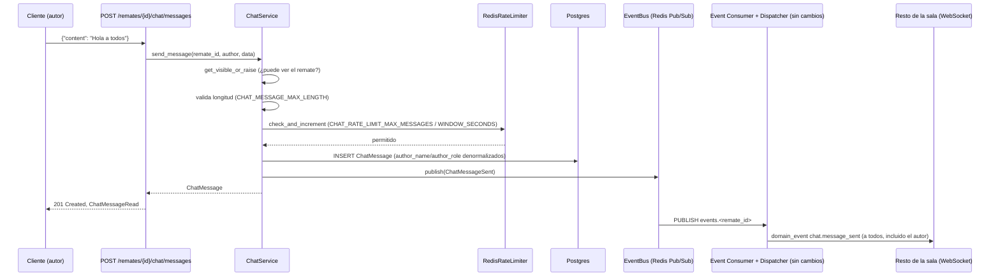
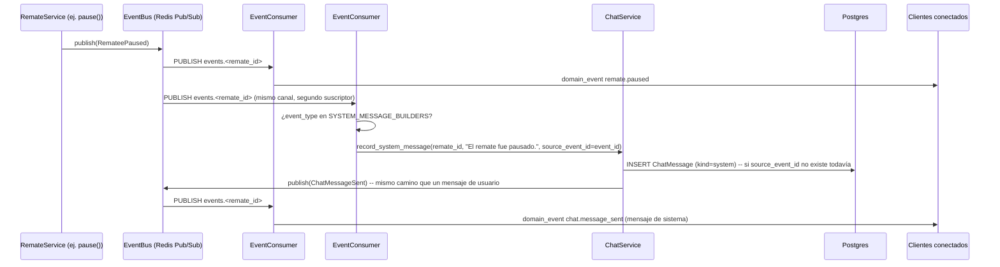

# 34 — Chat del Remate (Épica 6, Módulo 6.4)

Este documento es la referencia de diseño del Chat del Remate: cómo se envían y
reciben mensajes en tiempo real, cómo se generan los mensajes de sistema del ciclo de
vida del remate, cómo funciona la moderación y el rate limiting, y la paginación del
historial. Complementa
[22-sincronizacion-tiempo-real.md](22-sincronizacion-tiempo-real.md) (Módulo 3.5) y
[33-sistema-de-presencia.md](33-sistema-de-presencia.md) (Módulo 6.2), cuya
infraestructura reutiliza tal cual. Ver [ADR-037](adr/ADR-037-chat-del-remate.md) para
el razonamiento completo de las decisiones tomadas acá.

## Alcance de este módulo

Se implementa un módulo de dominio `Chat` (`app/modules/chat/`) que centraliza:

- Envío y recepción de mensajes en tiempo real, con historial reciente al unirse a la
  sala.
- Auto-scroll al último mensaje cuando se está al final del chat; posición preservada
  al leer mensajes anteriores.
- Cada mensaje muestra nombre, rol, hora y contenido del autor.
- Mensajes automáticos de sistema para eventos de ciclo de vida del remate (inicio,
  pausa, reanudación, apertura de lote, cierre de lote, finalización), visualmente
  diferenciados de los mensajes de usuario.
- Integración con el Presence Service (Módulo 6.2): "conectados al chat" reutiliza
  `connected_users`, sin pedir un dato nuevo al backend; indicador de "está
  escribiendo...".
- Moderación: el rematador dueño del remate puede eliminar (soft-delete) cualquier
  mensaje de usuario.
- Validaciones: longitud máxima (500 caracteres por defecto) y rechazo de mensajes
  vacíos.
- Rate limiting básico, tanto para el envío de mensajes como para el aviso de "está
  escribiendo".
- Un Chat Service desacoplado (`ChatService`), preparado para futuras extensiones.

**No se implementa** (fuera de alcance, mismo criterio de "preparado, no construido"
que ya usó cada módulo anterior): hilos de respuesta, reacciones, adjuntos/emojis,
moderación avanzada (silenciar usuarios, palabras prohibidas), notificaciones push. La
referencia a un "Notification Service" del enunciado original no aplica: no existe tal
componente en el código, y no se construye acá.

## Dónde vive el código

`app/modules/chat/` — módulo de dominio top-level, mismo nivel que
`app/modules/remates/`/`app/modules/ofertas/`, **no** un paquete transversal como
`app/presence/`/`app/snapshot/`: a diferencia de esos dos, el chat persiste datos de
negocio reales (mensajes, con reglas propias de longitud/moderación/rate limiting), el
mismo perfil que `Oferta`.

| Archivo | Responsabilidad |
|---|---|
| `models.py` | `ChatMessage` (`kind`: `user`/`system`), `ChatMessageKind`. |
| `schemas.py` | `ChatMessageCreate` (validación de entrada), `ChatMessageRead` (respuesta, enmascara `content` si `is_deleted`). |
| `events.py` | `ChatMessageSent`/`ChatMessageDeleted`/`ChatUserTyping` (`RemateScopedEvent`). |
| `repository.py` | `ChatMessageRepository` — CRUD + paginación keyset. |
| `service.py` | `ChatService` — envío, borrado, mensajes de sistema, "está escribiendo", listados. |
| `dependencies.py` | `get_chat_message_repository`, `get_chat_service`. |
| `router.py` | `POST/GET .../chat/messages`, `DELETE .../chat/messages/{id}`, `POST .../chat/typing`. |
| `realtime.py` | `ChatSystemEventDispatcher` — genera mensajes de sistema a partir de eventos de ciclo de vida. |

**Archivos existentes tocados**, todos puntos de extensión ya identificados por
módulos anteriores:

- `app/realtime/consumer.py`: el tipo del parámetro `dispatcher` de `EventConsumer`
  pasa de la clase concreta `EventDispatcher` a un `Protocol` estructural nuevo
  (`Dispatcher`, con un único método `dispatch`) — **cero cambio de comportamiento**:
  el test existente ya pasaba un `_RecordingDispatcher` que no hereda de
  `EventDispatcher`, solo implementa `dispatch` (duck typing). Este cambio es lo que
  permite tener un **segundo** `EventConsumer` con un dispatcher distinto.
- `app/realtime/registry.py`: los tres eventos de chat se agregan a `SYNCED_EVENTS` —
  cero cambios en `dispatcher.py`.
- `app/main.py`: el lifespan arranca una **segunda** instancia de `EventConsumer`
  (`ChatSystemEventDispatcher`), suscripta al mismo patrón `events.*`, junto a la ya
  existente.
- `app/api/router.py`: una línea, `include_router(chat_router)`.
- `app/core/exceptions.py`: `RateLimitError` (429, `error_code="rate_limited"`), mismo
  patrón que `BusinessRuleError`.
- `app/core/config.py`: `CHAT_MESSAGE_MAX_LENGTH`, `CHAT_HISTORY_DEFAULT_LIMIT`,
  `CHAT_RATE_LIMIT_MAX_MESSAGES`, `CHAT_RATE_LIMIT_WINDOW_SECONDS`,
  `CHAT_TYPING_RATE_LIMIT_WINDOW_SECONDS`.
- `app/redis/rate_limit.py` (nuevo, infraestructura genérica): `RedisRateLimiter`.
- `app/redis/dependencies.py`: `get_rate_limiter`.

**Cero cambios** en el Gateway WebSocket (`app/websocket/router.py`), `RoomManager`,
`ConnectionManager`, `EventDispatcher`, `app/presence/`, `app/snapshot/` ni el dominio
de remates/ofertas — el chat vive completamente al costado.

## El Chat Service

```python
class ChatService:
    def __init__(
        self,
        repository: ChatMessageRepository,
        remate_service: RemateService,
        event_bus: EventBus,
        rate_limiter: RedisRateLimiter,
        settings: Settings,
    ) -> None: ...

    async def send_message(self, remate_id, author, data: ChatMessageCreate) -> ChatMessage: ...
    async def delete_message(self, remate_id, message_id, moderator) -> ChatMessage: ...
    async def record_system_message(self, remate_id, content, *, system_event_type, source_event_id) -> ChatMessage | None: ...
    async def notify_typing(self, remate_id, user) -> None: ...
    async def list_recent(self, remate_id, viewer) -> list[ChatMessage]: ...
    async def list_before(self, remate_id, viewer, *, before_created_at, before_id) -> list[ChatMessage]: ...
```

Inyecta `RemateService` completo (no solo su repositorio) — mismo patrón que
`AuctionEngine` (`app/modules/ofertas/engine.py`) para reutilizar
`get_visible_or_raise`/`get_owned_or_raise` sin duplicar la lógica de
visibilidad/propiedad de un remate. Sin restricción por estado del remate: se puede
chatear en cualquier estado visible, mismo criterio que Presencia.

## Flujo de envío de un mensaje



**HTTP para escribir, WebSocket solo para el broadcast** — mismo criterio que
`AuctionEngine.place_bid`: envío, borrado y "está escribiendo" van por HTTP; el
Gateway WebSocket (`app/websocket/router.py`) no gana ningún tipo de mensaje nuevo
(hoy solo entiende `pong`/`join_room`/`leave_room`). Evita una tercera excepción a "el
Gateway no conoce dominio" (las dos ya existentes son Snapshot y Presencia). El
`ChatMessageSent` viaja con todos los campos necesarios para pintar el mensaje sin
ninguna consulta adicional — mismo criterio que `LoteOpened`.

## Mensajes de sistema — segundo `EventConsumer` independiente



Dos suscriptores independientes sobre el mismo patrón `events.*` es el uso normal de
Redis Pub/Sub — `app/main.py` instancia una segunda `EventConsumer` con un
`ChatSystemEventDispatcher` en el lifespan, arrancada/parada junto a la existente.
`ChatSystemEventDispatcher` reconoce una whitelist explícita de 6 `event_type`
(`remate.started/paused/resumed/finished`, `lote.opened/closed`,
`SYSTEM_MESSAGE_BUILDERS` en `realtime.py`) y arma el texto usando solo campos que el
evento ya trae — sin queries extra. Nunca reacciona a sus propios eventos `chat.*`
(están simplemente ausentes de la whitelist), lo cual evita un loop.

### Idempotencia (bug real de diseño, no cosmético)

En un despliegue multi-instancia (el diseño de Redis Pub/Sub como backplane ya asume
esto, ADR-009), cada instancia del backend tiene su propio `ChatSystemEventDispatcher`
reaccionando al mismo `PUBLISH` — sin protección, cada una insertaría su propia fila
duplicada del mismo mensaje de sistema. Se resuelve con `ChatMessage.source_event_id`
(el `event_id` del evento de dominio que lo originó) + un índice único parcial
(`uq_chat_messages_source_event_id`, `WHERE source_event_id IS NOT NULL`) — la primera
instancia gana el `INSERT`, las demás reciben `IntegrityError`, hacen `rollback()` y
devuelven la fila ya persistida (`get_by_source_event_id`) sin publicar un segundo
`ChatMessageSent`. Ver ADR-037 para el análisis completo, incluida la distinción entre
esta condición de carrera esperada y una anomalía genuina (logueada, nunca relanzada).

**Limitación aceptada** (mismo tono que ADR-009): una desconexión de Redis justo en la
ventana de un evento de ciclo de vida puede perder ese mensaje de sistema puntual, sin
mecanismo de recuperación — a diferencia del estado real del remate, que se
autocorrige en cada reconexión vía snapshot, no existe un "reintento" de mensajes de
sistema perdidos.

## Modelo y paginación del historial

`ChatMessage` (`UUIDPrimaryKeyMixin`, `TimestampMixin`, `SoftDeleteMixin`, reutilizados
tal cual): `remate_id` (FK RESTRICT), `kind`, `author_id` (FK `users.id`, `SET NULL`,
nulo en mensajes de sistema), `author_name`/`author_role` **denormalizados** al momento
de enviar (sin `JOIN` en cada lectura, y preserva el nombre/rol que la persona tenía en
ese momento — `author_role` es un `String(20)` plano, no el ENUM nativo `user_role`, un
dato de auditoría histórico, no una referencia viva), `content` (`String(500)`),
`system_event_type` (solo para mensajes de sistema), `deleted_by`, `source_event_id`
(+ índice único parcial).

Historial paginado con **keyset**
(`WHERE (created_at, id) < (:before_created_at, :before_id)`, comparación row-wise
para no perder/duplicar filas con timestamps empatados bajo concurrencia), no
offset/limit como `OfertaRepository.list_by_lote` — "miles de mensajes" con scroll
infinito hacia atrás es exactamente el escenario donde `OFFSET` se degrada. El cliente
manda `before_created_at`+`before_id` (los del mensaje más antiguo ya cargado), no un
cursor opaco. Índice `(remate_id, created_at)` alcanza. `list_recent`/`list_before` no
filtran mensajes eliminados: un mensaje moderado sigue apareciendo en la línea de
tiempo (con su texto oculto), igual que cualquier chat conocido — la moderación deja
constancia de que algo se dijo y fue removido, no reescribe la conversación.

## Moderación, validación y rate limiting

`ChatService.delete_message` exige que quien llama sea el **dueño** del remate
(`get_owned_or_raise`, mismo método que ya usa `RemateService` para sus propias
transiciones) — sin excepción para admin, mismo criterio restrictivo que el resto de
las acciones de escritura sobre un remate. Soft-delete (`deleted_at`/`deleted_by`),
publica `ChatMessageDeleted` con solo el `message_id` (el frontend ya tiene el mensaje
en memoria). Idempotente: eliminar un mensaje ya eliminado no es un error.

Validación de contenido: `ChatMessageCreate` rechaza contenido vacío/solo espacios
(`field_validator`); el límite de longitud (`CHAT_MESSAGE_MAX_LENGTH`, 500 por
defecto) se aplica en `ChatService.send_message`, no en el schema — mismo patrón que
`MAX_IMAGE_UPLOAD_BYTES`, configurable sin tocar el contrato Pydantic.

`RedisRateLimiter.check_and_increment` (`app/redis/rate_limit.py`, infraestructura
genérica, mismo nivel que `RedisCache`/`RedisLockFactory`, sin conocimiento de chat):
`INCR`+`EXPIRE`, ventana fija. Aplica tanto a mensajes
(`CHAT_RATE_LIMIT_MAX_MESSAGES`/`CHAT_RATE_LIMIT_WINDOW_SECONDS`, por defecto 5 cada 10
segundos) como al indicador de escritura (`CHAT_TYPING_RATE_LIMIT_WINDOW_SECONDS`, más
laxo) — el rate limit real vive en el servidor, el throttle del cliente
(`useChatMessages`, frontend) es solo una protección adicional, no la única.

## Endpoints

| Método y ruta | Quién | Qué hace |
|---|---|---|
| `POST /remates/{remate_id}/chat/messages` | Cualquiera que pueda ver el remate | Envía un mensaje, devuelve `201`. |
| `GET /remates/{remate_id}/chat/messages` | Idem | Historial: sin parámetros trae los últimos `CHAT_HISTORY_DEFAULT_LIMIT`; con `before_created_at`+`before_id` trae la página anterior (keyset). |
| `DELETE /remates/{remate_id}/chat/messages/{message_id}` | Solo el rematador dueño | Soft-delete (moderación), devuelve el mensaje actualizado. |
| `POST /remates/{remate_id}/chat/typing` | Cualquiera que pueda ver el remate | Avisa "está escribiendo", `204`, de mejor esfuerzo. |

## Interfaz — frontend

### Compartir la única conexión WebSocket

`features/sala/hooks.ts::useLiveRemateState` expone
`subscribeToRealtime(listener) => unsubscribe`, que reenvía cualquier mensaje ya
parseado del único `WebSocketClient` de la página a quien se suscriba — sin esto, el
chat necesitaría su propia conexión + su propio `join_room`, duplicando el conteo de
`connected_users` de Presencia (dos `connection_id` por usuario real). Un `Set` de
listeners vive en un `useRef` creado desde el primer render, robusto al orden
hijo-antes-que-padre de los efectos de React.

### `features/chat/`, paralelo a `features/sala/`

| Archivo | Qué hace |
|---|---|
| `types.ts` | Espeja `ChatMessageRead`. |
| `realtime/events.ts` | `ChatDomainEvent` — unión **propia**, deliberadamente separada de `SalaDomainEvent`: el chat filtra los mismos mensajes `domain_event` crudos por su cuenta. |
| `api.ts` | `fetchChatMessagesRequest`/`sendChatMessageRequest`/`deleteChatMessageRequest`/`notifyChatTypingRequest`. |
| `hooks.ts` | `useChatMessages` — historial inicial por HTTP + suscripción a `subscribeToRealtime`, mantiene mensajes + `typingUsers` con auto-limpieza (~5s sin señal repetida), `sendMessage`/`deleteMessage`/`notifyTyping` (con throttle interno) y `loadOlder` (keyset). |
| `components/ChatPanel.tsx` | Contenedor principal: historial con scroll, header con `PresenceCounter`, `TypingIndicator`, `ChatInput`, modal de confirmación de borrado. |
| `components/ChatMessageItem.tsx` | Un mensaje — de usuario (nombre, rol, hora, contenido, botón de borrado si `canModerate`) o de sistema (centrado, sin nombre/rol/avatar). |
| `components/ChatInput.tsx` | Caja de envío: Enter para enviar, Shift+Enter salto de línea, contador de caracteres. |
| `components/TypingIndicator.tsx` | "Fulano está escribiendo...", con pluralización. |

Integrado de forma aditiva en `SalaPage.tsx` (comprador, `canModerate={false}`) y
`ConsolaOperativaPage.tsx` (rematador, `canModerate` según sea el dueño) — ningún panel
existente se modificó.

### Scroll: auto al final, preservado al leer hacia arriba

`ChatPanel` mide (`useLayoutEffect`, antes de que el navegador pinte) si el contenedor
estaba cerca del final **antes** de que llegara un mensaje nuevo: si lo estaba,
auto-scroll tras renderizar; si no, se preserva la posición visual ajustando
`scrollTop` por el delta de altura agregado al anteponer mensajes más viejos
(`loadOlder`, disparado al acercarse al principio del scroll).

## Limitaciones conocidas (documentadas, no huecos)

- **Pérdida posible de un mensaje de sistema puntual** en la ventana de una
  desconexión de Redis — ver sección de idempotencia arriba.
- **Sin hilos de respuesta, reacciones, adjuntos ni emojis** — fuera de alcance de
  este módulo, mismo criterio de "preparado, no construido".
- **Sin moderación avanzada** (silenciar usuarios, filtro de palabras) — solo borrado
  de mensajes individuales por el dueño del remate.
- **`author_name`/`author_role` denormalizados no se actualizan retroactivamente** si
  el usuario cambia de nombre o de rol después de haber escrito — es la decisión
  deliberada de auditoría histórica descrita arriba, no un descuido.

## Checklist del módulo

- [x] Envío y recepción de mensajes en tiempo real.
- [x] Historial de mensajes recientes al unirse a la sala, con paginación keyset hacia
      atrás.
- [x] Auto-scroll al último mensaje; posición preservada al leer mensajes anteriores.
- [x] Cada mensaje muestra nombre, rol, hora y contenido.
- [x] Mensajes automáticos de sistema (inicio/pausa/reanudación/apertura de
      lote/cierre de lote/finalización), visualmente diferenciados.
- [x] Integración con Presence Service: conectados al chat, indicador de "está
      escribiendo...".
- [x] Moderación: el rematador puede eliminar mensajes.
- [x] Validación de longitud máxima y rechazo de mensajes vacíos.
- [x] Rate limiting básico (mensajes y "está escribiendo"), del lado del servidor.
- [x] Chat Service desacoplado (`app/modules/chat/`), preparado para extensiones
      futuras sin reabrir el resto del sistema.
- [x] Diseño responsive, integrado en Sala del Remate (comprador) y Consola Operativa
      (rematador).
- [x] Tests: `test_redis_rate_limit.py`, `test_chat_service.py`,
      `test_chat_repository.py`, `test_chat_router.py`,
      `test_chat_realtime_system_messages.py`, extensión de
      `test_architecture_boundaries.py`, `test_domain_events.py` (filtro de eventos de
      chat en pruebas de orden estricto); frontend: `hooks.test.ts`,
      `ChatMessageItem.test.tsx`, `ChatInput.test.tsx`, `TypingIndicator.test.tsx`,
      `ChatPanel.test.tsx` (incluye comportamiento de scroll).
- [x] Documentación (este archivo) y ADR (ADR-037) actualizados.
- [x] Cero cambios en el Gateway WebSocket, `RoomManager`, `ConnectionManager`,
      `EventDispatcher`, `app/presence/`, `app/snapshot/` ni el dominio de
      remates/ofertas.
