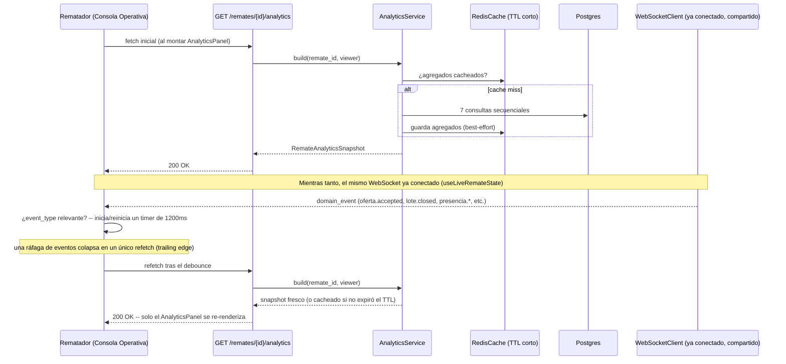

# 35 — Dashboard de Analítica en Tiempo Real (Épica 7, Módulo 7.1)

Este documento es la referencia de diseño del Analytics Service: de dónde sale cada
métrica, cómo se actualiza el panel en tiempo real sin recargar la página, y por qué el
control de acceso es distinto al del resto de los servicios de lectura ya construidos.
Complementa [23-snapshot-service.md](23-snapshot-service.md) (Módulo 3.6),
[33-sistema-de-presencia.md](33-sistema-de-presencia.md) (Módulo 6.2) y
[34-chat-del-remate.md](34-chat-del-remate.md) (Módulo 6.4), cuya infraestructura
reutiliza tal cual. Ver [ADR-038](adr/ADR-038-dashboard-analitica-tiempo-real.md) para
el razonamiento completo de las decisiones tomadas acá.

## Alcance de este módulo

Se implementa un panel de métricas en tiempo real, exclusivo del rematador dueño del
remate (o un administrador), integrado en la Consola Operativa:

- Compradores conectados, usuarios activos, ofertas por minuto, total de ofertas
  realizadas, lotes vendidos, lotes restantes, tiempo promedio por lote, valor total
  adjudicado, oferta más alta del remate, lote con mayor cantidad de ofertas.
- Tarjetas KPI con indicador visual de crecimiento/disminución.
- Un gráfico simple (barras) de evolución de ofertas por minuto.
- Una línea de tiempo de eventos relevantes (apertura/cierre de lotes, finalización o
  cancelación del remate).
- Actualización automática a partir de los eventos del sistema ya existentes, sin
  recargar la página ni ningún componente que no sea el propio panel.
- Un Analytics Service desacoplado (`app/analytics/`), preparado para sumar métricas
  nuevas sin tocar el resto de la arquitectura.

**No se implementa** (fuera de alcance, mismo criterio de "preparado, no construido"
que cada módulo anterior): un dashboard agregado multi-remate para el administrador
(docs/02 ya anticipa "acceso a métricas y auditoría globales" para el rol admin, pero
como capacidad futura, no como parte de este módulo — este panel es siempre por
remate), exportación de reportes, alertas configurables, series históricas más allá de
la ventana reciente. La referencia a un "Notification Service" del enunciado original
no aplica: no existe tal componente en el código, y no se construye acá (mismo hallazgo
ya aceptado por el usuario para el módulo de Chat, Épica 6.4).

## Dónde vive el código

`app/analytics/` — paquete transversal nuevo, mismo nivel que `app/presence/`/
`app/snapshot/`: **no** es un módulo de dominio (no tiene modelo de base de datos, no
persiste ni una fila). A diferencia de Chat (Módulo 6.4, que sí necesitó un segundo
`EventConsumer` porque persiste datos nuevos), Analítica es 100% lectura: cada métrica
es una consulta agregada de Postgres, calculada en el momento, siempre exacta.

| Archivo | Responsabilidad |
|---|---|
| `schemas.py` | DTOs de respuesta (`RemateAnalyticsSnapshot`, `LoteStatusCounts`, `HighestOferta`, `TopLoteByOffers`, `BidsTimelineBucket`, `RecentAnalyticsEvent`, `RawAnalyticsAggregates` cacheable). |
| `repository.py` | `AnalyticsRepository` — las consultas agregadas, directas sobre `Oferta`/`Lote`/`User`. |
| `service.py` | `AnalyticsService.build` — control de acceso, orquestación secuencial de las consultas, caché Redis, conteo de Presencia. |
| `dependencies.py` | `get_analytics_repository`, `get_analytics_service`. |
| `router.py` | `GET /remates/{remate_id}/analytics`. |

**Archivos existentes tocados**, mínimos:

- `app/api/router.py`: una línea, `include_router(analytics_router)`, mismo patrón que
  `snapshot_router`/`chat_router`.
- `app/core/config.py`: `ANALYTICS_CACHE_TTL_SECONDS`, `ANALYTICS_BIDS_TIMELINE_MINUTES`,
  `ANALYTICS_RECENT_EVENTS_LIMIT`, `ANALYTICS_OFFERS_RATE_WINDOW_SECONDS`.

**Cero cambios** en `app/realtime/registry.py`/`consumer.py`, el Gateway WebSocket,
`RoomManager`/`ConnectionManager`, `app/presence/`, `app/snapshot/`, ni el dominio de
remates/lotes/ofertas (`OfertaRepository`/`LoteRepository`/`UserRepository` no ganan
ningún método nuevo — todas las consultas de Analítica viven en su propio repositorio).

## De dónde sale cada métrica

Todo lo necesario ya estaba persistido por módulos anteriores: `Lote.opened_at`/
`closed_at`/`final_price` (Épica 2.3) y `Oferta.created_at`/`amount`/`status` (Épica
2.4). Ninguna métrica necesitó una columna nueva.

| Métrica | Cálculo |
|---|---|
| Compradores conectados | `PresenceService.connected_users_summary()` (Módulo 6.2) filtrado a `role == comprador` — el rol se resuelve en `AnalyticsRepository.get_roles_by_ids`, sin tocar `PresenceService` (que deliberadamente no conoce roles, ver ADR-036 sección J). |
| Usuarios activos | `len(connected_users_summary())` — total, todos los roles; mismo dato que ya expone Presencia para `connected_users`. |
| Ofertas por minuto | `COUNT(Oferta) JOIN Lote WHERE Lote.remate_id = X AND Oferta.created_at >= now() - 60s`. |
| Total de ofertas realizadas | `COUNT(Oferta) JOIN Lote WHERE Lote.remate_id = X` — todo intento persistido, incluidas las rechazadas (RF-25). |
| Lotes vendidos / no vendidos / restantes / cancelados | Una sola consulta `SELECT COUNT(*) FILTER (WHERE status = ...) ... FROM lotes WHERE remate_id = X` (`FILTER`, no cinco consultas separadas). "Restantes" = `pending + open`. |
| Tiempo promedio por lote | En la misma consulta: `AVG(EXTRACT(EPOCH FROM (closed_at - opened_at))) FILTER (WHERE opened_at IS NOT NULL AND closed_at IS NOT NULL)`. |
| Valor total adjudicado | En la misma consulta: `COALESCE(SUM(final_price) FILTER (WHERE status = 'closed_sold'), 0)`. |
| Oferta más alta del remate | `ORDER BY amount DESC, created_at ASC LIMIT 1`, excluye `rejected` (no son ofertas válidas en pie), `JOIN Lote` para el contexto (lote/número). |
| Lote con mayor cantidad de ofertas | `GROUP BY lote_id ORDER BY COUNT(*) DESC LIMIT 1`. |
| Evolución de ofertas (gráfico) | `date_trunc('minute', created_at)` agrupado, últimos `ANALYTICS_BIDS_TIMELINE_MINUTES` minutos, zero-filled en el servicio (un minuto sin ofertas se ve como una barra en cero, no desaparece del gráfico). |
| Línea de tiempo de eventos | Reconstruida de `Lote.opened_at`/`closed_at` (hasta 2 entradas por lote resuelto: "abrió"/"cerró vendido o desierto") + `Remate.finished_at`/`cancelled_at`, ordenado descendente. |

**Restricción técnica del método `AnalyticsService.build`**: las siete consultas
corren sobre la misma `AsyncSession` de request y se ejecutan **secuencialmente**
(`await` una por una) — `AsyncSession` no admite operaciones concurrentes sobre la
misma sesión, así que nunca se usa `asyncio.gather` acá. La caché Redis (ver más abajo)
es lo que absorbe el costo de repetir esto en cada refetch.

**Por qué la línea de tiempo no incluye inicio/pausa/reanudación del remate**:
`Remate` solo persiste `finished_at`/`cancelled_at` (no `started_at`/`paused_at`/
`resumed_at`), y no existe un event store (ADR-009: Redis Pub/Sub, no Streams, sin
historial durable) — esos tres tipos de transición son visibles en vivo mientras el
panel está abierto (llegan como eventos de dominio que disparan un refetch, ver abajo),
pero no se pueden reconstruir retroactivamente al cargar el panel. Limitación
documentada, no un hueco — ver ADR-038, sección F.

## Control de acceso — solo dueño del remate o administrador

A diferencia de `SnapshotService` (que nunca deniega, solo enmascara campos
sensibles), Analítica no tiene una vista parcial con sentido para un comprador ajeno:
expone agregados de negocio (dinero, cantidad de ofertas) que son, en su totalidad,
información privada del rematador. `AnalyticsService.build`:

1. Llama `RemateService.get_visible_or_raise` (mismo criterio que cualquier lectura:
   404 para quien ni siquiera podría ver el remate, por ejemplo un borrador ajeno).
2. Si el remate es visible pero el viewer no es dueño ni admin, levanta
   `ForbiddenError` (403) — **no** un 404: para cualquier remate no-`DRAFT` (el único
   estado donde este panel tiene sentido) la existencia del remate ya es pública, así
   que negar el sub-recurso de analítica con un 403 no filtra nada nuevo.

## Flujo: fetch inicial + actualización en tiempo real

**Sin cambios en el pipeline de eventos**: los eventos que disparan un refetch
(`remate.*`, `lote.*`, `oferta.*`, `presencia.*`) ya llegan al cliente por el
`EventConsumer`/`EventDispatcher` existentes desde la Épica 3 — Analítica es un nuevo
**consumidor del lado del frontend** de ese mismo stream (vía `subscribeToRealtime`,
`features/sala/hooks.ts`, ya usado por Chat), no un productor de eventos nuevos.

**Por qué refetch debounced y no un reducer incremental** (como el que ya usa
`features/sala/realtime/reducer.ts` para el snapshot principal): varias métricas (tasa
en una ventana de tiempo, promedio, conteo filtrado por rol, "top N") no son una
función pura de `(valor previo, un evento)` sin arriesgar una deriva acumulada
silenciosa en una sesión larga. Un número ~1.2 segundos viejo es preferible a uno que
puede desincronizarse sin que nadie lo note. Ver ADR-038, sección D, para el análisis
completo, incluida una inconsistencia de UX aceptada y documentada: el badge
"Conectados" del header se actualiza al instante (reducer existente), mientras que la
tarjeta KPI "usuarios activos" del panel de Analítica queda hasta ~1.2s atrás.

## Caché Redis — mismo patrón que Snapshot Service

`RawAnalyticsAggregates` (todo lo derivado de Postgres, sin lo de Presencia) se cachea
por `ANALYTICS_CACHE_TTL_SECONDS` (3s por defecto) en `RedisCache`, best-effort (una
falla de Redis nunca impide devolver los agregados ya calculados desde Postgres —
mismo criterio que `SnapshotService`/`RedisEventBus.publish`, ADR-022). Los conteos de
Presencia (`connected_users_total`/`connected_buyers`) **nunca** se cachean: ya son
lecturas en memoria, baratas, y deben verse instantáneas.

## Interfaz — frontend

`features/analytics/`, paralelo a `features/chat/`:

| Archivo | Qué hace |
|---|---|
| `types.ts` | Espeja `RemateAnalyticsSnapshot`. |
| `api.ts` | `fetchRemateAnalyticsRequest`. |
| `hooks.ts` | `useRemateAnalytics` — fetch inicial + refetch debounced. |
| `realtime/events.ts` | `isAnalyticsTriggerMessage` — solo detecta la señal "hay que refetchear", no tipa el payload completo (a diferencia de `chat/realtime/events.ts`). |
| `labels.ts` | Textos/colores de `RecentAnalyticsEventType`, reusando `LOTE_STATUS_BADGE_VARIANTS` (`features/remates/labels.ts`) para los tipos que ya tienen un color establecido. |
| `components/KpiCard.tsx` | Tarjeta: etiqueta, número grande, flecha de tendencia (color + ícono), pulso al cambiar. |
| `components/BidsTimelineChart.tsx` | Gráfico de barras a mano (SVG, sin librería nueva). |
| `components/EventsTimeline.tsx` | Lista (no gráfico) de eventos recientes. |
| `components/AnalyticsPanel.tsx` | Contenedor: KPIs + gráfico + línea de tiempo + estados de carga/error. |

Integrado únicamente en `ConsolaOperativaPage.tsx` (no en `SalaPage.tsx` — panel
exclusivo del rematador), debajo de `ChatPanel`, reusando `subscribeToRealtime` para no
abrir una segunda conexión WebSocket.

**Manejo de errores acotado al panel**: solo el primer fetch puede mostrar un error
bloqueante dentro de `AnalyticsPanel` (`initialError`); un refetch de fondo que falla
mantiene el último dato bueno en pantalla y no se propaga al `Alert` de página de
`ConsolaOperativaPage` (ese estado de error es exclusivo del snapshot principal, del
que depende toda la pantalla).

## Limitaciones conocidas (documentadas, no huecos)

- **Sin dashboard agregado multi-remate para el admin** — cada consulta a este
  endpoint es por remate; un panel cross-remate queda como extensión futura natural.
- **La línea de tiempo no reconstruye inicio/pausa/reanudación históricos** — ver
  arriba y ADR-038, sección F.
- **~1.2s de staleness aceptada** en las métricas actualizadas por refetch debounced
  (todas salvo el badge "Conectados" del header, que sigue siendo instantáneo) — ver
  ADR-038, sección D.
- **Sin exportación de reportes ni alertas configurables** — fuera de alcance de este
  módulo.

## Checklist del módulo

- [x] Compradores conectados, usuarios activos, ofertas por minuto, total de ofertas,
      lotes vendidos, lotes restantes, tiempo promedio por lote, valor total
      adjudicado, oferta más alta, lote con mayor cantidad de ofertas.
- [x] Tarjetas KPI con indicador visual de crecimiento/disminución.
- [x] Gráfico simple de evolución de ofertas (barras, zero-filled).
- [x] Línea de tiempo de eventos relevantes.
- [x] Actualización automática vía eventos del sistema ya existentes, sin recargar la
      página ni ningún componente ajeno al panel.
- [x] Analytics Service desacoplado (`app/analytics/`), preparado para nuevas métricas
      (agregar una consulta + un campo al schema + una tarjeta, sin tocar el resto de
      la arquitectura).
- [x] Diseño responsive, integrado en la Consola Operativa del rematador.
- [x] Tests: `test_analytics_repository.py` (incluye aislamiento cross-remate),
      `test_analytics_service.py` (control de acceso, caché, roles de Presencia),
      `test_analytics_router.py` (200/403/404/401 end-to-end); frontend:
      `hooks.test.ts` (debounce con fake timers), `AnalyticsPanel.test.tsx`,
      `BidsTimelineChart.test.tsx`, `EventsTimeline.test.tsx`.
- [x] Documentación (este archivo) y ADR (ADR-038) actualizados.
- [x] Cero cambios en `app/realtime/`, el Gateway WebSocket, `app/presence/`,
      `app/snapshot/` ni el dominio de remates/lotes/ofertas.
