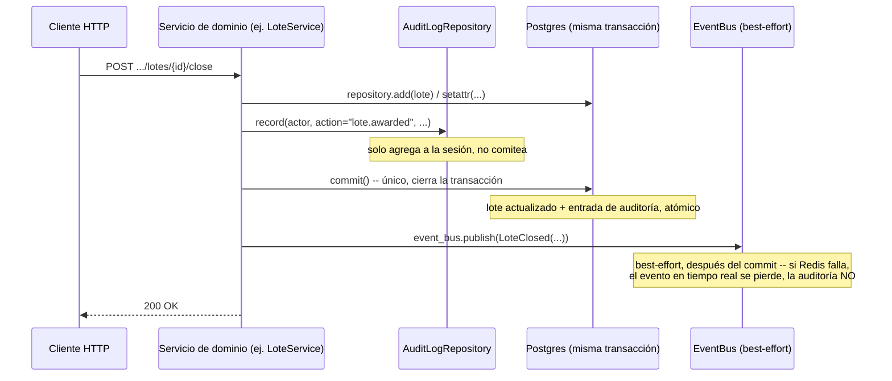

# 36 — Sistema de Auditoría y Trazabilidad (Épica 7, Módulo 7.2)

Este documento es la referencia de diseño del Audit Service: qué acciones registra, de
dónde sale cada entrada, cómo se garantiza que nunca se pierda un registro, y cómo
funciona el panel de consulta para administradores y rematadores. Complementa
[19-arquitectura-de-eventos.md](19-arquitectura-de-eventos.md) (Módulo 3.2, el Event
Bus que este módulo deliberadamente **no** usa para escribir, ver más abajo) y
[35-dashboard-analitica-tiempo-real.md](35-dashboard-analitica-tiempo-real.md) (Módulo
7.1, el paquete transversal más reciente, mismo nivel arquitectónico). Ver
[ADR-039](adr/ADR-039-sistema-de-auditoria-y-trazabilidad.md) para el razonamiento
completo de las decisiones tomadas acá.

## Alcance de este módulo

Se implementa un Audit Service centralizado que registra, como mínimo, las acciones que
pide el enunciado:

- Inicio y cierre de sesión.
- Creación, modificación y eliminación de remates; cambio de estado del remate
  (programar, iniciar, pausar, reanudar, finalizar, cancelar).
- Apertura y cierre de lotes; creación, modificación y eliminación de lotes;
  adjudicación de un lote (distinguida de un cierre sin venta).
- Ofertas realizadas y ofertas rechazadas.
- Mensajes eliminados del chat.
- Cambios de configuración del remate (`Remate.settings`, ADR-012).

Cada entrada guarda fecha y hora, usuario responsable (y su rol al momento de la
acción), tipo de acción, tipo y id del recurso afectado, el remate al que pertenece (si
corresponde) e información adicional libre según la acción. Un panel de auditoría en
tarjetas/línea de tiempo, con búsqueda, filtros (usuario, tipo de acción, tipo de
recurso, rango de fechas) y ordenamiento, disponible para administradores (global) y
para el rematador dueño de un remate (acotado a ese remate).

**No se implementa** (fuera de alcance, mismo criterio de "preparado, no construido" que
cada módulo anterior): exportación del log a un SIEM externo o integración real con una
herramienta de monitoreo (el diseño deja el namespace de acciones abierto y el modelo
desacoplado del transporte HTTP específicamente para que esa integración futura sea
agregar un consumidor nuevo de la tabla, no reescribir nada — ver ADR-039, sección B);
un picker de usuarios para filtrar por `actor_id` puntual en la UI (la búsqueda por
nombre ya cubre el caso de uso); reversión/deshacer de una acción a partir de su entrada
de auditoría.

## Dónde vive el código

`app/audit/` — paquete transversal nuevo, top-level (no `app/modules/`), mismo criterio
que `app/analytics/`/`app/presence/`/`app/snapshot/`: cruza todos los bounded contexts
del dominio, no pertenece a uno. A diferencia de Analítica (100% lectura, sin modelo
propio), Auditoría sí persiste — su perfil es más parecido al de Chat (Módulo 6.4, un
modelo propio con reglas de negocio propias), salvo que **no** necesita un segundo
`EventConsumer`: en vez de reaccionar a eventos de dominio ya publicados, cada servicio
de dominio llama directo al Audit Service (ver la sección de flujo, más abajo).

| Archivo | Responsabilidad |
|---|---|
| `models.py` | `AuditLogEntry` — insert-only, sin `updated_at` ni borrado lógico. |
| `actions.py` | `AuditAction` — catálogo de constantes string (namespace `"dominio.verbo"` abierto). |
| `repository.py` | `AuditLogRepository` — superficie de **escritura** (`record`, sin comitear) y de lectura paginada/filtrada (`list_paginated`). Sin ninguna dependencia de `app.modules.*`. |
| `service.py` | `AuditService` — superficie de **lectura** del panel (`list_global`, `list_for_remate`), compone `RemateService` para ownership/visibilidad. |
| `schemas.py` | `AuditLogEntryRead`, `AuditLogFilters`; reutiliza `Page[T]` de `app/common/schemas.py`. |
| `dependencies.py` | `get_audit_log_repository`, `get_audit_service`. |
| `router.py` | `GET /audit` (global, admin) y `GET /remates/{remate_id}/audit` (dueño o admin). |

**Por qué `repository.py` y `service.py` están separados** (a diferencia de
`AnalyticsRepository`/`AnalyticsService`, que también lo están pero por una razón
distinta): `AuditLogRepository` es la pieza que se **inyecta directo en los servicios de
dominio** (`AuthService`, `RemateService`, `LoteService`, `AuctionEngine`, `ChatService`)
para que cada uno deje constancia de sus propias acciones — no puede depender de
`RemateService` (que `AuditService` sí necesita para el panel) porque eso cerraría un
ciclo de imports. Mismo criterio ya aplicado en ADR-019 ("`RemateService` recibe
`LoteRepository`, no `LoteService`, para evitar un ciclo").

**Archivos existentes tocados**:

- `app/db/base.py`: importar `AuditLogEntry` (único punto que necesita Alembic).
- `app/api/router.py`: `include_router(audit_router)`, mismo patrón que
  `analytics_router`/`snapshot_router`.
- `app/core/config.py`: `AUDIT_LOG_DEFAULT_PAGE_SIZE`.
- `alembic/versions/`: una migración nueva, tabla `audit_log_entries`.
- **Cinco servicios de dominio** (`AuthService`, `RemateService`, `LoteService`,
  `AuctionEngine`, `ChatService`) ganan un parámetro de constructor
  (`audit_repository: AuditLogRepository`) y una llamada a `record(...)` antes de cada
  `commit()` ya existente — mismo patrón mecánico ya usado cuando `event_bus` se agregó
  a estos mismos servicios en la Épica 3.2. Ninguna validación ni regla de negocio
  existente se modificó; ver la tabla completa de puntos de integración más abajo.
- Sus respectivos `dependencies.py` (`auth/`, `remates/`, `remates/lotes/`, `ofertas/`,
  `chat/`) y `app/snapshot/dependencies.py`/`app/modules/chat/realtime.py` (construyen
  `RemateService`/`ChatService` a mano fuera del árbol de `Depends()` de FastAPI, ganan
  la misma dependencia nueva).

**Cero cambios** en `app/realtime/`, el Gateway WebSocket, `RoomManager`/
`ConnectionManager`, `app/presence/`, `app/snapshot/` (salvo la única línea de
`dependencies.py` arriba), ni ninguna validación/regla de negocio de remates, lotes,
ofertas o chat.

## De dónde sale cada entrada de auditoría

| Acción (`AuditAction`) | Servicio / método | Notas |
|---|---|---|
| `auth.login` | `AuthService.login` | Actor ya resuelto por `authenticate()`. |
| `auth.logout` | `AuthService.logout` | Solo si el refresh token era válido (idempotente); se busca el `User` por `user_id` del token para denormalizar nombre/rol. |
| `remate.created` | `RemateService.create` | |
| `remate.updated` / `remate.settings_changed` | `RemateService.update` | La segunda si `"settings"` está entre los campos modificados (cubre "cambios importantes de configuración" del enunciado — ver ADR-039 sección E). |
| `remate.status_changed` | `RemateService.schedule/start/pause/resume/finish/cancel/try_auto_finish` | `details` incluye `from`/`to`/`trigger` (`"manual"` o `"auto"`, esta última solo en la finalización automática de RF-10, sin actor). |
| `remate.deleted` | `RemateService.soft_delete` | |
| `lote.created` / `lote.updated` / `lote.deleted` | `LoteService.create/update/soft_delete` | |
| `lote.opened` | `LoteService.open/open_next` | |
| `lote.awarded` / `lote.closed` | `LoteService.close` | La primera si `outcome == sold` (adjudicación), la segunda si no — ítems distintos del enunciado, nunca la misma acción. |
| `lote.cancelled` | `LoteService.cancel` | Extra sobre lo pedido explícitamente, mismo costo que el resto. |
| `oferta.placed` / `oferta.rejected` | `AuctionEngine._save` (dentro de `place_bid`) | La primera si la oferta persistida quedó `ACCEPTED`, la segunda si `REJECTED`. No se audita la transición `ACCEPTED -> OUTBID` de una oferta previamente ganadora (efecto secundario de una oferta ya auditada, alto volumen). |
| `chat.message_deleted` | `ChatService.delete_message` | El moderador (dueño del remate) como actor. |

## Garantía central: escritura atada a la transacción del dominio, no al Event Bus

`EventBus.publish()` es **best-effort y nunca lanza** (ADR-022): si Redis está caído, el
evento se pierde en silencio, por diseño. Un log de auditoría no puede tener ese mismo
comportamiento — una acción que ocurrió pero no se pudo auditar es un hueco de
compliance. Por eso `AuditLogRepository.record(...)` **no** se llama desde un consumidor
del Event Bus: cada servicio de dominio la llama directo, de forma síncrona (sin
`commit()` propio), justo antes del `commit()` que ya iba a ejecutar para persistir su
propia acción. El resultado: la entrada de auditoría vive en la **misma transacción**
que la acción que audita.

**Consecuencia directa**: si la transacción del dominio se revierte (por ejemplo, un
`IntegrityError` de concurrencia), la entrada de auditoría se revierte con ella —
correcto, porque la acción tampoco ocurrió. Si la transacción se confirma, la entrada
queda confirmada junto con ella, sin ninguna ventana donde una pueda persistir sin la
otra. Esta es una garantía que ningún evento del Event Bus tiene hoy.

**Para acciones que crean una fila nueva** (`RemateService.create`, `LoteService.create`,
`AuctionEngine._save`), el `id` del recurso recién construido no existe todavía cuando
se llama a `record()` (es un default client-side, `uuid.uuid4()`, que SQLAlchemy asigna
recién al hacer `flush()`) — por eso esos tres puntos llaman
`await self._audit_repository.flush()` (asigna el id sin comitear) antes de construir la
entrada de auditoría, seguido del único `commit()` de siempre. Para acciones sobre una
fila ya existente (actualizaciones, transiciones de estado, eliminaciones), el id ya se
conoce de antes y no hace falta ese paso.

## Estructura de almacenamiento

Una única tabla, `audit_log_entries` (`app/audit/models.py`), **insert-only**: sin
`updated_at` (una entrada nunca se modifica) ni `deleted_at` (nunca se borra, ni
lógicamente — es la propiedad central que la distingue de cualquier otra tabla del
proyecto, incluida `Oferta`, que sí tiene `TimestampMixin`).

| Columna | Tipo | Notas |
|---|---|---|
| `id` | UUID | `UUIDPrimaryKeyMixin`, default client-side. |
| `occurred_at` | timestamptz | `server_default=now()`, indexado. |
| `actor_id` | UUID, FK `users.id` | `ON DELETE SET NULL`, nullable. |
| `actor_name` / `actor_role` | string | Denormalizados al momento del registro (mismo criterio que `ChatMessage.author_name`/`author_role`): preservan quién hizo qué, con qué rol, aunque el usuario cambie de nombre/rol o se dé de baja después. |
| `action` | string(100), indexado | Namespace abierto (`"remate.created"`), **no** un `Enum` nativo de Postgres. |
| `resource_type` | string(50), indexado | `"remate"`, `"lote"`, `"oferta"`, `"chat_message"`, `"user"`. |
| `resource_id` | UUID, nullable | Sin FK — un `AuditLogEntry` puede referenciar cualquier tipo de recurso, no uno fijo. |
| `remate_id` | UUID, FK `remates.id` | `ON DELETE SET NULL`, nullable (nulo en acciones no ligadas a un remate, ej. login/logout); clave de scoping del panel del rematador. |
| `details` | JSONB, nullable | Metadata libre por acción (motivo, campos modificados, monto, outcome, etc.) — se llama `details`, no `metadata` (reservado por `Base.metadata` de SQLAlchemy). |

**Por qué `action` es `String` y no un `Enum` nativo de Postgres** (ADR-010 aplicó enum
nativo a `UserRole`/`RemateStatus`/etc.): un enum nativo exige `ALTER TYPE ... ADD VALUE`
cada vez que se suma una acción — exactamente la fricción que el enunciado pide evitar
("extensible sin modificar significativamente el código existente"). Mismo criterio que
`DomainEvent.event_type: str` ya usa para los eventos de dominio.

**Por qué las FKs son `SET NULL` y no `RESTRICT`** (al revés del criterio que usa el
resto del proyecto: `ChatMessage.remate_id`, `Oferta.lote_id`, todas `RESTRICT` para que
la entidad *auditada* no pueda desaparecer): acá `AuditLogEntry` **es** el registro de
auditoría — debe ser la tabla más tolerante posible a que la fila que referencia deje de
existir, nunca puede bloquear esa operación ni perder la entrada.

Índices: `occurred_at`, `actor_id`, `action`, `resource_type`, `remate_id`, y un
compuesto `(remate_id, occurred_at)` para las consultas scoped del panel del rematador.

## Control de acceso

- `GET /audit` (global): exclusivo de `admin`, verificado en dos capas — `require_roles`
  a nivel de router (defensa en el borde de la API) y de nuevo dentro de
  `AuditService.list_global` (defensa en profundidad, mismo criterio que el resto del
  proyecto no confía únicamente en la capa de transporte).
- `GET /remates/{remate_id}/audit` (scoped): dueño del remate o `admin`.
  `AuditService.list_for_remate` reutiliza `RemateService.get_visible_or_raise` (404
  para un borrador ajeno, mismo criterio "no confirmar su existencia" del resto de la
  API) y luego exige dueño-o-admin con `ForbiddenError` (403) — mismo patrón que
  `AnalyticsService.build`.

## Interfaz — frontend

`features/audit/`, paralelo a `features/analytics/`:

| Archivo | Qué hace |
|---|---|
| `types.ts` | Espeja `AuditLogEntry`/`AuditLogFilters`. |
| `api.ts` | `fetchGlobalAuditLogRequest`, `fetchRemateAuditLogRequest`. |
| `labels.ts` | `describeAction`/`describeResourceType` — namespace abierto, una acción sin entrada cae al string crudo en vez de romper. |
| `hooks.ts` | `useAuditLog(scope, filters, page, pageSize)` — fetch simple, sin tiempo real (a diferencia de Analítica: un log histórico no necesita refetch debounced ante eventos de dominio). |
| `components/AuditLogFilters.tsx` | Búsqueda por nombre, tipo de acción, tipo de recurso, rango de fechas, orden. |
| `components/AuditLogEntryCard.tsx` | Una entrada: hora, acción (badge), actor+rol, detalle expandible. |
| `components/AuditLogTimeline.tsx` | Tarjetas agrupadas por día — **no** una tabla, pedido explícito de diseño. |
| `components/AuditLogView.tsx` | Composición completa (filtros + timeline + paginación), reutilizada tal cual por ambos paneles. |

**Dos puntos de integración**, mismo componente (`AuditLogView`) con distinto `scope`:

- **Admin, global**: `/admin` — reemplaza `AdminPlaceholderPage` (Épica 4.1, existía
  únicamente para probar `RequireRole` de punta a punta), ya protegida por
  `RequireRole allowedRoles={['admin']}` en `app/router.tsx`.
- **Rematador, scoped**: `/remates/:remateId/auditoria` — ruta nueva, sin `RequireRole`
  a nivel de ruta (mismo criterio que `/remates/:remateId/lotes`/`gestionar`: el backend
  decide), enlazada desde un botón "Ver auditoría" en `RemateManagementSidebar`
  (Gestión de Remates y Lotes, Épica 5.3).

## Limitaciones conocidas (documentadas, no huecos)

- **Sin exportación a un SIEM externo** — el modelo y el namespace de acciones abierto
  dejan el terreno preparado (ver ADR-039, sección B), pero ningún conector real se
  construye en este módulo.
- **Sin picker de usuario por id** en los filtros del frontend — la búsqueda por nombre
  (`search`, `ILIKE` sobre `actor_name`) cubre el caso de uso sin esa pieza nueva.
- **Paginación offset/limit, no keyset** — volumen esperado bajo (panel administrativo,
  no "miles de mensajes" con scroll infinito como Chat); ver ADR-039, sección D.

## Checklist del módulo

- [x] Registra inicio y cierre de sesión.
- [x] Registra creación, modificación y eliminación de remates.
- [x] Registra cambio de estado del remate (programar/iniciar/pausar/reanudar/
      finalizar/cancelar).
- [x] Registra apertura y cierre de lotes; creación, modificación y eliminación de
      lotes.
- [x] Registra ofertas realizadas y ofertas rechazadas.
- [x] Registra lotes adjudicados, distinguido de un cierre sin venta.
- [x] Registra mensajes eliminados del chat.
- [x] Registra cambios importantes de configuración (`Remate.settings`).
- [x] Cada entrada guarda fecha/hora, usuario responsable, rol, tipo de acción, recurso
      afectado, id del recurso e información adicional cuando corresponde.
- [x] Panel de auditoría para administradores (global) y rematadores (scoped a sus
      remates).
- [x] Búsqueda, filtros por usuario/tipo de acción/rango de fechas, ordenamiento,
      visualización cronológica.
- [x] Audit Service desacoplado (`app/audit/`), centraliza el registro de eventos.
- [x] Preparado para integraciones futuras con SIEM/monitoreo externo (namespace de
      acciones abierto, sin acoplar el modelo al transporte HTTP).
- [x] Diseño en tarjetas y línea de tiempo, sin tablas cargadas.
- [x] Fácilmente extensible: sumar una acción nueva es una constante en `actions.py` +
      una llamada a `record(...)`, sin migración ni cambio estructural.
- [x] Tests: `test_audit_repository.py`, `test_audit_service.py`, `test_audit_router.py`
      (cobertura de cada acción pedida, filtros, control de acceso); dos tests nuevos en
      `test_architecture_boundaries.py`; frontend: `hooks.test.ts`,
      `AuditLogTimeline.test.tsx`, `labels.test.ts`.
- [x] Documentación (este archivo) y ADR (ADR-039) actualizados.
- [x] Cero cambios en `app/realtime/`, el Gateway WebSocket, `app/presence/`,
      `app/snapshot/`, ni ninguna validación/regla de negocio existente de remates,
      lotes, ofertas o chat.
