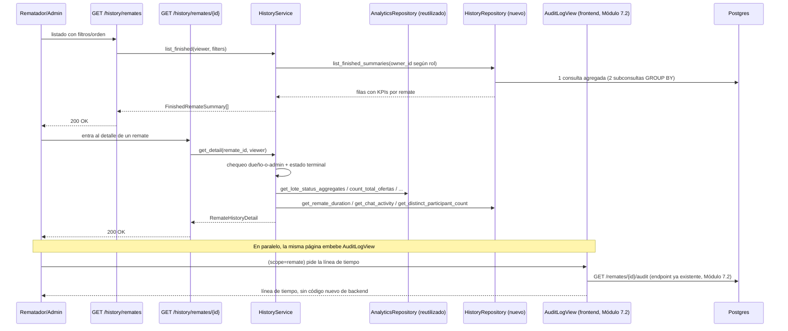

# 37 — Historial y Resultados de Remates (Épica 7, Módulo 7.3)

Este documento es la referencia de diseño del History Service: qué muestra el listado
de remates finalizados, de dónde sale cada dato del detalle (con especial atención a lo
que se reutiliza de Analítica y Auditoría en vez de recalcularse), y cómo queda
preparada la arquitectura para una futura exportación a PDF/Excel. Complementa
[35-dashboard-analitica-tiempo-real.md](35-dashboard-analitica-tiempo-real.md) (Módulo
7.1) y [36-sistema-de-auditoria-y-trazabilidad.md](36-sistema-de-auditoria-y-trazabilidad.md)
(Módulo 7.2), cuya infraestructura reutiliza en vez de duplicar. Ver
[ADR-040](adr/ADR-040-historial-y-resultados-de-remates.md) para el razonamiento
completo de las decisiones tomadas acá.

## Alcance de este módulo

Se implementa una vista retrospectiva de remates ya terminados, para rematadores
(sus propios remates) y administradores (todos):

- **Listado de remates finalizados/cancelados**: nombre, fecha, estado, cantidad de
  lotes, cantidad de lotes vendidos, monto total adjudicado, cantidad de compradores
  participantes, duración total. Con búsqueda por título, filtros por rango de fechas y
  ordenamiento (fecha, título, monto adjudicado).
- **Detalle de un remate**: resumen general, línea de tiempo de eventos importantes
  (reutilizando el panel de auditoría ya construido), métricas finales (reutilizando
  las mismas consultas de Analítica), actividad del chat (resumen), cantidad de
  usuarios que participaron durante el evento.
- **Detalle de cada lote**: ganador, precio inicial, precio final, cantidad de ofertas
  recibidas, tiempo que permaneció abierto, historial completo de ofertas, estado
  final.
- Un History Service desacoplado (`app/history/`), que reutiliza Analytics y Audit en
  vez de duplicar su lógica.

**No se implementa** (fuera de alcance, mismo criterio "preparado, no construido" que
cada módulo anterior aplicó a ítems fuera de alcance del MVP): generación real de
archivos PDF/Excel, ni un botón de "compartir" -- ver la sección dedicada más abajo
sobre por qué y qué es lo que sí queda preparado.

## Dónde vive el código

`app/history/` -- paquete transversal nuevo, top-level, mismo nivel que
`app/analytics/`/`app/audit/`/`app/presence/`/`app/snapshot/`: sin modelo de base de
datos propio, sin migración nueva -- **100% derivado** de columnas que remates/lotes/
ofertas/chat ya persisten desde épicas anteriores.

| Archivo | Responsabilidad |
|---|---|
| `schemas.py` | DTOs de respuesta (`FinishedRemateSummary`, `RemateHistoryDetail`, `LoteHistoryDetail`, `OfertaHistoryEntry`, `LoteWinner`, `ChatActivitySummary`) -- reutiliza `LoteStatusCounts`/`HighestOferta`/`TopLoteByOffers` de `app/analytics/schemas.py` tal cual. |
| `repository.py` | `HistoryRepository` -- **solo** las consultas genuinamente nuevas (ver tabla de abajo). |
| `service.py` | `HistoryService` -- control de acceso, orquestación; compone `AnalyticsRepository`/`LoteRepository`/`OfertaRepository` para el detalle. |
| `dependencies.py` | `get_history_repository`, `get_history_service`. |
| `router.py` | `GET /history/remates`, `GET /history/remates/{id}`, `GET /history/remates/{id}/lotes/{lote_id}`. |

**Archivos existentes tocados**, mínimos:

- `app/api/router.py`: una línea, `include_router(history_router)`, mismo patrón que
  `audit_router`.
- `app/analytics/schemas.py`: `HighestOferta.from_row`/`TopLoteByOffers.from_row`
  (classmethods nuevos) -- el mapeo `Row -> DTO` se movió del propio `AnalyticsService`
  al schema, para que `HistoryService` lo reutilice exactamente igual sin copiar los
  ocho campos a mano. `AnalyticsService` se actualizó para llamar a estos classmethods
  en vez de sus antiguos métodos privados `_build_highest_oferta`/`_build_top_lote`
  (eliminados) -- comportamiento idéntico, verificado con la suite de tests de
  Analítica sin cambios.

**Cero cambios** en `app/realtime/`, el Gateway WebSocket, `app/presence/`,
`app/snapshot/`, `app/audit/` (ver más abajo por qué History no lo importa), ni ninguna
validación/regla de negocio de remates/lotes/ofertas/chat.

## De dónde sale cada dato -- reutilización explícita

| Dato | Origen | Reutiliza |
|---|---|---|
| Lotes vendidos/no vendidos/restantes/cancelados, tiempo promedio por lote, valor total adjudicado | `AnalyticsRepository.get_lote_status_aggregates` | **Sí** -- misma consulta que el panel en vivo (Módulo 7.1). |
| Total de ofertas | `AnalyticsRepository.count_total_ofertas` | **Sí**, tal cual. |
| Oferta más alta / lote con más ofertas | `AnalyticsRepository.get_highest_oferta`/`get_top_lote_by_offer_count` | **Sí**, tal cual (mapeados a DTO con `HighestOferta.from_row`/`TopLoteByOffers.from_row`, compartidos con Analítica). |
| Duración total del remate | `HistoryRepository.get_remate_duration` (nuevo) | `MIN(opened_at)`/`MAX(closed_at)` entre los lotes del remate -- no `finished_at - starts_at` (mide desde la fecha *programada*, no desde que arrancó de verdad; `Remate` no persiste `started_at`, ver ADR-038 sección F). |
| Actividad del chat (mensajes, eliminados, participantes) | `HistoryRepository.get_chat_activity` (nuevo) | Consulta directa sobre `ChatMessage` (`kind=user`), sin tocar `ChatMessageRepository`. |
| Cantidad de participantes ("conectados durante el evento") | `HistoryRepository.get_distinct_participant_count` (nuevo) | Ver limitación dedicada más abajo -- es una aproximación, no un conteo real de conexiones. |
| Ganador de un lote | `OfertaRepository.get_leading_offer` | **Sí**, tal cual -- la oferta `ACCEPTED` de un lote `closed_sold` es, por invariante del motor (ADR-020), el ganador. |
| Historial de ofertas de un lote | `OfertaRepository.list_by_lote` | **Sí**, tal cual, paginado. |
| Línea de tiempo de eventos importantes | Panel de auditoría (`app/audit/`, Módulo 7.2) | **Sí, pero del lado del frontend** -- ver sección dedicada abajo. |
| Nombres (dueño, ganador, compradores del historial de ofertas) | `HistoryRepository.get_users_by_ids` (nuevo) | Mismo patrón que `AnalyticsRepository.get_roles_by_ids`, sin tocar `UserRepository`. |
| Listado de lotes de un remate | `GET /remates/{id}/lotes` (ya existente, Épica 2.2) | **Sí, reutilizado directo en el frontend** -- `useLotes` (Épica 4.4), sin endpoint nuevo. |

### Por qué `HistoryService` no importa `AnalyticsService` ni `AuditService`

`AnalyticsService` compone `PresenceService` y una caché Redis de TTL corto, ambos
pensados para "métricas de un remate **ahora mismo**" -- un remate ya finalizado no
tiene nadie "conectado en este instante" en el sentido que Presencia mide, y no hay
nada que cachear con TTL corto (el resultado no cambia más). `HistoryService` inyecta
`AnalyticsRepository` directo (la capa sin ese acoplamiento) para las cuatro consultas
que sí le sirven tal cual.

`AuditService` (lectura del panel de auditoría) depende de `RemateService` -- si
`HistoryService` la importara para resolver la línea de tiempo del lado del backend,
tendría que devolver esos datos embebidos en `RemateHistoryDetail`, duplicando en el
tipo de respuesta algo que el frontend ya sabe pedir por su cuenta. En cambio, la
página de detalle del historial (`RemateHistoryDetailPage.tsx`) embebe directo el
componente `AuditLogView` (`features/audit/components/`, Módulo 7.2) con
`scope={{type:'remate', remateId}}` -- el mismo componente, contra el mismo endpoint
(`GET /remates/{id}/audit`) que ya alimenta `/remates/:id/auditoria`. Cero código nuevo
para la línea de tiempo, ni en el backend ni en el frontend.

## Preparación para reportes (PDF/Excel/compartir) -- preparado, no construido

Mismo criterio que el proyecto ya aplicó a otros ítems fuera de alcance del MVP (por
ejemplo, transmisión en vivo, ADR-005): **no se agrega ningún endpoint ni botón que no
haga nada** -- una UI que promete una exportación inexistente es peor que no tener el
botón. La preparación real es arquitectónica: `RemateHistoryDetail`/`LoteHistoryDetail`
(`app/history/schemas.py`) ya son el contrato de datos completo y autocontenido que un
generador de reportes futuro necesitaría -- un único `GET /history/remates/{id}` (y,
si hiciera falta detalle por lote, `GET .../lotes/{lote_id}`) trae todo lo necesario
para armar un PDF/Excel, sin N+1 ni lógica adicional de agregación. Agregar esa
exportación a futuro es: un renderer nuevo (ej. `weasyprint`/`openpyxl`) que consuma
estos mismos DTOs y un endpoint que lo invoque -- no requiere tocar `HistoryService` ni
el modelo de datos.

## Control de acceso

- `GET /history/remates` (listado): `admin` ve el listado global; el rematador dueño ve
  siempre y solo los suyos (forzado, no un filtro opcional que pudiera manipularse);
  `comprador` recibe 403 -- mismo alcance que pide el enunciado ("rematadores y
  administradores").
- `GET /history/remates/{id}` y `GET /history/remates/{id}/lotes/{lote_id}` (detalle):
  dueño del remate o `admin` -- mismo patrón `get_visible_or_raise` + chequeo
  dueño-o-admin que `AnalyticsService`/`AuditService`. Además, el remate debe estar
  `FINISHED` o `CANCELLED` (los dos únicos estados terminales, ver
  `state_machine.ALLOWED_TRANSITIONS`) -- de lo contrario, `BusinessRuleError` (422):
  "El historial solo está disponible para remates finalizados o cancelados."

## Flujo de consulta

## Interfaz -- frontend

`features/history/`, paralelo a `features/analytics/`/`features/audit/`:

| Archivo | Qué hace |
|---|---|
| `types.ts` | Espeja los schemas nuevos; reutiliza `HighestOferta`/`TopLoteByOffers`/`LoteStatusCounts` de `features/analytics/types.ts`. |
| `api.ts` | `fetchFinishedRemateHistoryRequest`, `fetchRemateHistoryDetailRequest`, `fetchLoteHistoryDetailRequest`. |
| `hooks.ts` | `useFinishedRemates`, `useRemateHistoryDetail`, `useLoteHistoryDetail` -- fetch simple, sin tiempo real (a diferencia de Analítica: un registro histórico no cambia, no hay nada que refetchear ante un evento de dominio). |
| `components/FinishedRemateList.tsx` | Filtros + tarjetas + paginación -- reutilizado tal cual por `RemateHistoryListPage` (rematador) y `AdminHistoryPanel` (admin). A diferencia de `AuditLogView` (dos endpoints según scope), acá hay un único endpoint que el backend ya resuelve según el rol del token. |
| `components/RemateHistorySummary.tsx` | Tarjetas KPI del detalle -- reutiliza `KpiCard` de `features/analytics/components/` tal cual, con `showTrend={false}` (un valor final no sube ni baja). |
| `components/ChatActivityCard.tsx` | Resumen de actividad del chat. |
| `components/LoteHistoryCard.tsx` | Tarjeta de un lote dentro del listado del detalle -- reutiliza el `Lote` que ya trae `useLotes` (Épica 4.4). |

**Páginas**:
- `AdminAuditLogPage.tsx` (`/admin`) gana un selector de pestañas Auditoría/Historial --
  un único punto de entrada admin, sin fragmentar la navegación en rutas sueltas.
- `features/history/pages/RemateHistoryListPage.tsx` en `/historial` -- listado propio
  del rematador, enlazado desde un botón "Ver historial" en `RematadorDashboardPage`.
- `features/history/pages/RemateHistoryDetailPage.tsx` en `/remates/:remateId/historial`
  -- combina `useRemateDetail` (título/moneda, reutilizado de la Épica 4.4),
  `useRemateHistoryDetail` (métricas), `useLotes` (listado de lotes, reutilizado), y
  embebe `AuditLogView` (scope remate) para la línea de tiempo.
- `features/history/pages/LoteHistoryDetailPage.tsx` en
  `/remates/:remateId/historial/lotes/:loteId` -- ganador, precios, duración, historial
  de ofertas paginado.

## Limitaciones conocidas (documentadas, no huecos)

- **`participants_count` es una aproximación de "usuarios conectados durante el
  evento"**, no un conteo real de conexiones: Presencia (`app/presence/`, Módulo 6.2)
  es en memoria, sin historial persistido (ADR-009: Redis Pub/Sub, no Streams, sin
  event store) -- no existe forma de reconstruir cuántos usuarios estuvieron
  efectivamente conectados a un remate que ya terminó. Se cuentan los usuarios
  distintos que interactuaron de verdad (ofertaron o escribieron en el chat), que es
  información real y persistida, aunque subestima a quienes solo miraron sin
  participar. Ver ADR-040.
- **Sin exportación real a PDF/Excel ni botón de compartir** -- arquitectura
  preparada, no construida (ver sección dedicada arriba).
- **La duración total puede ser `null`** si el remate se canceló antes de abrir algún
  lote (no hay `opened_at`/`closed_at` de qué derivarla) -- se muestra como "—" en la UI,
  no como un error.
- **Un lote marcado `closed_sold` puede no tener ganador identificable**: el resultado
  de un cierre lo declara el rematador (ADR-018), no necesariamente hay una oferta real
  de por medio -- `winner` queda `null` en ese caso, documentado explícitamente en la UI.

## Checklist del módulo

- [x] Listado de remates finalizados: nombre, fecha, estado, cantidad de lotes,
      cantidad de lotes vendidos, monto total adjudicado, cantidad de compradores
      participantes, duración total.
- [x] Búsqueda, filtros por fecha, ordenamiento.
- [x] Detalle del remate: resumen general, línea de tiempo de eventos importantes,
      métricas finales, actividad del chat, cantidad de usuarios que participaron.
- [x] Detalle de cada lote: ganador, precio inicial, precio final, cantidad de ofertas
      recibidas, tiempo que permaneció abierto, historial de ofertas, estado final.
- [x] History Service desacoplado (`app/history/`).
- [x] Reutiliza Analytics (`AnalyticsRepository`) y Audit (`AuditLogView`) en vez de
      duplicar lógica -- ver tabla de reutilización explícita arriba.
- [x] Arquitectura preparada (no construida) para exportación a PDF/Excel y compartir
      resultados -- documentado, sin código especulativo.
- [x] Diseño en tarjetas, indicadores KPI y línea de tiempo; sin tablas cargadas;
      responsive.
- [x] Tests: `test_history_repository.py`, `test_history_service.py`,
      `test_history_router.py`; test nuevo en `test_architecture_boundaries.py`;
      frontend: `hooks.test.ts`, `FinishedRemateCard.test.tsx`,
      `ChatActivityCard.test.tsx`.
- [x] Documentación (este archivo) y ADR (ADR-040) actualizados.
- [x] Cero cambios en `app/realtime/`, el Gateway WebSocket, `app/presence/`,
      `app/snapshot/`, `app/audit/`, ni ninguna validación/regla de negocio existente
      de remates, lotes, ofertas o chat.
