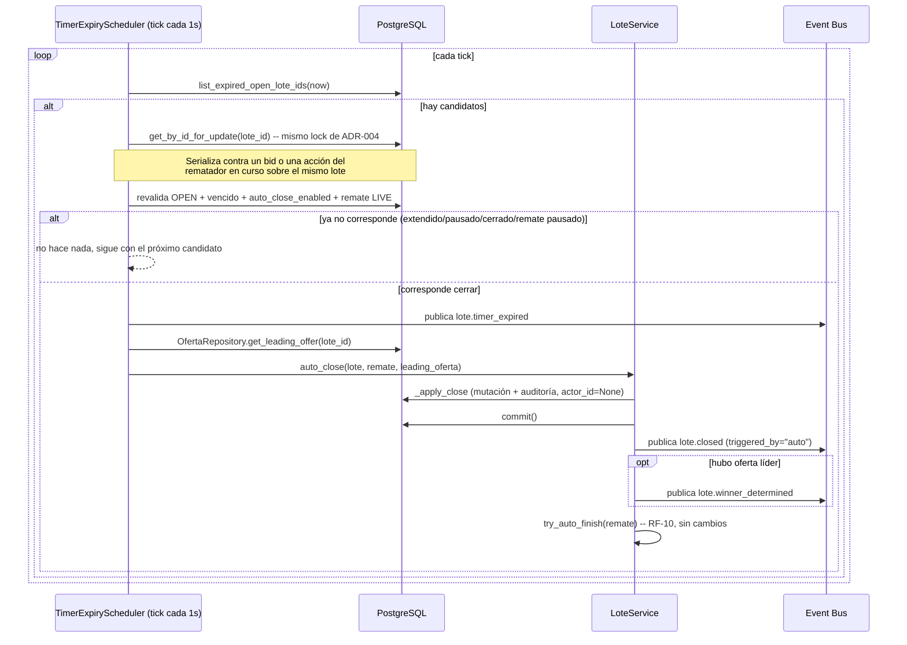

# 40 — Cuenta Regresiva y Cierre Automático de Lotes (Épica 8)

Este documento es la referencia de diseño del Timer Service: qué columnas nuevas tiene
`Lote`, qué hace cada método, cada evento de dominio nuevo, cómo se sincroniza en
tiempo real, el flujo completo de cierre automático y adjudicación, y qué queda
documentado como limitación conocida. Ver
[ADR-043](adr/ADR-043-cuenta-regresiva-y-cierre-automatico.md) para el razonamiento
completo de las decisiones tomadas.

## Por qué este módulo, y por qué ahora

[ADR-007](adr/ADR-007-anti-sniping.md) (Fase 0) ya había decidido la extensión
anti-sniping completa -- ventana configurable, "el estado del timer debe vivir en
Postgres, no en memoria de una instancia" -- y `RemateSettings.anti_sniping_enabled`/
`anti_sniping_extension_seconds` existían en el schema desde el Módulo 2.1. Nunca se
había implementado: ninguna línea de código fuera de ese schema los leía. El catálogo
de eventos de Fase 0 (`docs/06-eventos-del-sistema.md`) reservó igual
`lote.cierre_extendido` y `lote.cerrado` ("vence timer") sin construirlos. Este módulo
implementa RF-14 (cierre automático por timer) por primera vez, de punta a punta.

## Alcance de este módulo

- Temporizador configurable por remate (`settings.lote_timer_seconds`, nuevo).
- Cuenta regresiva visible para compradores (Sala del Remate) y rematador (Consola
  Operativa), sincronizada por WebSocket -- nunca por polling.
- Extensión automática (anti-sniping, ADR-007) cuando una oferta se acepta dentro de
  la ventana configurada.
- Cierre automático y adjudicación al mejor postor cuando el timer vence.
- Cinco acciones del rematador: pausar, reanudar, reiniciar, fijar un tiempo restante
  arbitrario, y activar/desactivar el cierre automático.
- Nueve eventos de dominio nuevos, sincronizados en tiempo real igual que cualquier
  otro evento del proyecto (`app/realtime/registry.py`).

**No se implementa**: un timer por lote independiente del configurado a nivel remate
(el enunciado pide "configurable por remate", no por lote); una cola de "próxima
extensión" distinta del mismo campo que ya sirve de umbral y de extensión.

## Dónde vive el código

`app/timer/` -- paquete transversal nuevo, top-level, mismo nivel que
`app/snapshot/`: sin modelo propio (el estado del timer vive en columnas nuevas de
`Lote`), pero sí depende de módulos de dominio (`app.modules.remates`,
`app.modules.remates.lotes`, y `app.modules.ofertas` solo en `scheduler.py`) para
operar sobre ellos -- mismo perfil de dependencia que `app/snapshot/` ya tiene hacia
`app.modules.ofertas`.

| Archivo | Responsabilidad |
|---|---|
| `service.py` | `TimerService` -- mutadores puros (`start_for_lote`, `maybe_extend_for_bid`) + las cinco acciones del rematador (flujo completo). |
| `scheduler.py` | `TimerExpiryScheduler` -- tarea de fondo, cierra lotes vencidos. |
| `router.py` | `POST .../lotes/{id}/timer/{pause,resume,reset,remaining,auto-close}`. |
| `dependencies.py` | `get_timer_service`. |
| `schemas.py` | `TimerRemainingRequest`, `TimerAutoCloseRequest`. |

**Archivos existentes tocados**, todos additivos:

- `app/modules/remates/lotes/models.py` (`Lote`): tres columnas nuevas --
  `timer_ends_at`, `timer_paused_remaining_seconds`, `timer_auto_close_enabled`.
  Nunca ambas de las dos primeras no-`None` a la vez: "corriendo" (`timer_ends_at`
  fijo), "pausado" (`timer_paused_remaining_seconds` fijo) o "sin timer" (ambas
  `None`) se derivan de esas dos columnas, sin un enum de estado propio ni un
  `PAUSED` nuevo en `LoteStatus` (la pausa es del *timer*, no del lote -- el lote
  sigue `OPEN` todo el tiempo).
- `app/modules/remates/schemas.py` (`RemateSettings`): `lote_timer_seconds: int |
  None` nuevo (`None` = sin timer, opt-in).
- `app/modules/remates/lotes/service.py` (`LoteService`): `open`/`open_next` ganan
  una llamada a `TimerService.start_for_lote` antes de su commit ya existente;
  `close()` se refactorizó en un `_apply_close` privado (mutación + auditoría
  compartida) sin cambiar su firma ni comportamiento externo; `auto_close()` nuevo,
  llamado únicamente por el scheduler.
- `app/modules/ofertas/engine.py` (`AuctionEngine.place_bid`): una llamada síncrona a
  `TimerService.maybe_extend_for_bid` en la rama `ACCEPTED`, antes de `_save` -- ver
  ADR-043 para por qué debe ser síncrona, no vía el Event Bus.
- `app/modules/remates/lotes/events.py`: nueve eventos nuevos (ver más abajo) +
  `LoteClosed.triggered_by` (`"manual" | "auto"`, mismo patrón que
  `RemateFinished.triggered_by`).
- `app/modules/remates/lotes/repository.py`: `list_expired_open_lote_ids`.
- `app/audit/actions.py`: cinco constantes nuevas (`LOTE_TIMER_*`), namespace de
  string abierto, sin migración.
- `app/main.py`: `TimerExpiryScheduler` arranca/se detiene junto a los dos
  `EventConsumer` ya existentes.
- `app/api/router.py`: `include_router(timer_router)`.
- Migración Alembic nueva: tres columnas + un índice parcial
  (`ix_lotes_open_timer_ends_at`).

**Cero cambios** en `AuctionEngine.place_bid` más allá de la línea de extensión
descripta arriba (ninguna regla de aceptación/rechazo se tocó), en `LoteService.close`
(firma y comportamiento externo intactos), en `app/websocket/`, `app/realtime/consumer.py`
ni `app/realtime/dispatcher.py`.

## El Timer Service

### Mutadores puros (sin commit ni publish)

`start_for_lote(lote, remate)` y `maybe_extend_for_bid(lote, remate)` son
`@staticmethod`: mutan el objeto `Lote` ya cargado por el caller, en memoria, y
devuelven el evento a publicar (o `None`) -- nunca comitean ni publican ellos mismos.
El caller (`LoteService.open`/`open_next`, `AuctionEngine.place_bid`) ya está dentro de
su propia transacción con un único `commit()`; el evento se publica después de ese
commit, exactamente igual que cualquier otro evento del proyecto.

`maybe_extend_for_bid` **debe** ejecutarse síncronamente, en la misma transacción que
acepta la oferta -- ver ADR-043 para el razonamiento completo (evita una ventana de
carrera real contra `TimerExpiryScheduler`).

### Acciones del rematador (flujo completo)

`pause`, `resume`, `reset`, `set_remaining`, `set_auto_close_enabled`: cada una
verifica ownership (`RemateService.get_owned_or_raise`), carga el lote, exige que esté
`OPEN` y tenga un timer en curso (422 si no, mismo criterio que `close()`/`cancel()`),
muta, audita (`AuditLogRepository`), comitea, refresca, publica el evento
correspondiente, y devuelve el `Lote` actualizado.

## Los nueve eventos nuevos

| Evento | Disparado por | Cuándo |
|---|---|---|
| `lote.timer_started` | `LoteService.open`/`open_next` | Se abre un lote con `settings.lote_timer_seconds` configurado. |
| `lote.timer_paused` | `TimerService.pause` (rematador) | — |
| `lote.timer_resumed` | `TimerService.resume` (rematador) | — |
| `lote.timer_reset` | `TimerService.reset` (rematador) | Vuelve a la duración completa configurada. |
| `lote.timer_adjusted` | `TimerService.set_remaining` (rematador) | Tiempo restante arbitrario, corriendo o pausado. |
| `lote.timer_auto_close_toggled` | `TimerService.set_auto_close_enabled` (rematador) | — |
| `lote.timer_extended` | `AuctionEngine.place_bid` | Anti-sniping: oferta aceptada dentro de la ventana configurada. |
| `lote.timer_expired` | `TimerExpiryScheduler` | El timer venció -- antes de decidir la adjudicación. |
| `lote.winner_determined` | `LoteService.auto_close` | Solo si el cierre automático resulta `sold` -- implementa `lote.ganador_determinado` (Fase 0). Nunca en un cierre manual: ahí el rematador declara un `final_price` sin comprador asociado (ADR-018). |

Los nueve se agregaron a `SYNCED_EVENTS`/`EVENT_REGISTRY`
(`app/realtime/registry.py`) -- se reenvían a los clientes conectados exactamente
igual que cualquier otro evento, sin ningún cambio en `app/websocket/` ni en
`app/realtime/consumer.py`/`dispatcher.py` (el mecanismo de reenvío ya era genérico).

## Sincronización en tiempo real

Nada nuevo del lado del transporte: los nueve eventos viajan por el mismo pipeline que
ya reenvía `oferta.accepted`, `lote.opened`, etc. (Event Bus → Redis Pub/Sub →
`EventConsumer` → `EventDispatcher` → sala correspondiente). El frontend
(`features/sala/realtime/reducer.ts`) parchea únicamente los tres campos de timer del
lote afectado (`timer_ends_at`, `timer_paused_remaining_seconds`,
`timer_auto_close_enabled`), reusando el mismo `patchLote` genérico que ya usan
`lote.opened`/`lote.closed`/`lote.cancelled` -- ningún componente de presentación
sabe que existe un WebSocket.

**El backend es la única fuente de verdad del tiempo restante** (pedido explícito del
enunciado): `LoteCountdown.tsx` recibe `timer_ends_at` (deadline absoluto, ISO 8601
UTC) como prop y un `setInterval` local solo recalcula `endsAt - Date.now()` una vez
por segundo para el efecto visual de tictac -- nunca decrementa un contador propio. Un
reloj de cliente adelantado o atrasado no puede desviar el conteo más de lo que ya
estaba desviado (la resta siempre usa el mismo `endsAt` del servidor), y cada
evento/reconexión lo corrige solo sin acumular error. La decisión real de cuándo
cerrar un lote la toma exclusivamente `TimerExpiryScheduler`, comparando contra su
propio reloj de servidor -- el cliente nunca decide, solo muestra.

## El flujo completo de cierre automático

**Por qué el scheduler respeta la pausa del remate**: si el rematador pausó el remate
(no el timer), nadie puede ofertar mientras tanto -- adjudicar automáticamente en ese
momento sería injusto. El timer sigue vencido en términos absolutos; el scheduler
simplemente no actúa mientras el remate esté pausado, y lo cierra en el primer tick
después de que se reanude.

**Por qué el lock de fila es el mismo de ADR-004**: `LoteRepository.get_by_id_for_update`
ya serializaba toda oferta concurrente sobre un lote (Auction Engine). El scheduler lo
reusa tal cual -- primera vez que algo *distinto* del Auction Engine lo usa, validando
que es un mecanismo general de concurrencia, no accidentalmente acoplado a ofertas. Un
bid llegando casi al mismo tiempo que el scheduler evalúa expiración siempre termina en
un estado consistente: o el bid extendió a tiempo (el lote sigue `OPEN`) o el scheduler
ya cerró el lote (el bid se rechaza por "no está abierto") -- nunca los dos a la vez.

## Interfaz -- frontend

- `LoteCountdown.tsx` (nuevo, `features/sala/components/`): cuenta regresiva grande,
  indicador visual urgente bajo los 10 segundos restantes, estado "pausado" distinto
  del "corriendo". Integrado en `ActiveLotePanel` (comprador) y `ConsolaLotePanel`
  (rematador, solo lectura).
- `ConsolaControlPanel.tsx`: cinco controles nuevos (pausar/reanudar/reiniciar/fijar
  tiempo restante/alternar cierre automático), mismo patrón de toast
  (`useToastStore`) ya usado para abrir/cerrar lotes -- solo visibles si el lote
  activo tiene un timer en curso.
- `SalaPage.tsx`: un toast en `lote.closed` ("Lote adjudicado" / "Lote cerrado sin
  ofertas") -- efecto secundario, deliberadamente fuera del reducer puro
  (`reducer.ts` nunca dispara side effects).

## Limitaciones conocidas (documentadas, no huecos)

- **Resolución de un segundo**: el scheduler sondea cada 1s (`DEFAULT_TICK_INTERVAL_SECONDS`)
  -- un lote puede seguir técnicamente `OPEN` hasta 1s después de que su timer
  venciera. Aceptable para una cuenta regresiva visible a humanos; no pensado para
  cierres con precisión de milisegundos.
- **Sin límite a las extensiones anti-sniping repetidas** -- mismo riesgo ya aceptado
  por ADR-007: una sucesión de ofertas de último segundo podría extender un lote
  indefinidamente. El rematador siempre puede cerrarlo manualmente en cualquier
  momento, que actúa como límite práctico.
- **Un único timer por remate, no por lote** -- pedido explícito del enunciado
  ("configurable por remate"); todo lote de ese remate usa la misma duración al
  abrirse.

## Checklist del módulo

- [x] Temporizador configurable por remate (`settings.lote_timer_seconds`).
- [x] Cuenta regresiva visible para todos los compradores, sincronizada por WebSocket.
- [x] Cierre automático al llegar a cero.
- [x] Adjudicación automática al mejor postor (`lote.winner_determined`).
- [x] Extensión de tiempo configurable (anti-sniping, ADR-007 implementado).
- [x] Rematador: pausar, reanudar, reiniciar, modificar tiempo restante, desactivar cierre automático.
- [x] Comprador: cuenta regresiva grande, indicador de urgencia, mensaje de adjudicación.
- [x] Timer Service desacoplado (`app/timer/`), Postgres como fuente de verdad (ADR-007).
- [x] Backend fuente de verdad del tiempo restante -- frontend nunca decide el cierre.
- [x] Eventos: inicio, pausa, reanudación, reinicio, tiempo agotado, adjudicación automática (+ ajuste manual y extensión).
- [x] Tests: cuenta regresiva, extensión, adjudicación automática, sincronización entre múltiples compradores (concurrencia bid vs. scheduler).
- [x] Documentación (este archivo) y ADR (ADR-043) actualizados.
- [x] Cero cambios en la arquitectura existente más allá de lo aditivo documentado arriba.

**Nota (Épica 8.0, revisión funcional)**: el primer ítem de este checklist estaba
marcado como hecho por existir a nivel de schema/API (`RemateSettings.lote_timer_seconds`),
pero `RemateFormModal` (crear/editar remate) nunca tuvo un campo para configurarlo -- un
rematador no tenía forma real, desde la UI, de habilitar la cuenta regresiva. Corregido:
el formulario ahora tiene un toggle "Habilitar cuenta regresiva por lote" + segundos
(mismo patrón que `anti_sniping_enabled`), ver `features/rematador/remateForm.ts`.
